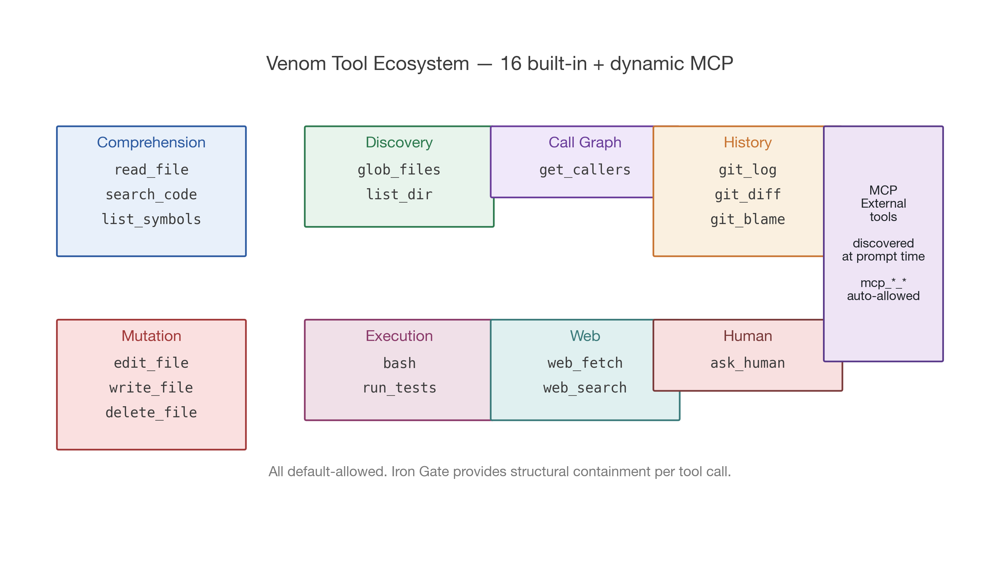
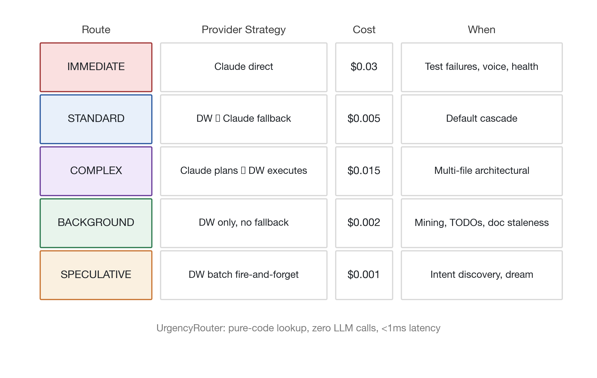

# Ouroboros + Venom: A Governed Architecture for Autonomous Self-Development

> **Prepared by:** Derek J. Russell
> **Report date:** 2026-04-16
> **Repository:** `github.com/drussell23/JARVIS-AI-Agent`
> **Canonical technical reference:** `docs/architecture/OUROBOROS.md` (2,774 lines)
> **This paper:** research-paper treatment of the above — plain-English explanation, analogies, architectural narrative, visual diagrams, honest evidence-backed claims.

---

## Abstract

Ouroboros + Venom (O+V) is the autonomous self-development engine at the heart of the JARVIS Trinity AI Operating System. It is the mechanism by which the system detects its own improvement opportunities, reasons about code changes, generates patches, validates them against tests, applies them to disk, commits them under an autonomous signature, and learns from the outcome — without a human engineer in the driver's seat for most operations.

The paper describes O+V at three levels simultaneously. For non-technical readers, each section opens with a plain-English **Big Picture** paragraph using analogies drawn from biology, medicine, manufacturing, and everyday life. For software engineers, the technical detail — phase semantics, FSM transitions, budget allocations, safety invariants — is presented in full with source-file citations. For researchers interested in autonomous AI systems, the design principles are connected back to a coherent architectural philosophy: a deterministic skeleton with an agentic nervous system, governed by a constitutional document (the Manifesto), and supervised by a metacognition layer (Trinity Consciousness).

Battle-test evidence is treated with equal seriousness. The paper includes a full postmortem of sessions A through W — the 11-day arc during which O+V evolved from a shadow-mode exploration scorer to producing its first end-to-end autonomous multi-file `APPLY` on 2026-04-15 (Session W: four Python test modules autonomously generated, validated, repaired, written to disk, committed, 20/20 pytest green). The paper is honest about what is proven (enforcement, persistence, Iron Gate semantics) and what is not yet proven (durability per Manifesto §6, broader scope beyond new-file creation, load-bearing workarounds on three deferred latent bugs).

The architecture is open — the full source is at `github.com/drussell23/JARVIS-AI-Agent`, every file cited in this paper is browseable at the referenced line numbers, and every battle-test session has its own debug log preserved in `.ouroboros/sessions/`. The goal is that a researcher or engineer can read this paper, clone the repo, and reproduce any claim end-to-end.

---

## How to Read This Paper

This is a **comprehensive research-paper treatment of O+V**, written to work simultaneously for three audiences:

1. **Non-technical readers — business partners, investors, research peers, newcomers to autonomous AI.** Each section opens with a **Big Picture** callout in plain English, using everyday analogies (apprentices, immune systems, dining rooms, mentorship loops). You can read just these callouts end-to-end and come away with the full narrative of what O+V is, how it works, and why it matters.

2. **Software engineers — anyone who might read, extend, or adopt ideas from the O+V codebase.** Every technical section cites source files, line numbers, configuration variables, and FSM transitions. A glossary is included as Appendix A. All environment variables are indexed in Appendix B.

3. **Researchers — anyone studying autonomous AI, governance architectures, or self-improving systems.** The paper connects implementation details back to design principles (the seven Manifesto principles) and provides honest evidence — what is proven through battle tests, what remains unproven, and what the deliberate deferred trade-offs are.

The paper is **intentionally long** — approximately 150 pages — because O+V is genuinely intricate. A cursory treatment would not do the architecture justice. However, the structure supports **skim reading**: every Part opens with a Big Picture paragraph and a brief contents summary, so a reader can navigate directly to the parts relevant to their interest.

**The canonical technical reference** remains `docs/architecture/OUROBOROS.md` in the repository. This paper is a companion document — it adds narrative, context, and accessibility, while pointing at OUROBOROS.md for the deepest technical detail and at the battle-test session logs for the raw evidence.

---

# PART I — Vision and Context

> **Big Picture:** This Part explains what Ouroboros + Venom is — in plain English first, then in technical terms, then in the context of the philosophical document (the Manifesto) that shapes every design decision. If you only read the first three sections of this paper, you will come away with the complete conceptual picture.

## §1. What O+V Is, In Plain English

> **Analogy:** Imagine hiring a junior software engineer who works 24 hours a day, never gets tired, and costs almost nothing per task. This engineer reads the team's codebase, notices what needs fixing, writes the fix, tests it against the existing test suite, checks in the result, and learns from whether it worked. A senior engineer reviews the junior's work when the stakes are high; when the stakes are low, the junior is trusted to act autonomously. Over time, the junior develops opinions about which parts of the codebase are fragile, remembers which past attempts failed, and asks clarifying questions when the direction is ambiguous.
>
> That is what Ouroboros + Venom is. It is an autonomous software engineer that lives inside your codebase, with the discipline of a senior professional and the scale of a machine. The word "Ouroboros" — the serpent eating its own tail — captures the self-referential nature: JARVIS uses O+V to improve JARVIS.

### §1.1 What it *does*

Every few seconds, a set of 16 autonomous sensors scans the codebase for specific classes of improvement opportunities. One sensor watches the test suite and fires when a test fails. Another looks at code complexity and flags overly-tangled functions. A third reads the most recent commits and notices documentation that has drifted out of sync with the code it describes. Yet another scans for `TODO`, `FIXME`, and `HACK` comments left by human engineers. These sensors are event-driven — they do not poll on a schedule; they react to events in the file system and the version control system.

When a sensor fires, it produces a **signal**: a structured description of a potential change, including the target files, a goal (a sentence describing what should happen), an urgency level, and metadata about where the signal came from. The signal enters a **pipeline**. The pipeline is the heart of O+V.

The pipeline has **eleven phases**. At each phase, the operation is either permitted to proceed, queued for later, escalated for human review, or rejected outright. The phases handle, in order: classifying the operation's risk level, routing it to the correct model provider (cheap inference for routine work, expensive reasoning for critical work), expanding the context the model will see, reasoning about the implementation strategy, generating the actual code change, validating that change against the test suite, gating it through deterministic safety checks, approving it (automatically for low risk, human-in-the-loop for higher risk), applying it to disk, verifying the applied change still passes tests, and completing the operation with a postmortem entry.

Between the phases, a **metacognition layer** (Trinity Consciousness) records what happened and predicts what will happen next time. It remembers which files have been trouble before, notices when the same failure is recurring across operations, predicts regression risk before a change is attempted, and during idle time speculatively pre-computes improvements that might be valuable later.

The whole thing runs with an explicit budget — cost per operation, cost per day, wall-clock time per phase, and human-approval time limits. When budgets are exhausted, the system falls back gracefully rather than burning resources or asking the human to intervene at 3 AM.

### §1.2 What makes it different

Three things distinguish O+V from a typical AI coding assistant.

First, it is **proactive, not reactive**. A chatbot answers when asked. A copilot suggests when invoked. O+V *initiates*: it decides for itself what to work on next, based on what the sensors have detected, what the human has prioritized, and what the metacognition layer predicts will be most valuable. There is no prompt box. There is no "generate me a fix for X." There is a running organism, and its decisions are observable through a rich terminal interface and a persistent thought log.

Second, it is **governed, not free**. The autonomy is contained inside a deterministic safety skeleton called the Iron Gate. The Iron Gate is not an AI. It is a set of hard-coded rules — AST parsers, command blocklists, exploration-depth scorers, file-path protectors, cost ceilings — that no model can override. When a model tries to edit a file outside the repository, the Iron Gate blocks it. When a model tries to run a destructive shell command, the Iron Gate blocks it. When a model produces output containing non-ASCII characters that might corrupt a file, the Iron Gate blocks it. The agentic intelligence provides flexibility; the deterministic skeleton provides safety. The model cannot deceive the skeleton because the skeleton is not listening to language — it is reading file paths, token types, and exit codes.

Third, it is **accountable**. Every operation has an identifier. Every phase transition is written to an append-only ledger. Every model call is recorded with its cost. Every applied change becomes a git commit with a structured message that attributes the work to the autonomous system, names the operation ID, notes the risk tier, and cites the provider used. If something goes wrong six months later, the full causal chain can be reconstructed from the ledger and the git history.

### §1.3 Why the name

**Ouroboros** is the ancient symbol of a serpent consuming its own tail — a closed loop of self-reference. The name captures the architectural fact that the system is the subject of its own improvements. JARVIS uses O+V to refactor JARVIS, to add features to JARVIS, to write tests for JARVIS, and to document JARVIS.

**Venom** is the agentic execution layer — the subsystem that gives the provider (the language model) the ability to read files, search code, run tests, and revise its output across multiple turns. The name is taken from the Marvel symbiote — a nervous system that attaches to a host, granting the host abilities the host could not exercise alone. The analogy is deliberate: Ouroboros is the governance skeleton; Venom is the fluid intelligence layered on top.

Together, **Ouroboros + Venom** means "disciplined self-improvement." The discipline comes from Ouroboros. The self-improvement comes from Venom. Neither works without the other.

## §2. What O+V Is, In Technical Terms

> **Big Picture:** This section re-states the same system in technical vocabulary. If you are an engineer, this is the section that situates O+V inside a system architecture you can reason about. The plain-English framing in §1 is the *what*; this section is the *how*.

O+V is a six-layer event-driven pipeline running as a governed coroutine tree inside the JARVIS backend process. The layers, from top to bottom, are:

1. **Strategic Direction** (`strategic_direction.py`) — a boot-time service that reads the Manifesto (`README.md`) and architectural documents, extracts the seven core principles, and injects a ~2,500-character strategic context digest into every generation prompt. This layer answers the question "where are we going?" and ensures the model generates Manifesto-aligned code, not generic fixes.

2. **Trinity Consciousness** (`backend/core/ouroboros/consciousness/`) — a metacognition layer comprising four core engines (HealthCortex, MemoryEngine, DreamEngine, ProphecyEngine) and three awareness-fusion engines (Contextual Awareness Intelligence, Situational Awareness Intelligence, Unified Awareness Engine). This layer answers "why evolve?" and feeds cross-session episodic learning back into the pipeline.

3. **Event Spine** (`backend/core/ouroboros/governance/intake/`) — the `IntakeLayerService` (Zone 6.9) and 16 sensors plugged into a unified event bus. This layer answers "when to act?" Signals arrive event-driven (filesystem changes via `watchdog`, test-result JSON from a pytest plugin, post-commit hook metadata, webhook deliveries, voice commands) rather than via polling loops.

4. **Ouroboros Pipeline** (`backend/core/ouroboros/governance/orchestrator.py`) — the deterministic governance skeleton running the 11-phase FSM. This layer answers "what to do, safely." It owns no domain logic — only phase transitions, error handling, retry bookkeeping, and ledger writes. Every unhandled exception routes to `POSTMORTEM`. Every phase transition writes a `LedgerEntry` to an append-only JSONL log.

5. **Venom Agentic Loop** (`tool_executor.py`, `repair_engine.py`) — the multi-turn tool-use layer. A `ToolLoopCoordinator` wraps each generation call. The provider (Claude or DoubleWord) is given a tool manifest; it can call `read_file`, `search_code`, `edit_file`, `run_tests`, `bash`, and twelve other tools across multiple turns within a single generation. When validation fails, the L2 Self-Repair Engine attempts up to five iterations of fix-test-classify-revise within a 120-second wall-clock timebox.

6. **ChangeEngine + AutoCommitter** (`change_engine.py`, `auto_committer.py`) — the persistence layer. When the pipeline decides to APPLY, the ChangeEngine writes the patch to disk with pre-APPLY snapshots for rollback. When VERIFY passes, the AutoCommitter creates a structured git commit with an `Ouroboros+Venom` co-author signature, an operation identifier, a risk tier, and an integrity hash.

The pipeline runs inside a `BackgroundAgentPool` of three workers (default; configurable via `JARVIS_BG_POOL_SIZE`). Operations are dequeued from a 16-slot `PriorityQueue` keyed on a composite score (source tier, urgency boost, file-count penalty, confidence bonus, dependency credit). The pool guarantees bounded concurrency and provides worker watchdog timeouts configurable per route (IMMEDIATE 60s, STANDARD 120s, COMPLEX/BACKGROUND 180s, plus grace and tool-loop overhead).

Provider routing is deterministic — a pure-code `UrgencyRouter` at the ROUTE phase maps `(urgency, source, complexity)` to a `ProviderRoute` enum in under a millisecond with zero LLM calls. The five routes (`IMMEDIATE`, `STANDARD`, `COMPLEX`, `BACKGROUND`, `SPECULATIVE`) each define a cascade contract — which provider is primary, whether a fallback exists, what the cost target is. Adaptive recovery within the cascade is handled by a `FailbackStateMachine` that classifies failures into modes (`RATE_LIMITED`, `TIMEOUT`, `SERVER_ERROR`, `CONNECTION_ERROR`, `CONTENT_FAILURE`) and uses exponential backoff with failure-mode-specific timing.

The system is *not* monolithic. Each layer has a clean interface and is independently testable. The pipeline orchestrator imports the providers via a `CandidateProvider` protocol; it does not know whether a given provider is backed by Claude, DoubleWord, a self-hosted Prime instance, or a test mock. The consciousness bridge is optional — if disabled, the pipeline runs without metacognition; the ops still complete, just without reputation-driven risk assessment. The Venom tool loop can be disabled with `JARVIS_GOVERNED_TOOL_USE_ENABLED=false`, at which point the system degrades gracefully to single-shot generation.

All of this runs under one overriding architectural commitment: **no hardcoded model names**. Every model reference is resolved at runtime from `brain_selection_policy.yaml` or an environment variable. This makes the system model-agnostic; when a new inference provider is on-boarded, the code does not change — only the policy file does.

## §3. The Seven Manifesto Principles

> **Big Picture:** Every engineering team has values — usually unwritten. The JARVIS Trinity has them written down as seven principles, and those principles are actively injected into every AI generation call as prompt context. The model is literally reminded of the team's architectural philosophy every time it writes code. This section states the principles in the form they appear in the source code, with a plain-English gloss of what each one means in practice.

The seven principles are quoted verbatim from `strategic_direction.py`. They are numbered and named here for ease of reference throughout the rest of the paper.

### Principle 1 — The Unified Organism

> *"Tri-partite microkernel. Single entry point."*

JARVIS is not a collection of scripts — it is one organism with three parts (Body, Mind, Soul) that communicate via well-defined protocols. The organism has a single entry point; you do not start ten services to run JARVIS; you start JARVIS, and JARVIS orchestrates everything else.

In O+V terms: the governed loop service is a single coroutine tree. It is not spawned by a supervisor and forgotten; it is owned, observed, and shut down cleanly as part of the unified process lifecycle. When the organism shuts down, every in-flight operation is either completed, explicitly cancelled, or recorded as aborted. No silent leaks.

### Principle 2 — Progressive Awakening

> *"Adaptive lifecycle. No blocking boot chains."*

The system comes online *adaptively*. If a dependency is slow, the system does not hang — it marks the dependency as degraded, continues booting, and hot-swaps the dependency in when it becomes ready. There is no twenty-second blocking wait at startup.

In O+V terms: providers can be `INACTIVE`, `STARTING`, `ACTIVE`, `DEGRADED`, `STOPPING`. The GovernedLoopService runs `_oracle_index_loop` as a background task; it does not wait for the codebase index to finish before accepting operations. If the index is stale, operations run with stale-index warnings; they do not fail.

### Principle 3 — Asynchronous Tendrils (Disciplined Concurrency)

> *"Structured concurrency. No event-loop starvation. Zero polling. Pure reflex."*

All I/O is `asyncio`. Nothing blocks the event loop. Nothing polls. The system reacts to events via message passing, not timers. When a file changes, a filesystem watcher publishes an event; a sensor subscribes; the sensor decides whether the event is actionable; if it is, a signal is pushed into the intake router. No five-second `while True: sleep(5); scan()` loops anywhere.

In O+V terms: the DW 3-tier event-driven architecture (Part VI, §34) is a direct expression of this principle. Tier 0 is real-time SSE streaming (zero polling). Tier 1 is webhook-driven batch (zero polling). Tier 2 is adaptive-backoff polling — used only as a safety net when webhooks are unavailable, and even then with exponential backoff plus jitter, not fixed-interval polling.

### Principle 4 — The Synthetic Soul

> *"Episodic awareness. Cross-session learning."*

The organism has memory. Not parameter-weight memory — *episodic* memory. It remembers that file X failed three operations ago. It remembers that the operator rejected a change to file Y yesterday with a specific reason. It remembers which routing decisions have worked on which classes of problem.

In O+V terms: the MemoryEngine writes `FileReputation` records to `~/.jarvis/ouroboros/consciousness/` with a 168-hour TTL. The UserPreferenceMemory persists typed memory entries across sessions. The LastSessionSummary reads the previous session's `summary.json` at CONTEXT_EXPANSION so the new session inherits context. Cross-session learning is first-class, not an add-on.

### Principle 5 — Intelligence-Driven Routing

> *"Semantic, not regex. DAGs, not scripts. The cognitive forge."*

Decisions are made by reasoning about *meaning*, not pattern-matching on *strings*. A regex that dispatches work based on the presence of the word "refactor" in a signal description is a crude proxy for what the routing layer should actually do: reason about the signal's semantic content, its likely complexity, its risk profile, and the appropriate provider tier.

But — and this is the nuance — routing itself should be *deterministic code*, not another model call. The deterministic fast-path (`UrgencyRouter`) executes in under a millisecond with zero LLM calls, by consulting lookup tables derived from the intelligence layer's offline analysis. The model reasons about *what* the change should be. The deterministic code decides *which provider* will do the reasoning.

### Principle 6 — Threshold-Triggered Neuroplasticity (Ouroboros)

> *"Detect gaps. Synthesize. Graduate."*

When the system detects a gap in its own capabilities, it does not merely log a `TODO`. It synthesizes a candidate fix, validates it, and — if the fix works reliably over multiple attempts — graduates the capability into a permanent part of the organism. The Ouroboros loop is the mechanism: detect → generate → validate → apply → verify → learn → graduate.

The graduation threshold is deliberately conservative: three consecutive successes for a capability class (configurable via `JARVIS_GRADUATION_THRESHOLD`). One success is a data point. Three successes is a pattern.

### Principle 7 — Absolute Observability

> *"Every autonomous decision is visible."*

The organism's decisions are not a black box. Every operation has a visible thought log (`.jarvis/ouroboros_thoughts.jsonl`). Every heartbeat is rendered in the SerpentFlow CLI. Every model call's cost is tracked and summed. Every commit carries an `Ouroboros+Venom` signature identifying which subsystems contributed. If something goes wrong, the full causal chain from signal to side-effect can be reconstructed from disk.

In O+V terms: five-phase `CommProtocol` messages (`INTENT → PLAN → HEARTBEAT → DECISION → POSTMORTEM`) provide structured observability for every operation. The `SerpentFlow` CLI renders these messages using the same visual language Claude Code popularized, adapted for O+V's proactive nature. A human can sit in front of the terminal and watch the organism think.

### The Zero-Shortcut Mandate

Beyond the seven principles, the Manifesto contains one overriding *mandate*:

> **"No brute-force retries without diagnosis. No hardcoded routing tables. Structural repair, not bypasses."**

When something fails, the answer is not to retry harder or to special-case the failure. The answer is to understand the failure, to fix the structural cause, and to ensure the failure cannot recur for the same reason. This mandate is invoked repeatedly through the battle-test postmortems (Part XII): when an issue was discovered, the fix was never "retry five more times." It was always "instrument the FSM, find the true root cause, and rewrite the contract."

## §4. Why This Was Built

> **Big Picture:** There is a specific reason autonomous software engineering is worth building, and it has nothing to do with replacing human engineers. The goal is to make maintenance work — the grinding 80% of an engineer's time spent on small fixes, test repairs, doc updates, and refactors — happen while the engineer is doing something else. This section makes that case in concrete terms.

The thesis that motivates O+V is not "AI will replace programmers." The thesis is: **most of the work programmers do is maintenance, and most of that maintenance is proceduralizable by a disciplined autonomous agent.**

Consider a typical week for a senior engineer on a mature codebase. They spend maybe eight hours writing genuinely novel code — the code that required their actual judgment, their taste, their architectural intuition. They spend the other thirty-two hours on: investigating flaky tests, updating docs that drifted out of sync, fixing lint warnings, bumping dependency versions, writing tests for edge cases they spotted during code review, renaming a symbol across the codebase, refactoring a duplicated pattern into a utility, triaging GitHub issues, and responding to alerts.

The thirty-two hours are *not* wasted. They are the work that keeps a codebase habitable. But they are also *prescriptive* — the engineer knows what needs to happen; the question is only whether they have the time to do it. An autonomous agent with enough discipline to not cause damage, enough taste to produce patches that feel hand-written, and enough observability to be audited after the fact, could do most of that thirty-two hours while the engineer sleeps.

The key constraint is *discipline*. A human engineer doing maintenance work is disciplined by fear — fear of breaking the build, fear of triggering a pager, fear of being called out in code review. An autonomous agent has no such fear. The discipline must be structural — baked into the system. That is what O+V is: structural discipline for autonomous code generation.

The seven Manifesto principles are the philosophical embodiment of that discipline. The eleven-phase pipeline is the structural embodiment. The Iron Gate is the unconditional-safety embodiment. Trinity Consciousness is the episodic-learning embodiment. Every design choice in O+V exists in service of the following invariant:

> *The organism may do any procedurally-describable maintenance work, autonomously, at any hour, under its own budget — but it may never do work the human would not have sanctioned, cannot be audited, or cannot be rolled back.*

This is the bargain O+V offers. In exchange for structural discipline, the organism is granted procedural autonomy. That is the bargain the Manifesto codifies, the pipeline enforces, and the battle-test log (Part XII) has been incrementally validating one session at a time.

---

# PART II — The Trinity Architecture

> **Big Picture:** Before we descend into the details of the pipeline, we need to understand the *body* O+V lives in. JARVIS is not a monolith — it is a three-part organism. Each part has a distinct role, a distinct codebase, and a distinct hosting environment. O+V runs in the Body layer, but it reaches into the Mind and the Soul. This Part establishes the three parts and the Multi-Repo Saga pattern that lets O+V coordinate work across all three.

## §5. The Three-Part Organism: Body, Mind, Soul


> **Analogy:** Think of a Formula 1 racing team. The car (the Body) is what physically races. The driver (the Mind) makes split-second decisions on how to race. The strategy engineers back at the factory (the Soul) reason about race strategy, long-term trade-offs, and what the car should do next lap. Each part is essential; none can replace the others; and they communicate via clear protocols (radio comms, telemetry streams, pit stops). JARVIS is architected the same way.

### §5.1 JARVIS — The Body

**Role:** Real-time perception and action on the operator's machine.

**Codebase:** `github.com/drussell23/JARVIS-AI-Agent` (this repository).

**Runs on:** macOS, as a local process with privileged access to screen, keyboard, audio, and filesystem.

**Contains:**
- Vision pipeline: `backend/vision/` — screen capture, OCR, visual-language-action models, frame server.
- Voice pipeline: `backend/voice/` — voice I/O, wake-word detection, text-to-speech.
- Ghost Hands: `backend/ghost_hands/` — focus-preserving UI automation (moves the mouse and types without stealing focus).
- Core Contexts: `backend/core_contexts/` — five execution contexts (Executor, Architect, Developer, Communicator, Observer).
- **The O+V pipeline itself**: `backend/core/ouroboros/` — because self-development happens on the Body's codebase.
- The unified supervisor: `unified_supervisor.py` — a 102,000-line monolithic kernel that owns process lifecycle across Zones 0 through 7.

The Body is where real-time work happens. When you speak to JARVIS, the Body hears you. When JARVIS types on your keyboard, the Body types. When O+V generates a patch, the Body writes it to disk.

### §5.2 J-Prime — The Mind

**Role:** Self-hosted model inference, heavy reasoning, cross-session cognitive state.

**Codebase:** Separate repository (`JARVIS_PRIME_REPO_PATH`).

**Runs on:** Google Cloud Platform virtual machines with GPU acceleration.

**Contains:**
- `PrimeClient`: HTTP protocol for model invocation with schema enforcement.
- Self-hosted model weights (when available) for cost-optimized heavy reasoning.
- Cross-session memory that is too large to fit on the operator's laptop.

In the provider cascade (Part VI), J-Prime is Tier 2. It is used when available but is not required — if J-Prime is `unhealthy`, the CandidateGenerator promotes DoubleWord to primary. The architecture is deliberately resilient to J-Prime being offline.

### §5.3 Reactor Core — The Soul

**Role:** Sandboxed execution runtime.

**Codebase:** Separate repository (`JARVIS_REACTOR_REPO_PATH`).

**Runs on:** Can be local (development) or remote (production).

**Contains:**
- Execution sandboxes for code that Venom's tool loop wants to run.
- Isolated environments for validating candidate patches.
- Resource limits, process isolation, syscall filtering.

When Venom's `run_tests` tool is invoked, it runs inside Reactor. When the Iron Gate permits a `bash` command, the command executes inside Reactor, not on the Body's shell. This separation is what makes the Iron Gate's containment guarantees meaningful.

### §5.4 Communication Between the Three

The three parts talk via explicit protocols, not shared memory.

- **Body ↔ Mind:** HTTP/WebSocket over TLS. The Body sends generation requests to the Mind; the Mind streams results back. The protocol carries operation identifiers so the Body's ledger and the Mind's telemetry can be correlated.
- **Body ↔ Soul:** Sandbox invocation protocol. The Body hands the Soul a patch to validate; the Soul runs tests in an isolated environment and returns structured results.
- **Mind ↔ Soul:** Uncommon. Usually mediated through the Body, but the architecture permits it for capability-graduation workflows.

The communication protocol carries **tracing data**: every request has an operation identifier and phase identifier; every response carries the context necessary to reconstruct the causal chain. This is Principle 7 (Absolute Observability) manifesting at the inter-part boundary.

## §6. Zone 6.8 — The Governed Loop Service

> **Big Picture:** The Governed Loop Service is the *process lifecycle manager* for O+V. It is not the pipeline itself — the pipeline runs as a coroutine tree inside it. The Service is what turns the pipeline on and off cleanly, what handles the in-flight operations when the process is shutting down, and what ensures that every operation is either completed or gracefully abandoned. It is the boring infrastructure that makes everything else not-boring work.

**Source:** `backend/core/ouroboros/governance/governed_loop_service.py`.

**Zone:** 6.8 in the unified supervisor's numbering scheme.

The Service is instantiated by the supervisor at Zone 6.8 boot-time. It owns:

- **Provider wiring:** it constructs `DoublewordProvider`, `ClaudeProvider`, and (if available) `PrimeProvider`, passing them configured API keys, cost caps, and retry budgets.
- **Orchestrator construction:** it builds a `GovernedOrchestrator` with the providers and an `OrchestratorConfig`.
- **Health probes:** a 30-second health loop polls each provider and records whether the provider is healthy, degraded, or in `QUEUE_ONLY` mode.
- **The file-touch cache:** `_file_touch_cache` — a three-touches-per-ten-minutes-window counter per file. If a file has been modified three times in ten minutes by O+V, further modifications are hard-blocked until the window resets. This is a concurrency guard.
- **The active brain set:** `_active_brain_set` — the set of usable provider endpoints discovered during the boot handshake. Providers that failed the handshake are excluded.
- **The Oracle index loop:** a background coroutine that continuously indexes the codebase's symbol graph. The index is used by `get_callers`, `list_symbols`, and `list_dir` tools. If the index is stale (more than 300 seconds old), context expansion emits a warning rather than blocking.
- **The repo registry:** `_repo_registry` — the map from repo key (`jarvis`, `jarvis-prime`, `jarvis-reactor`) to local path. Used for multi-repo operations.

### §6.1 The Service State Machine

The Service itself has a deterministic state machine:

```
    INACTIVE ──→ STARTING ──→ ACTIVE
                     │             │
                     └──→ FAILED   ├──→ DEGRADED
                                   │
                                   └──→ STOPPING ──→ INACTIVE
```

**INACTIVE** is the cold state. **STARTING** happens during boot. **ACTIVE** is steady-state healthy. **DEGRADED** is steady-state with some providers unhealthy but operations still flowing. **STOPPING** is a cooperative shutdown — in-flight operations are given a grace period to complete before being cancelled. **FAILED** is a terminal failure state that prevents further operations.

Transitions are logged to the ledger and emitted as structured events. An operator watching the CLI sees precisely when the Service transitioned.

### §6.2 The `submit()` Interface

All operation submission flows through a single method:

```python
async def submit(self, envelope: SignalEnvelope) -> OperationContext:
    """Delegate to orchestrator. Never blocks on I/O longer than necessary."""
```

The Service does not do any pipeline work itself. It delegates to the orchestrator. This separation is deliberate: the Service is the lifecycle manager, not the pipeline. An upgrade to the pipeline (e.g., adding a new phase) does not require modifying the Service.

## §7. Multi-Repo Operation — The Saga Pattern

> **Big Picture:** Real work in the Trinity often spans multiple repositories. A change to an HTTP contract must land in both the Body and the Mind simultaneously — if only one side is updated, the contract is broken. The Saga pattern is how O+V coordinates these multi-repo changes atomically, with rollback if any part fails.

**Source:** `backend/core/ouroboros/governance/saga/`.

### §7.1 The Problem

Imagine a sensor detects that the API contract between JARVIS Body and J-Prime has drifted. The fix requires editing `jarvis/backend/protocols/prime.py` (Body side) *and* `jarvis-prime/api/v1/schemas.py` (Mind side). If O+V applies only the Body change, the Mind will reject requests. If O+V applies only the Mind change, the Body will send stale requests. Both must land, or neither.

### §7.2 The Solution

The Saga pattern wraps multi-repo operations in an atomic transaction with compensation. The pipeline produces a `schema 2c.1` candidate — a patch dictionary keyed by repo, with per-repo `RepoPatch` objects. The `SagaApplyStrategy` applies them in dependency order, with each `RepoPatch` recording an undo descriptor.

If any single `RepoPatch` fails validation or application, the Saga enters **compensation**: it walks the already-applied patches in reverse order and reverts them via `ChangeEngine.rollback()`. The end state is either **fully applied** or **fully reverted** — never partially applied.

The `CrossRepoVerifier` runs *after* all repo patches have been applied but *before* commit. It executes cross-repo tests to validate that the union of the patches is consistent. If the cross-repo verification fails, the Saga compensates even though every individual patch validated in isolation.

Schema versions carried by the pipeline:

| Schema | Use |
|---|---|
| `2b.1` | Single-repo patch (the common case) |
| `2b.1-noop` | Target change is already present; fast-path to COMPLETE |
| `2c.1` | Multi-repo patch (Saga) |
| `2d.1` | Execution-graph operations (L3 self-repair with parallel work units) |

### §7.3 Where Sagas Fit in the Pipeline

From the orchestrator's perspective, a Saga is just a candidate with `schema: 2c.1`. The pipeline phases (CLASSIFY through COMPLETE) run once per operation, not once per repo. Only the APPLY phase knows it is handling a Saga — it dispatches to `SagaApplyStrategy` instead of the single-repo `ChangeEngine.execute()`.

This is a design choice: the pipeline's 11 phases remain uniform. Multi-repo complexity is encapsulated in the apply strategy. A reader of the orchestrator source code can understand the phase flow without needing to understand Saga semantics.

---

# PART III — The Eleven-Phase Pipeline

> **Big Picture:** The pipeline is the heart of O+V. Every operation passes through the same eleven phases, in the same order, with the same contract at each boundary. The phases are *deterministic* — they transition based on explicit conditions, not on model output. The *content* of what happens at GENERATE is agentic and probabilistic; the *decision* about whether GENERATE's output proceeds to APPLY is deterministic. This is the key architectural choice that makes O+V safe while still being autonomous.

## §8. The Eleven Phases — Overview


The eleven-phase flow:

```
CLASSIFY → ROUTE → [CONTEXT_EXPANSION] → [PLAN] → GENERATE → VALIDATE
                                                              │
                                                              ▼
           COMPLETE ← VERIFY ← APPLY ← APPROVE ← GATE
```

Square brackets indicate phases that may be skipped for trivial operations (single-file, short-description changes).

Each phase has a **contract**: the inputs it receives from the previous phase, the outputs it produces for the next phase, the failure modes it can emit, and the retry budget it is governed by. The contracts are enforced by the orchestrator; a phase cannot transition to an arbitrary next phase — only to phases the contract permits.

### §8.1 Terminal and Non-Terminal Phases

| Phase | Terminal? | Notes |
|---|---|---|
| `CLASSIFY` | No | |
| `ROUTE` | No | |
| `CONTEXT_EXPANSION` | No | |
| `PLAN` | No | |
| `GENERATE` | No | |
| `GENERATE_RETRY` | No | |
| `VALIDATE` | No | |
| `VALIDATE_RETRY` | No | |
| `GATE` | No | |
| `APPROVE` | No | |
| `APPLY` | No | |
| `VERIFY` | No | |
| `COMPLETE` | **Yes** | Success |
| `POSTMORTEM` | **Yes** | Failure — always reached, never skipped |
| `CANCELLED` | **Yes** | User-initiated cancellation |
| `BLOCKED` | **Yes** | Short-circuited at CLASSIFY (e.g., protected path) |
| `FAILED_PERMANENT` | **Yes** | Unrecoverable error — sink state |

Every operation ends in a terminal state. The orchestrator's guarantee is that **no operation is leaked** — if an exception unwinds the call stack without being handled, the FSM's `__exit__` handler transitions to POSTMORTEM before re-raising. Every terminal transition writes a `LedgerEntry`.

### §8.2 The Governance Contract

The phases are what gives O+V its structure, but the *governance contract* is what gives it its safety. The contract has five clauses:

1. **Every phase transition is logged.** No silent transitions.
2. **Every unhandled exception routes to POSTMORTEM.** No silent crashes.
3. **Retries are bounded by config.** No infinite retry loops.
4. **BLOCKED operations short-circuit at CLASSIFY.** No wasted work on a pre-rejected op.
5. **Cost is tracked continuously.** Every phase transition carries a cost update. When the daily budget is exhausted, the next operation is queued rather than executed.

These five clauses are not advisory. They are enforced by the orchestrator's code structure. A contributor who adds a new phase must wire it into the contract; otherwise the phase will not be reachable from the FSM.

## §9. CLASSIFY & ROUTE — Risk and Urgency

> **Big Picture:** The first two phases exist to answer two deterministic questions: "how dangerous is this change?" (CLASSIFY) and "which model provider should handle it?" (ROUTE). Neither phase calls a model. Both use lookup tables, heuristic code, and cached metadata. The goal is to spend zero inference cost deciding whether an operation is cheap or expensive — the deterministic fast-path is a cost-optimization on top of a safety-optimization.

### §9.1 CLASSIFY — The Risk Engine

**Source:** `backend/core/ouroboros/governance/risk_engine.py`.

**Purpose:** Assign a `RiskTier` and a `ChangeType` to the incoming signal.

The `RiskTier` enum has four levels:

| Tier | Color | Auto-Apply? | Example Triggers |
|---|---|---|---|
| `SAFE_AUTO` | Green | Yes, silent | Single-file, non-core, non-security |
| `NOTIFY_APPLY` | Yellow | Yes, visible | New files, multi-file changes, core orchestration paths |
| `APPROVAL_REQUIRED` | Orange | No, blocks for human | Security-sensitive, breaking API changes |
| `BLOCKED` | Red | Never reaches APPLY | Supervisor files, credentials, governance-engine internals |

The tier is assigned by evaluating the signal against a rule ladder — twelve rules, evaluated in order, with the first matching rule assigning the tier. Rule 0 is protected-path detection: if any target file matches `.env`, `credentials.*`, `.git/`, or the supervisor's core files, the tier is `BLOCKED` and the operation short-circuits immediately. Rule 1 is security-sensitive pattern detection (API keys, secrets). Rules 2–11 handle increasing specificity: file count, line count, path class, change-type class, intent-description keywords, consciousness-driven escalation.

Consciousness-driven escalation is the interesting one: if `ConsciousnessBridge.assess_regression_risk()` returns `HIGH`, the operation's tier is elevated by one step (Yellow → Orange, Green → Yellow). The MemoryEngine knows that the target files have failed often before; the ProphecyEngine predicts the operation is risky; the risk engine listens.

### §9.2 ROUTE — The Urgency Router

**Source:** `backend/core/ouroboros/governance/urgency_router.py`.

**Purpose:** Stamp a `ProviderRoute` onto the operation based on `(urgency, source, complexity)`.

The five routes:

| Route | Strategy | Intended Cost/Op | When |
|---|---|---|---|
| `IMMEDIATE` | Claude direct (skip DW) | ~$0.03 | Test failures, voice commands, runtime-health critical |
| `STANDARD` | DW primary → Claude fallback | ~$0.005 | Default cascade for normal-priority work |
| `COMPLEX` | Claude plans → DW executes | ~$0.015 | Multi-file architectural, heavy tool loops |
| `BACKGROUND` | DW only, no Claude fallback | ~$0.002 | Opportunity mining, doc staleness, TODOs |
| `SPECULATIVE` | DW batch fire-and-forget | ~$0.001 | Intent discovery, proactive exploration, dream-engine |

The router is pure code. No LLM call. Latency under one millisecond. It consults two deterministic lookup tables:

- `_IMMEDIATE_SOURCES`: frozen set of source names whose high-urgency signals always route to IMMEDIATE (`test_failure`, `voice_human`, `runtime_health`).
- `_BACKGROUND_SOURCES`: frozen set whose signals always route to BACKGROUND regardless of urgency (`ai_miner`, `exploration`, `backlog`, `architecture`, `todo_scanner`, `doc_staleness`).

And one deterministic complexity check:

- `_COMPLEX_COMPLEXITIES`: frozen set (`heavy_code`, `complex`) — architectural operations route to COMPLEX regardless of urgency.

If none of those apply, the signal falls through to STANDARD. The fall-through default is the cheapest cascade that still has a Claude safety net.

**Why deterministic and not model-driven?** Three reasons:

1. **Determinism** — the routing must be reproducible from the signal envelope alone. If you replay a signal, you get the same route. Non-determinism in routing would break the ledger's causal reconstruction guarantee.
2. **Cost** — a routing model call would itself cost money. Routing happens for *every* operation; inferencing every routing decision would double the bill.
3. **Latency** — agent workloads have tight per-phase budgets. A routing model call would consume budget the generation phase needs.

## §10. CONTEXT_EXPANSION — Bounded Exploration Before Generation

> **Big Picture:** Before the model writes code, it helps to have seen the code. Context expansion is where O+V identifies which files the model should read *before* generation, so it is not writing blind. But exploration must be bounded — letting the model wander the codebase would be expensive and slow. The context expander is a two-round, five-files-per-round, lightweight-prompt service that the model uses to nominate additional context.

**Source:** `backend/core/ouroboros/governance/context_expander.py`.

**Hardcoded governance limits:**

| Limit | Value |
|---|---|
| `MAX_ROUNDS` | 2 |
| `MAX_FILES_PER_ROUND` | 5 |
| `MAX_FILES_PER_CATEGORY` | 10 |

The phase runs only when `context_expansion_enabled=true` in the orchestrator config (default `true`). For trivial operations (single file, short description), the orchestrator skips expansion entirely via a fast-path heuristic.

### §10.1 The Expansion Loop

Each round:

1. **Build a lightweight prompt** — description, target filenames, no file contents. The goal is to spend as few input tokens as possible to get expansion suggestions.
2. **Call `generator.plan(prompt, deadline)`** — a plan-oriented model call that returns `expansion.1` schema JSON.
3. **Parse the response** — extract a list of file path suggestions with per-file justifications.
4. **Resolve the paths** — each suggestion is resolved against the repo root. Paths outside the repo are rejected (Iron Gate). Paths that don't exist are silently skipped (the model may hallucinate).
5. **Accumulate** — confirmed paths are added to `ctx.expanded_context_files`.

The loop stops early if: the response is empty, the JSON is invalid, no paths confirm, or the generator raises.

### §10.2 Why Two Rounds?

The two-round limit is a deliberate compromise. One round captures first-order relationships (files imported by the target). A second round captures second-order relationships (files imported by the files imported by the target). A third round would be mostly noise — the useful signal is concentrated in orders one and two.

### §10.3 Stale-Index Tolerance

Context expansion consults the Oracle (`backend/core/ouroboros/oracle.py`) for structural neighborhood data. The Oracle maintains a NetworkX graph of the codebase, indexed asynchronously by `_oracle_index_loop`. If the index is more than 300 seconds stale (checked via `Oracle.index_age_s()`), the context expander emits a warning but does not block. Stale data is better than no data.

## §11. PLAN — Model-Reasoned Implementation Strategy

> **Big Picture:** Before generating code, the model reasons about *how* to implement the change. This phase mirrors what Claude Code does internally, exposed as an explicit phase so the reasoning is observable and auditable. For trivial operations, planning is skipped — the overhead would exceed the value. For architectural operations, planning is required — the coordination across files is what makes the change tractable.

**Source:** `backend/core/ouroboros/governance/plan_generator.py` (`PlanGenerator`, `PlanResult`).

### §11.1 The `plan.1` Schema

The model produces structured JSON conforming to the `plan.1` schema:

| Field | Type | Purpose |
|---|---|---|
| `approach` | string | 1–3 sentence strategy summary |
| `complexity` | enum (`trivial`/`moderate`/`complex`/`architectural`) | Self-assessed complexity |
| `ordered_changes` | list of `FileChangeDescriptor` | Dependency-ordered list of changes |
| `risk_factors` | list of string | Specific actionable risks |
| `test_strategy` | string | Verification approach |
| `architectural_notes` | string | Cross-cutting concerns |

The `ordered_changes` list is the most important field. It tells the GENERATE phase which files to change in which order, with per-file rationale.

### §11.2 When Planning Runs, When It Doesn't

Planning runs when:

- The operation involves more than one file (`JARVIS_PLAN_TRIVIAL_MAX_FILES`, default `1`).
- The description is longer than a trivial threshold.
- Complexity was classified as `moderate` or higher at ROUTE.

Planning is skipped when the operation is trivial — single-file, short description, low-complexity classification. The orchestrator short-circuits through PLAN with an implicit "default approach" entry.

### §11.3 Soft Failure

Planning failures are **soft** — if the plan call times out or returns invalid JSON, the pipeline falls through to GENERATE with no plan injected. This is a deliberate choice: planning is *helpful* but not *required*. A failed plan should not block a routine operation.

### §11.4 Prompt Injection

The plan is injected into the GENERATE prompt under an `## Implementation Plan` section. The code-generation model sees the plan's strategy summary, the ordered changes, and the risk factors. This ensures coherent execution across multi-file operations — file 3 is written knowing what files 1 and 2 committed to.

### §11.5 Coherence Validation

Before the plan is injected, it is validated for coherence:

- **File overlap:** planned files must overlap with target files. A plan that omits all target files is incoherent.
- **Acyclic dependencies:** if the plan declares that file A depends on file B and B depends on A, the plan has a cycle. Cycles are rejected.
- **Ordering:** the file order must be a topological sort of the declared dependencies.

Validation failures downgrade the plan to "default approach" rather than blocking the pipeline.

### §11.6 Observability

SerpentFlow renders the plan phase as:
- `🗺️  planning` during execution.
- `🗺️  planned [complexity=moderate]` on completion, with the complexity badge visible.

The plan itself is recorded in the ledger under the `PLAN` state entry — `ctx.plan_result` is serialized with the `ordered_changes` structure so a postmortem reader can reconstruct what the model intended before GENERATE began.

## §12. GENERATE — The Agentic Heart

> **Big Picture:** This is where the model actually writes code. But unlike a single-shot "here's a prompt, give me a completion" call, GENERATE with Venom is a multi-turn conversation in which the model can read files, search the codebase, run tests, and revise its own output across multiple iterations. This turns generation from a one-shot gamble into a process of exploration, drafting, and verification — the same process a human engineer uses. This phase consumes more than half of the total operation wall-clock on architectural changes, and that's by design.

**Sources:**
- `backend/core/ouroboros/governance/providers.py` — `ClaudeProvider`, `PrimeProvider`.
- `backend/core/ouroboros/governance/doubleword_provider.py` — `DoublewordProvider`.
- `backend/core/ouroboros/governance/tool_executor.py` — `ToolLoopCoordinator`.
- `backend/core/ouroboros/governance/candidate_generator.py` — cascade routing.

### §12.1 The Cascade

At GENERATE time, the provider decision has already been made at ROUTE. Depending on route:

- **IMMEDIATE**: call Claude directly; skip DoubleWord entirely.
- **STANDARD**: call DoubleWord primary; on failure, cascade to Claude.
- **COMPLEX**: call Claude for planning; call DoubleWord for execution (current topology has DW sealed from COMPLEX pending SSE stability; see `brain_selection_policy.yaml`).
- **BACKGROUND**: call DoubleWord only; no Claude cascade (cost optimization).
- **SPECULATIVE**: call DoubleWord batch; tolerate high discard rate.

The `CandidateGenerator` owns cascade mechanics. It wraps each provider call in a `FailbackStateMachine` that classifies failures and decides recovery timing. If the primary provider fails with `TIMEOUT`, the FSM enters `FALLBACK_ACTIVE` and the next operation prefers the fallback. If it fails with `CONNECTION_ERROR` (unreachable host), the FSM enters `QUEUE_ONLY` and waits for a health-probe success before retrying.

### §12.2 The Tool Loop

Each provider's `generate()` method accepts an optional `tool_loop: ToolLoopCoordinator`. When provided, `generate()` delegates to the coordinator instead of making a single API call.

The coordinator's `run()` method is the multi-turn loop:

1. Send the prompt (plus accumulated tool results) to the provider.
2. Parse the provider's response for tool calls.
3. For each tool call:
   - `GoverningToolPolicy.evaluate()` — check the call against the Iron Gate (Part XI).
   - If allowed: `AsyncProcessToolBackend.execute()` runs the tool in a subprocess sandbox.
   - If denied: emit a `tool_denied` result back to the provider.
4. Append tool results to the conversation.
5. Loop until the provider produces a response with no tool calls (the final answer).

The loop is bounded by `JARVIS_GOVERNED_TOOL_MAX_ROUNDS` (default `5`) and by the generation deadline.

### §12.3 The 16 Tools

The full tool manifest is the subject of Part IV (Venom). In brief, the tools cover:

- **Comprehension:** `read_file`, `search_code`, `list_symbols`.
- **Discovery:** `glob_files`, `list_dir`.
- **Call graph:** `get_callers`.
- **History:** `git_log`, `git_diff`, `git_blame`.
- **Mutation:** `edit_file`, `write_file`, `delete_file` (Iron-Gate-protected).
- **Execution:** `bash` (blocklist-gated), `run_tests` (policy-gated).
- **Web:** `web_fetch`, `web_search` (domain-allowlisted).
- **Human:** `ask_human` (risk-tier-gated).

Plus MCP external tools discovered from connected servers at prompt construction time.

### §12.4 The Iron Gate at GENERATE

Two Iron Gates fire in the GENERATE phase:

1. **Exploration-first gate.** Before emitting any patch, the model must have called at least two exploration tools (`read_file`, `search_code`, `get_callers`). Violating this produces a `GENERATE_RETRY` with targeted feedback.

2. **ASCII-strictness gate.** The candidate's content must contain only ASCII codepoints. Non-ASCII characters trigger automatic repair (replacing the character with an ASCII approximation) or, if repair fails, rejection.

These gates flow through the GENERATE retry loop — they are enforced post-generation, pre-VALIDATE, and violations result in a regeneration rather than a fall-through to APPLY. Part XI details the full Iron Gate philosophy.

### §12.5 Context Auto-Compaction

During long tool-loop runs, the accumulated prompt grows. Older tool results are compacted into a deterministic summary when the prompt exceeds 75% of the maximum budget (default 98,304 characters). The compaction preserves the most recent six tool chunks and summarizes older ones as:

```
[CONTEXT COMPACTED]
Compacted 12 earlier tool results (45,230 chars): 5 read_file, 4 search_code, 3 bash.
Recent results preserved below.
[END CONTEXT COMPACTED]
```

No model inference is used for the summary — it is pure deterministic counting and string manipulation. This keeps the loop viable on long runs without spending extra tokens.

### §12.6 The Candidate Produced

At the end of GENERATE (whether single-shot or tool-loop), the provider returns a `GenerationResult`:

- `candidates`: a list of candidate patches. Usually length 1; some providers support multiple candidates.
- `rationales`: per-candidate model reasoning (for observability).
- `tool_execution_records`: audit log of every tool call made during the loop.
- `usage`: token counts and cost.

The candidate is a structured object with `file_path` + `full_content` (single-file) or a `files: [{file_path, full_content, rationale}, ...]` list (multi-file). Multi-file candidates unlock coordinated changes across several files in a single atomic APPLY (see §15).

## §13. VALIDATE — Tests and Iron Gates

> **Big Picture:** Generating a candidate is necessary but not sufficient. The candidate must *work* — it must compile, pass type checks, pass tests, and meet the project's structural requirements. The VALIDATE phase runs the candidate through a gauntlet of increasingly strict checks. Failures here don't end the operation; they route to VALIDATE_RETRY or L2 Self-Repair.

**Source:** `backend/core/ouroboros/governance/orchestrator.py` (VALIDATE phase), `validation_runner.py`.

### §13.1 What Gets Validated

For each candidate file:

1. **Syntax check:** parse the file with the language's AST (Python `ast`, etc.). Invalid syntax = immediate rejection.
2. **Type check:** run `mypy` or equivalent. Type errors are classified as recoverable (can be fixed by L2) or unrecoverable (structural issue that needs regeneration).
3. **Test run:** `JARVIS_VERIFY_TIMEOUT_S` (default 60s) test run on the affected files. Tests that pass in isolation but fail together are rare but possible; they're caught here.
4. **Iron Gate checks:** exploration ledger, ASCII strictness, multi-file coverage (see Part XI).

### §13.2 The VALIDATE_RETRY Loop

If validation fails, the operation enters `VALIDATE_RETRY` and regenerates. The retry budget is bounded by `JARVIS_MAX_VALIDATE_RETRIES` (default `2`). After the budget is exhausted, the operation escalates to L2 Self-Repair.

### §13.3 L2 Self-Repair

L2 is an iterative convergence loop with its own FSM (see Part IV, §23). It tries up to `JARVIS_L2_MAX_ITERS` (default `5`) iterations within a `JARVIS_L2_TIMEBOX_S` (default `120s`) wall-clock budget. Each iteration:

1. Generate a patch informed by the failure context.
2. Run validation in sandbox.
3. Classify the failure (syntax, test, environment, flaky).
4. Evaluate progress (new failures? same failures? oscillation?).
5. Decide to retry, stop, or converge.

Kill conditions: deadline exhaustion, timebox expiry, max iterations, no-progress streak (`2`), oscillation detection (signature hash matching).

### §13.4 Convergence

A successful L2 iteration transitions the operation out of VALIDATE_RETRY and into GATE. A failed L2 sequence routes to POSTMORTEM with `root_cause` reflecting the failure class.

## §14. GATE & APPROVE — The Safety Chokepoint

> **Big Picture:** GATE is the last safety checkpoint before a change is written to disk. It is the final "should we really do this?" moment. For low-risk changes, GATE auto-approves and the operation proceeds. For medium-risk changes, GATE emits a notification and proceeds after a brief delay. For high-risk changes, GATE blocks and waits for a human.

**Source:** `backend/core/ouroboros/governance/policy_engine.py`, `orchestrator.py` (Phase 5b).

### §14.1 The Four-Tier Escalator

This is the same risk-tier table from §9.1, repeated here because its operational meaning is at GATE:

| Tier | GATE Behavior |
|---|---|
| `SAFE_AUTO` (Green) | Auto-approve silently. Proceed to APPLY. |
| `NOTIFY_APPLY` (Yellow) | Emit `notify_apply` decision via CommProtocol. Render diff preview. Wait `JARVIS_NOTIFY_APPLY_DELAY_S` (default 5s) for human cancellation. Proceed to APPLY if no cancel. |
| `APPROVAL_REQUIRED` (Orange) | Block. Emit `awaiting_approval` decision. Wait up to `approval_timeout_s` (default 600s) for human Y/N. |
| `BLOCKED` (Red) | Already short-circuited at CLASSIFY. GATE is unreachable for BLOCKED ops. |

### §14.2 The Orange PR Reviewer

For `APPROVAL_REQUIRED` ops, the default approval provider is a CLI prompt. The human types Y/N at the SerpentFlow REPL. But a second provider is available: `OrangePRReviewer`.

**Source:** `backend/core/ouroboros/governance/orange_pr_reviewer.py`.

When `JARVIS_ORANGE_PR_ENABLED=true`, Orange-tier operations are async-reviewed instead of blocking. The reviewer:

1. Creates a branch `ouroboros/review/<op-id>`.
2. Commits the candidate to that branch.
3. Pushes the branch to origin.
4. Files a GitHub PR via `gh pr create` with an evidence body and review checklist.
5. **The autonomous loop continues immediately** — it does not block on the PR.

The human reviews the PR asynchronously. If approved and merged, the review is retroactively validated. If rejected, the branch is deleted and a `FEEDBACK` memory entry is recorded with the rejection reason.

This is **Manifesto §7 (Absolute Observability)** at work: the PR is the auditable artifact. The operation is not hidden behind a REPL interaction; it is a reviewable unit of work the human can engage with on their own schedule.

### §14.3 The Diff Preview

Before any Yellow auto-apply, the diff is rendered in the CLI with five seconds of delay. During that window, the operator can type `cancel <op-id>` at the REPL to abort. This is Refinement #17 from Edge Case Hardening — a trust-building mechanism that lets the operator veto decisions they disagree with without requiring a full approval workflow.

## §15. APPLY — Writing Changes to Disk

> **Big Picture:** APPLY is the moment of truth. The patches have been validated. Approval has been secured. Now the changes are actually written to the file system. The ChangeEngine performs this with full rollback capability — if anything goes wrong mid-write, the pre-APPLY state is restored.

**Source:** `backend/core/ouroboros/governance/change_engine.py`, `orchestrator.py` (APPLY phase).

### §15.1 Single-File APPLY

For single-file candidates:

1. `RollbackArtifact.capture()` snapshots the target file's pre-APPLY state. If the file is new, the artifact records "create" semantics.
2. `ChangeEngine.execute()` writes the candidate's `full_content` to disk atomically (write to temp, then rename).
3. The operation's `APPLY` state entry is written to the ledger with pre- and post-hash metadata.
4. Success: transition to VERIFY. Failure: `RollbackArtifact.restore()` is called to revert, and the operation routes to POSTMORTEM.

### §15.2 Multi-File APPLY

For multi-file candidates (the `files: [...]` schema), APPLY iterates the list:

```python
for idx, file_spec in enumerate(candidate.files):
    pre_snapshots[idx] = RollbackArtifact.capture(file_spec.file_path)
    try:
        ChangeEngine.execute(file_spec)
    except Exception:
        # Batch-level rollback: revert all already-applied files in this batch.
        for j in range(idx - 1, -1, -1):
            pre_snapshots[j].restore()
        raise
```

Every file has its own `::NN` sub-op identifier (`op-<uuid>::00`, `::01`, `::02`, ...) for per-file observability. If any file fails, the batch is rolled back atomically — all already-applied files are reverted via the captured snapshots. This preserves the atomic-update guarantee for multi-file operations.

### §15.3 Stale Exploration Guard

At APPLY, the target files' current SHA-256 hashes are recomputed and compared against the hashes that were snapshotted at GENERATE time (`ctx.generate_file_hashes`). If any differ, the candidate was built on stale file state. This is a soft gate today (warning + ledger entry) rather than a hard reject, on the theory that concurrent operations are rare and the cost of false positives is worse than the cost of occasional stale writes. The stale-exploration guard exists to catch the failure; L2 or the next-operation sensors will repair it.

### §15.4 The REPL `/cancel`

Between GATE and APPLY, a cooperative cancellation check fires. If `serpent_flow.py:SerpentREPL._handle_cancel` has set the cancellation flag for this op-id (via the operator typing `cancel <op-id>` at the REPL), the orchestrator transitions to `CANCELLED` with `reason=user_cancelled` instead of proceeding to APPLY. This is a last-chance abort mechanism — even after approval, the human can still stop the write.

## §16. VERIFY — Post-Apply Verification Loop

> **Big Picture:** Writing the patch to disk is not the end. The test suite must be re-run with the patch applied — validation in isolation is not enough; validation in situ is what actually matters. If the post-apply tests fail, L2 Repair gets one more chance. If L2 also fails, the operation rolls back.

**Source:** `backend/core/ouroboros/governance/orchestrator.py` (Phase 8a).

### §16.1 Scoped Test Run

VERIFY runs `_validation_runner.run(changed_files, timeout=JARVIS_VERIFY_TIMEOUT_S)`. This is a **scoped** test run — only tests that exercise the changed files are executed. Running the entire test suite would be slow; running a scope targeted to the diff catches regressions without burning the wall clock.

### §16.2 Outcomes

- **PASS:** Continue to the benchmark gate (if enabled) and COMPLETE.
- **FAIL:** Route to L2 Repair. L2 is given the post-apply test failure context and attempts to fix the regression. If L2 converges, the fix is APPLY'd (via ChangeEngine) on top of the already-applied change, and VERIFY re-runs. If L2 fails, the operation transitions to POSTMORTEM with the `RollbackArtifact` stack rolling back all applied changes.

### §16.3 Heartbeat Observability

During VERIFY, SerpentFlow renders:

```
⏺ Verify(test_foo.py, test_bar.py)  →  2/2 passed  (3.4s)
```

Pass/fail counts are visible in real time. An operator watching the CLI sees precisely when verification passes or fails.

## §17. POSTMORTEM, COMPLETE, and Terminal States

> **Big Picture:** Every operation ends somewhere. COMPLETE is the happy path. POSTMORTEM is the failure path — but crucially, POSTMORTEM is not silent; it is the mechanism by which the organism *learns* from what went wrong. The terminal state is the most important state for the organism's long-term development.

**Source:** `backend/core/ouroboros/governance/comm_protocol.py` (POSTMORTEM emission), `orchestrator.py` (terminal transitions).

### §17.1 COMPLETE

The COMPLETE state is reached when VERIFY passes and the benchmark gate (if enabled) passes. The terminal state record includes:

- Final operation status.
- Total wall-clock duration.
- Total cost.
- Provider breakdown.
- File hash pairs (pre vs post).
- Cost-governor summary.

COMPLETE triggers the AutoCommitter (Phase 8b) to create a structured git commit with the O+V signature.

### §17.2 POSTMORTEM

POSTMORTEM is reached on any failure path. It is **always reached** — the orchestrator's `__exit__` handler guarantees that every operation terminates in a terminal state, POSTMORTEM included. A POSTMORTEM record includes:

- `failed_phase`: which phase produced the terminal failure.
- `root_cause`: classified cause (`infra`, `test`, `lsp`, `timeout`, `user_cancelled`, etc., or `none` if the postmortem closes without a specific cause).
- `artifacts`: logs, diffs, and state snapshots useful for debugging.

The POSTMORTEM record is published via `CommProtocol.emit_postmortem()`, which feeds it into the ConversationBridge for cross-op episodic visibility (see Part V, §31).

### §17.3 CANCELLED

`CANCELLED` is the user-initiated terminal state, reachable from GATE or APPLY via the REPL `cancel <op-id>` command. The cancellation is cooperative — the orchestrator checks the flag at phase boundaries, not mid-phase, so an in-flight model call is allowed to complete before transitioning. The cancelled record includes the phase where cancellation took effect and the reason string (default `user_cancelled`).

### §17.4 BLOCKED

`BLOCKED` is the pre-classification terminal state. It is reached only when CLASSIFY short-circuits because the target files match a hardcoded protected pattern (`.env`, `credentials.*`, `.git/`, supervisor core files). BLOCKED is recorded in the ledger but does no further work.

### §17.5 FAILED_PERMANENT

`FAILED_PERMANENT` is a sink state for unrecoverable errors — the kind that indicate a programmer mistake (invalid configuration, missing env var, schema violations that should have been caught earlier). It is terminal; further events for the op are no-ops.

### §17.6 The Ledger as Causal Record

Every terminal transition writes a `LedgerEntry` to `~/.jarvis/ouroboros/ledger/<op_id>.jsonl`. The ledger is append-only, file-backed, and deduplicated by `(op_id, state)`. A postmortem reader opens the ledger file, iterates the entries, and reconstructs the complete causal chain: when the op was CLASSIFIED, what the risk tier was, which route was stamped, which context files were expanded, what the plan was, what the candidate was, which Iron Gates fired, what the test results were, which phase terminated, what the root cause was.

This ledger is the foundation for Principle 7 (Absolute Observability). It is the data source that feeds cost analysis, failure-mode classification, convergence trend detection, and — ultimately — the capability-graduation mechanism (Manifesto §6).


---

# PART IV — Venom: The Agentic Execution Layer

> **Big Picture:** The original O+V pipeline was a one-shot code generator — send a prompt, get a patch back. That design could not plan. It could not read target files before writing. It could not run tests and revise. Venom is what transforms the pipeline into a multi-turn agentic loop — the same capability that makes Claude Code powerful, but wrapped inside the deterministic Ouroboros skeleton. This Part describes Venom's design, its 16-tool manifest, the MCP forwarding architecture, and the L2 Self-Repair Engine that rescues operations when first-pass validation fails.

## §18. Why Venom Exists — The Phone-Call vs Letter Analogy

> **Analogy:** Imagine asking a friend to plan a week-long trip to Japan. In a one-shot arrangement, you write one letter: "please plan my trip." Your friend replies with a complete itinerary — but they had no way to ask you clarifying questions mid-planning, no way to check flight prices, no way to verify that your preferred hotel is available. In a multi-turn arrangement, you have a phone conversation. Your friend asks "what's your budget?" mid-planning. They say "let me check — the hotel you mentioned is fully booked, can I suggest an alternative?" The conversation is iterative, responsive, and produces a better itinerary because the planner could explore before committing.
>
> Venom is the phone-call version of code generation. The model can read files mid-generation, search for related code mid-generation, run tests mid-generation, and revise its patch based on what it finds. Without Venom, O+V is writing letters. With Venom, O+V is having conversations.

### §18.1 What Venom Adds

Four specific capabilities:

1. **Pre-patch exploration.** Before writing code, the model reads the target files, searches for related code, and inspects the call graph. This prevents patches generated from stale parameter-weight memory — "senior engineer behavior" replacing "junior engineer guessing."

2. **Intra-generation verification.** The model can run `run_tests` mid-generation to verify its own work. A test that fails after the first draft informs the second draft. The model iterates on its output before submitting it to VALIDATE.

3. **Agentic tool use.** The model uses tools the way a human engineer uses tools — not as a black box, but as a set of instruments that extend reach. `edit_file` lets the model make targeted changes. `bash` lets it run commands (under Iron Gate supervision). `web_fetch` lets it consult external documentation.

4. **Self-repair when validation fails.** If VALIDATE rejects the candidate, L2 Self-Repair takes over — iterating up to five times within a 120-second wall-clock budget, classifying failures, building repair prompts, and converging on a fix.

### §18.2 Why the Name

Venom is named after the Marvel symbiote — a creature that attaches to a host and grants abilities the host could not exercise alone, while the host grants the symbiote a vessel. The analogy holds: Ouroboros is the governance skeleton (the host); Venom is the agentic intelligence (the symbiote). Without Ouroboros, Venom would be unconstrained — an unsupervised model making uncaged changes to disk. Without Venom, Ouroboros would be rigid — a pipeline that cannot explore before acting. Together, they are disciplined self-improvement.

### §18.3 Tool Defaults — Unshackled Under Governance

All 15 primary tools are **enabled by default**. The safety perimeter is not env-var opt-in — it is the Iron Gate (AST parser, command blocklist, path protection), the risk engine, and the approval gates. Quoting `OUROBOROS.md` on this choice:

> *"The Iron Gate (AST parser, command blocklist) is the deterministic skeleton. The tools are the nervous system. The skeleton does not think; the nervous system does not hold weight."*

This is a deliberate architectural inversion of the industry default. Most agentic frameworks disable tools by default and require opt-in. O+V enables tools by default and requires opt-out — because the containment guarantees are structural, not configurational.

## §19. The ToolLoopCoordinator

> **Big Picture:** The ToolLoopCoordinator is the engine room of Venom. It is the loop that sends a prompt, parses the model's response for tool calls, gates each tool call through the Iron Gate, executes approved tools in subprocess sandboxes, feeds the results back into the conversation, and iterates until the model produces a final answer. Everything in this Part is about what happens inside that loop.

**Source:** `backend/core/ouroboros/governance/tool_executor.py`.

### §19.1 The Loop

```
┌─────────────────────────────────────────────────────────┐
│  ToolLoopCoordinator.run(prompt, deadline, max_rounds)  │
├─────────────────────────────────────────────────────────┤
│                                                          │
│  Round 1:                                                │
│    ├─ Provider.stream(prompt) → response                 │
│    ├─ parse_fn(response) → List[ToolCall]                │
│    ├─ For each ToolCall:                                 │
│    │    ├─ GoverningToolPolicy.evaluate(call)            │
│    │    │    ├─ Allowed  → execute                       │
│    │    │    └─ Denied   → inject tool_denied result     │
│    │    └─ AsyncProcessToolBackend.execute(call)         │
│    └─ Append tool results to conversation                │
│                                                          │
│  Round 2..N: (same pattern)                              │
│                                                          │
│  Termination:                                            │
│    - No tool calls in response → final answer            │
│    - max_rounds reached → system nudge "produce answer"  │
│    - deadline exceeded → abort with partial candidate    │
└─────────────────────────────────────────────────────────┘
```

### §19.2 Configuration

| Variable | Default | Purpose |
|---|---|---|
| `JARVIS_GOVERNED_TOOL_USE_ENABLED` | `true` | Master switch — `false` disables the loop |
| `JARVIS_GOVERNED_TOOL_MAX_ROUNDS` | `5` | Max tool iterations per generation |
| `JARVIS_GOVERNED_TOOL_TIMEOUT_S` | `30` | Per-tool execution timeout |
| `JARVIS_GOVERNED_TOOL_MAX_CONCURRENT` | `2` | Concurrent tool executions |
| `JARVIS_TOOL_OUTPUT_CAP_BYTES` | `4096` | Max tool output size in prompt |

The five-round default is conservative. Most generations complete in 2–3 rounds; a fifth round is the last-chance budget. The max rounds is hard — after round 5, a system message nudges the model: *"You have enough context. Produce your final code change now."*

### §19.3 Provider Integration

Both `ClaudeProvider` and `PrimeProvider` accept a `tool_loop: Optional[ToolLoopCoordinator]` parameter. When provided, their `generate()` method delegates to `tool_loop.run()` instead of making a single API call. The coordinator handles:

- Deadline enforcement (per-round and aggregate).
- Token-budget management (prompt growth, compaction triggering).
- Audit trail recording via `ToolExecutionRecord` objects — every tool call becomes a ledger entry.

### §19.4 MCP Forwarding Inside the Loop

External MCP tools are discovered at prompt-construction time via `GovernanceMCPClient.discover_tools()`. The discovered tools are injected into the prompt's tool manifest under an `**External MCP tools:**` section. When the model calls `mcp_{server}_{tool}`, the coordinator dispatches to `AsyncProcessToolBackend._run_mcp_tool()`, which makes a JSON-RPC `tools/call` to the external server.

MCP tools bypass the standard manifest check (policy Rule 0) and are auto-allowed by Rule 0b (`tool.allowed.mcp_external`). External servers handle their own authentication and authorization. The Iron Gate still applies to the invocation transport: `create_subprocess_exec` arrays for stdio, TLS for SSE. No shell injection surface.

## §20. The 16 Built-In Tools

> **Big Picture:** The tool manifest is the model's palette of actions. Every tool has a specific purpose, a specific input schema, a specific Iron Gate check, and a specific output shape. This section lists them, grouped by category, with enough detail that a reader can predict what the model will use each tool for.



### §20.1 Comprehension Tools

**`read_file`** — Read a file from the repository.
- *Input:* `path` (string, must resolve within repo root).
- *Output:* File contents (capped at `JARVIS_TOOL_OUTPUT_CAP_BYTES`).
- *Iron Gate:* Path must be within the repo root; no `..` traversal; no `.git/` or `.env` paths.

**`search_code`** — Grep-style pattern search.
- *Input:* `pattern` (regex), `path_glob` (optional).
- *Output:* Matching lines with file+line locations.
- *Iron Gate:* No `..` in glob patterns.

**`list_symbols`** — Extract classes, functions, and top-level symbols from a Python module.
- *Input:* `path` (Python file within repo).
- *Output:* Symbol tree with kind, name, line range.
- *Iron Gate:* Path within repo root.

### §20.2 Discovery Tools

**`glob_files`** — Enumerate files matching a glob pattern.
- *Input:* `pattern` (e.g., `backend/**/*.py`).
- *Output:* List of matching paths.
- *Iron Gate:* Glob rooted at repo root; no escape to parent directories.

**`list_dir`** — List the contents of a directory.
- *Input:* `path` (directory within repo).
- *Output:* Entries with name, kind, size.
- *Iron Gate:* Path within repo root.

### §20.3 Call-Graph Tool

**`get_callers`** — Find all call sites of a function.
- *Input:* `symbol` (function name), optional `scope`.
- *Output:* List of (file, line, caller context) tuples.
- *Iron Gate:* Symbol search scoped to repo; Oracle graph used when available.

### §20.4 History Tools

**`git_log`** — Read recent commit history.
- *Input:* `max_count` (optional), `path` (optional scope).
- *Output:* Commit list with hash, author, subject, date.
- *Iron Gate:* Read-only; no mutation risk.

**`git_diff`** — Show diff between commits or working tree.
- *Input:* `rev1`, `rev2` (optional), `path` (optional scope).
- *Output:* Unified diff.
- *Iron Gate:* Read-only.

**`git_blame`** — Annotate file with commit attribution per line.
- *Input:* `path`, optional `range`.
- *Output:* Per-line blame records.
- *Iron Gate:* Read-only.

### §20.5 Mutation Tools

**`edit_file`** — Targeted in-place edit of a file.
- *Input:* `path`, `old_string`, `new_string` (exact match required for precision).
- *Output:* Confirmation with pre/post line count delta.
- *Iron Gate:* Path within repo; not `.env`/`credentials`/`.git/`; `JARVIS_TOOL_EDIT_ALLOWED=true` (default `true`); stale-exploration guard.

**`write_file`** — Write a full file (create or overwrite).
- *Input:* `path`, `content`.
- *Output:* Bytes written.
- *Iron Gate:* Same as `edit_file` plus ASCII-strictness check on `content`.

**`delete_file`** — Remove a file from the repository.
- *Input:* `path`.
- *Output:* Confirmation.
- *Iron Gate:* Same path protections; extra risk-tier check — `delete_file` on multi-file targets or core paths escalates to Orange.

### §20.6 Execution Tools

**`bash`** — Sandboxed shell execution.
- *Input:* `command` (string), optional `cwd`, optional `timeout_s`.
- *Output:* stdout, stderr, exit code.
- *Iron Gate:* Command evaluated against a blocklist (`rm -rf`, `curl | sh`, destructive `git` commands, etc.). Allowed commands run in a subprocess sandbox (Reactor Core) with syscall filtering. `JARVIS_TOOL_BASH_ALLOWED=true` (default `true`).

**`run_tests`** — Run pytest on specific test files.
- *Input:* `paths` (list of test file paths), optional `pytest_args`.
- *Output:* Test result structure with pass/fail counts and stacktraces.
- *Iron Gate:* `JARVIS_TOOL_RUN_TESTS_ALLOWED=true` (default `true`); paths within repo.

### §20.7 Web Tools

**`web_fetch`** — HTTP content retrieval.
- *Input:* `url`.
- *Output:* Content (HTML/JSON/text), capped.
- *Iron Gate:* Domain allowlist (`JARVIS_WEB_TOOL_ENABLED=true` + allowlist). No POST/PUT/DELETE in default mode.

**`web_search`** — Web search via a permitted provider.
- *Input:* `query`.
- *Output:* Top-N result summaries.
- *Iron Gate:* `JARVIS_WEB_TOOL_ENABLED=true`.

### §20.8 Human Tool

**`ask_human`** — Request clarification from the human operator.
- *Input:* `question` (string).
- *Output:* Operator's answer, or `{"status": "timeout"}` after 300s.
- *Iron Gate:* **Risk-tier gated.** DENIED for `SAFE_AUTO` (low-risk ops should not interrupt). ALLOWED for `NOTIFY_APPLY` and `APPROVAL_REQUIRED`. DENIED for `BLOCKED`. Manifesto §5 alignment: asking the human a 10-second question can save 5 minutes of wrong-direction work, but only when the risk warrants the interruption.

## §21. The Iron Gate at the Tool Boundary

> **Big Picture:** Every tool call is evaluated by a policy engine before execution. The policy is not an AI — it is a rule ladder that reads the call's arguments, checks them against a deterministic set of checks, and returns `ALLOWED` or `DENIED` with a reason. This section describes the policy's structure, because understanding it is the key to understanding why O+V can enable tools by default without compromising safety.

**Source:** `backend/core/ouroboros/governance/governing_tool_policy.py`, `iron_gate.py`.

### §21.1 The Rule Ladder

The policy evaluates each tool call against a ladder of rules. The first rule to match determines the outcome.

**Rule 0 — Manifest check:** Is this tool name in the built-in manifest? If no, go to Rule 0b (MCP).

**Rule 0b — MCP auto-allow:** Does the name match the pattern `mcp_*_*`? If yes, auto-allow (`tool.allowed.mcp_external`). External servers own their own auth.

**Rule 1 — Path containment:** For any tool with a path argument (`read_file`, `edit_file`, `write_file`, etc.), the path must resolve within the repo root. Paths with `..` are rejected. Absolute paths outside the repo are rejected.

**Rule 2 — Protected paths:** The file must not match any protected pattern:
- `.env*`
- `credentials*`
- `.git/`
- Supervisor core files (`unified_supervisor.py`, etc.)
- Governance engine internals (the orchestrator must not rewrite the orchestrator).
- Any `FORBIDDEN_PATH` in UserPreferenceMemory.

**Rule 3 — Command blocklist:** For `bash`, the command is parsed and checked against a blocklist of destructive patterns (`rm -rf /`, `rm -rf ~`, `curl | sh`, `wget | bash`, `dd of=`, `git push --force-with-lease origin main`, etc.).

**Rule 4 — Domain allowlist:** For `web_fetch` and `web_search`, the domain must be in the allowlist.

**Rule 5 — Risk-tier gate (for `ask_human`):** Tier must be `NOTIFY_APPLY` or `APPROVAL_REQUIRED`.

**Rule 6 — Environment gates:** The tool's environment flag must be set (`JARVIS_TOOL_EDIT_ALLOWED`, `JARVIS_TOOL_BASH_ALLOWED`, `JARVIS_TOOL_RUN_TESTS_ALLOWED`, `JARVIS_WEB_TOOL_ENABLED`).

**Rule 7 — Concurrency cap:** At most `JARVIS_GOVERNED_TOOL_MAX_CONCURRENT` tool calls may execute concurrently (default `2`).

**Rule 8 — Rate limit:** Per-tool rate limits prevent runaway loops.

**Rule 9 — Default allow:** If no earlier rule has denied, allow.

### §21.2 The Key Architectural Inversion

Most agentic frameworks use a **default-deny** policy (tools are disabled unless explicitly allowed). O+V uses **default-allow** with **structural deny** — tools are enabled, but the Iron Gate rules deny anything that crosses a safety boundary.

The logic: a model operating inside the Iron Gate cannot escape via language. The gate is not listening to the model's reasoning; it is reading file paths, token types, and command strings. If the model writes a plausible-sounding argument for why `rm -rf /` is safe, the gate still denies. The gate is **pre-linguistic**.

### §21.3 Why This Matters

The inversion is the key to O+V's claim of **procedural autonomy under structural discipline** (§4). If the tools were default-deny, procedural autonomy would require the human to pre-authorize every class of action, which defeats the autonomy. If the tools were default-allow without structural deny, there would be no autonomy — just unconstrained risk.

Default-allow with structural deny lets the model try anything *that passes the structural checks*. The structural checks encode the human's non-negotiable safety constraints. Everything else is the model's to explore.

## §22. MCP Tool Forwarding (Gap #7)

> **Big Picture:** The Model Context Protocol (MCP) is a standardized way for external tools to expose themselves to language models. O+V supports MCP as a first-class integration — connected MCP servers' tools are injected into the generation prompt alongside the built-in 16 tools. The model can call any MCP tool using the `mcp_{server}_{tool}` naming convention, and the call is dispatched through O+V's policy engine just like a built-in tool.

**Source:** `backend/core/ouroboros/governance/mcp_tool_client.py`, `providers.py`, `tool_executor.py`.

### §22.1 Discovery

At prompt-construction time, `GovernanceMCPClient.discover_tools()` queries each connected MCP server via the `tools/list` JSON-RPC method. The response is a list of `{name, description, input_schema}` objects. The client flattens these into a single list with per-server qualification — for example, `mcp_github_create_issue` means "the `create_issue` tool exposed by the `github` MCP server."

### §22.2 Prompt Injection

The discovered tools are injected into the generation prompt under an **External MCP tools (connected servers):** section. The section lists each tool's qualified name, description, and input schema. The model sees these alongside the built-in manifest and can call them the same way.

### §22.3 Dispatch

When the model calls an MCP tool, the ToolLoopCoordinator's parser routes the call to `AsyncProcessToolBackend._run_mcp_tool()`. The backend resolves the server from the qualified name, issues a `tools/call` JSON-RPC request, awaits the response, and wraps the result as a normal tool result for the model's next turn.

### §22.4 Policy

MCP tools bypass Rule 0 (manifest check) and are auto-allowed by Rule 0b. External servers handle their own authentication and authorization. The Iron Gate still applies at the *transport layer*:

- **Stdio transport:** `create_subprocess_exec` array form, never shell strings. No shell injection surface.
- **SSE transport:** TLS-only connections. No plaintext.

### §22.5 Configuration

`JARVIS_MCP_CONFIG` points to a YAML file listing server connections:

```yaml
servers:
  - name: github
    transport: stdio
    command: ["mcp-server-github", "--token", "${GITHUB_TOKEN}"]
  - name: jira
    transport: sse
    url: "https://mcp.internal/jira"
    auth: "bearer ${JIRA_TOKEN}"
```

Each server is either `stdio` (local subprocess) or `sse` (remote HTTPS endpoint). The YAML is loaded at boot; connection failures are logged but non-fatal.

### §22.6 Manifesto Alignment

MCP forwarding is a direct expression of **Principle 5 (Intelligence-Driven Routing)**: tool choice is dynamic, not hardcoded. When a new MCP server is added to the config, the model sees its tools on the next generation and can call them immediately. No code change. No manifest update. Dynamic capability discovery.

## §23. L2 Self-Repair Engine — When Validation Fails

> **Big Picture:** Even with Venom's tool loop improving candidate quality, sometimes the first draft doesn't work. Tests fail. Types don't check. The candidate needs to be revised. L2 Self-Repair is the iterative convergence loop that takes over when VALIDATE exhausts its retry budget. Up to five iterations within a 120-second wall-clock timebox, classifying each failure, building repair prompts, and converging on a fix. L2 is the mechanism that turns "first attempt failed" into "operation succeeded" most of the time.

**Source:** `backend/core/ouroboros/governance/repair_engine.py`.

### §23.1 The FSM

```
L2_INIT → L2_GENERATE_PATCH → L2_RUN_VALIDATION → L2_CLASSIFY_FAILURE
     ↑                                                      │
     │                                                      ▼
     └────────── L2_BUILD_REPAIR_PROMPT ←── L2_DECIDE_RETRY
                                                  │
                                          (max iters or converged)
                                                  ▼
                                        L2_CONVERGED / L2_STOPPED
```

### §23.2 Each Iteration

1. **Generate patch** — the repair engine calls `generator.generate()` with failure context (error messages, failing tests, failure classification).
2. **Run validation** — the candidate is validated in sandbox (pytest on affected files).
3. **Classify failure** — failures are classified as `syntax`, `test`, `environment`, `flaky`.
4. **Evaluate progress** — are there new failures? same failures? oscillation between two states?
5. **Decide retry** — progress streak? class-specific retry budget? dead-end detection?
6. **Build repair prompt** — incorporate specific failure analysis for the next iteration.

### §23.3 Kill Conditions

L2 stops — and the operation transitions to POSTMORTEM — under any of:

- **Deadline exhaustion** — pipeline deadline exceeded.
- **Timebox expiry** — L2's own 120s wall-clock budget exhausted.
- **Max iterations** — five iterations completed without convergence.
- **No-progress streak** — two consecutive iterations with no improvement.
- **Oscillation detection** — signature hash matches a previous iteration (the fix went back to an earlier broken state).

### §23.4 The L2 Deadline Contract (Session V–W Bug)

A subtle bug was discovered in Sessions V–W (April 15, 2026): `JARVIS_L2_TIMEBOX_S` was being clamped by the inherited `ctx.pipeline_deadline`, which had been drained by the preceding VALIDATE phase. If VALIDATE ran for 60 seconds, L2 was handed only 120s - 60s = 60s even though `JARVIS_L2_TIMEBOX_S` was configured at 600s.

The fix (commit `53e6bd9f76`): L2's deadline is now computed **fresh at dispatch** as `now + JARVIS_L2_TIMEBOX_S`. If the pipeline's remaining clock is smaller, it is reconciled *upward* via `OperationContext.with_pipeline_deadline()` so downstream phases see the expanded budget. A mandatory INFO log line names both clocks and the winning cap:

```
[Orchestrator] L2 deadline reconciliation:
    pipeline_remaining=0.0s l2_timebox_env=600.0s
    effective=600.0s winning_cap=l2_timebox_fresh
    op=op-019d9368-654b
```

This fix was the proximate cause of Session W's breakthrough — the first end-to-end multi-file APPLY in the repo's history (see Part XII, §72).

### §23.5 Configuration

| Variable | Default | Purpose |
|---|---|---|
| `JARVIS_L2_ENABLED` | `true` | Master switch — set `false` to disable L2 entirely |
| `JARVIS_L2_MAX_ITERS` | `5` | Max repair iterations |
| `JARVIS_L2_TIMEBOX_S` | `120` | Total wall-clock budget for L2 |
| `JARVIS_L2_ITER_TEST_TIMEOUT_S` | `60` | Per-iteration test timeout |
| `JARVIS_L2_MAX_DIFF_LINES` | `150` | Max diff size per iteration |
| `JARVIS_L2_MAX_FILES_CHANGED` | `3` | Max files per repair patch |

### §23.6 Why L2 Matters

Without L2, every validation failure terminates the operation — the pipeline is fragile to the first draft not being perfect. With L2, the pipeline is *convergent* — it tolerates initial imperfection and works toward a fix. Given that even senior human engineers rarely write correct code on the first try, L2 is what makes autonomous operation pragmatic.

## §24. Live Context Auto-Compaction (Gap #8)

> **Big Picture:** Long tool loops accumulate a lot of prompt — every tool call and its result get appended to the conversation. At some point the prompt exceeds the provider's context window. Compaction is the mechanism that reclaims space by summarizing older tool results while preserving recent ones. The compaction is deterministic — no model inference — so it is fast, cheap, and predictable.

**Source:** `backend/core/ouroboros/governance/tool_executor.py` (`ToolLoopCoordinator._compact_prompt`), `context_compaction.py` (`ContextCompactor`).

### §24.1 The Trigger

Compaction fires when the accumulated prompt exceeds 75% of the maximum budget (default `98,304` characters, controllable via `JARVIS_TOOL_LOOP_COMPACT_THRESHOLD`). The 75% threshold is a soft gate — if the post-compaction size still exceeds the hard `_MAX_PROMPT_CHARS`, the next generation call will fail with a budget error; but in practice, compaction recovers enough space to continue.

### §24.2 The Algorithm

1. **Split at boundaries:** the accumulated prompt is split at `[TOOL RESULT]` and `[TOOL ERROR]` markers — these delimit individual tool-result chunks.

2. **Preserve recent:** the most recent `JARVIS_COMPACT_PRESERVE_TOOL_CHUNKS` (default `6`) chunks are preserved verbatim.

3. **Summarize older:** older chunks are replaced with a single summary block:

   ```
   [CONTEXT COMPACTED]
   Compacted 12 earlier tool results (45,230 chars): 5 read_file, 4 search_code, 3 bash.
   Recent results preserved below.
   [END CONTEXT COMPACTED]
   ```

4. **Reassemble:** the summary plus preserved chunks form the new prompt.

### §24.3 Why Deterministic?

The summary is produced by **counting**, not by model inference:

- Count tool calls by name (5 `read_file`, 4 `search_code`, 3 `bash`).
- Sum the character counts of the compacted chunks.
- Format into the summary block.

No model is invoked. This has three important properties:

- **Cost:** zero inference cost for compaction.
- **Latency:** microseconds, not seconds.
- **Predictability:** the same compaction produces the same summary every time. No nondeterminism.

### §24.4 What Gets Preserved

The **most recent** chunks are preserved because they carry the most relevant context for the model's next turn. Earlier chunks have already been digested — the model has read them, reasoned about them, and produced output based on them. Their specific content is no longer needed; only their statistical profile (which tools, how many chars) is retained.

### §24.5 Manifesto Alignment

Compaction is **Principle 3 (Asynchronous Tendrils / Disciplined Concurrency)** at work: the tool loop cannot run away on memory. Bounded growth, bounded cost, bounded latency — even on 10-round complex generations with dozens of tool calls.

## §25. The Venom + Ouroboros Integration

> **Big Picture:** Venom and Ouroboros are not separate systems — they are two layers of one organism. This section describes how they integrate in a concrete operation flow, tying together everything in Parts III and IV.

Here is what an operation looks like with Venom and Ouroboros working together:

```
┌───────────────────────────────────────────────────────────────┐
│  Ouroboros Pipeline — 11-Phase FSM                            │
│                                                               │
│  CLASSIFY → ROUTE → CONTEXT_EXPANSION → PLAN                  │
│                                          │                    │
│                                          ▼                    │
│  ┌────────────────── GENERATE ─────────────────────┐          │
│  │                                                  │          │
│  │  Venom Tool Loop (up to 5 rounds):              │          │
│  │   Round 1: read_file(orchestrator.py)           │          │
│  │   Round 2: search_code("ValidateRetryFSM")      │          │
│  │   Round 3: get_callers("_early_return_ctx")     │          │
│  │   Round 4: produce patch                        │          │
│  │   Round 5: run_tests(test_orchestrator.py)      │          │
│  │                                                  │          │
│  │   Iron Gate: exploration-first passed (≥2 tools)│          │
│  │   Iron Gate: ASCII-strict passed                │          │
│  │                                                  │          │
│  └────────────── candidate produced ───────────────┘          │
│                                          │                    │
│                                          ▼                    │
│  VALIDATE ───────────[fail]──────→ L2 Self-Repair            │
│     │                               (5 iters, 120s)          │
│     │[pass]                           │                      │
│     ▼                                 ▼[converged]           │
│  GATE → APPROVE → APPLY → VERIFY → COMPLETE                  │
│                                                               │
└───────────────────────────────────────────────────────────────┘
```

The Venom tool loop lives **inside** the GENERATE phase. The Iron Gate fires **after** GENERATE but **before** VALIDATE. L2 Self-Repair fires **after** VALIDATE retries are exhausted. APPLY uses ChangeEngine with rollback snapshots. VERIFY re-runs tests post-apply.

Every phase writes to the ledger. Every tool call is an audit-trail entry. Every terminal state is observable. This is the integrated picture of what "disciplined self-improvement" looks like at the level of a single operation.


---

# PART V — Trinity Consciousness: The Metacognition Layer

> **Big Picture:** The pipeline (Part III) is the *skeleton*. Venom (Part IV) is the *nervous system*. This Part introduces the *soul* — Trinity Consciousness, the layer that gives O+V episodic memory, failure prediction, idle-time improvement planning, and cross-session learning. The consciousness layer is what transforms O+V from a pipeline that executes operations into an *organism* that learns from them.

## §26. The Metacognition Layer — Zone 6.11

> **Analogy:** A junior engineer who wakes up every morning with total amnesia will never improve. They will keep making the same mistakes, keep being surprised by the same files being fragile, keep getting stuck on the same test flakes. A senior engineer remembers. They know which modules are trouble, which tests are flaky, which architectural corners they have been painted into before. Trinity Consciousness gives O+V that memory — not via parameter-weight retraining, but via structured episodic records consulted at the right moments in the pipeline.

**Source:** `backend/core/ouroboros/consciousness/`.

**Zone:** 6.11 in the unified supervisor's numbering.


### §26.1 The Four Engines and Three Awareness Layers

```
┌─────────────────────────────────────────────────────┐
│              Trinity Consciousness                   │
│                                                      │
│  Core Engines:                                       │
│   ├── HealthCortex     (30s health polling)         │
│   ├── MemoryEngine     (episodic outcomes, 168h TTL)│
│   ├── DreamEngine      (idle-time improvement plans)│
│   └── ProphecyEngine   (regression prediction)      │
│                                                      │
│  Awareness Fusion:                                   │
│   ├── CAI   Contextual Awareness Intelligence       │
│   ├── SAI   Situational Awareness Intelligence      │
│   └── UAE   Unified Awareness Engine                │
│                                                      │
│  Integration:                                        │
│   ├── ConsciousnessBridge   (5 methods → pipeline)  │
│   └── GoalMemoryBridge      (ChromaDB cross-session)│
│                                                      │
│  Strategic Overlay:                                  │
│   └── StrategicDirectionService (Manifesto → ops)   │
└─────────────────────────────────────────────────────┘
```

Each sub-section below describes one component, its source file, line count, and integration point.

## §27. MemoryEngine — Episodic Outcomes

**Source:** `consciousness/memory_engine.py` (680 lines).

**What it does:** ingests every terminal operation outcome (APPLIED, FAILED, ROLLED_BACK) and builds per-file reputation records that accumulate across sessions.

**What it records:**

- `FileReputation` per file:
  - `success_rate` — rolling percentage of operations on this file that completed.
  - `fragility_score` — weighted measure of how often operations on this file failed.
  - `co_failures` — map of files that often failed together with this one.
  - `last_modified_by_op` — most recent op id that touched this file.
  - `last_outcome` — success or failure class.

**Persistence:** records are written to `~/.jarvis/ouroboros/consciousness/insights.jsonl` and `file_reputations.json`. TTL is 168 hours (one week) by default — older records decay. The TTL is controllable via env.

**Why it matters:** the orchestrator consults MemoryEngine at CLASSIFY via `ConsciousnessBridge.assess_regression_risk()`. If the target file has a success rate below 0.5 or a high fragility score, the risk tier is elevated. This is how the organism avoids repeatedly breaking the same file.

### §27.1 What Is *Not* Stored

MemoryEngine does **not** store model weights, parameter updates, or any form of RL-style training signal. It stores **behavioral records** — which file, which op, which outcome, when. All inference still happens via the provider APIs with the providers' own static weights. The consciousness layer is non-parametric.

## §28. ProphecyEngine — Regression Prediction

**Source:** `consciousness/prophecy_engine.py` (402 lines).

**What it does:** predicts the risk of regression for a proposed operation using heuristic scoring over MemoryEngine data. No LLM; pure arithmetic.

**Risk formula:**

```
risk = (1 - success_rate) * 0.3
     + fragility * 0.3
     + (dependents / 20) * 0.2
     + 0.1  # baseline
```

**Risk levels:**

| Range | Level |
|---|---|
| `risk < 0.3` | `LOW` |
| `0.3 ≤ risk < 0.6` | `MEDIUM` |
| `0.6 ≤ risk < 0.8` | `HIGH` |
| `risk ≥ 0.8` | `CRITICAL` |

**Confidence cap:** confidence is capped at `0.6` — because the scoring is heuristic, not model-derived, the engine does not claim high confidence. This honesty is a feature, not a limitation. ProphecyEngine's role is to flag *concern*, not to make final decisions.

### §28.1 Integration at CLASSIFY

When `ConsciousnessBridge.assess_regression_risk()` is called at CLASSIFY, it queries ProphecyEngine for each target file. If any file is `HIGH` or `CRITICAL`, the operation's tier is elevated by one step (Green → Yellow, Yellow → Orange). This is a preventive measure — high-risk operations get extra human oversight *before* they run, not after they fail.

### §28.2 Why Heuristic, Not Learned

A learned model would require training data, a training pipeline, and ongoing re-training as the codebase evolves. A heuristic is inspectable, debuggable, and cheap. The risk formula can be tuned by editing four coefficients. The cost of false positives is "occasional extra human review on a low-risk op" — acceptable. The cost of a learned-model bug would be much higher: opaque misclassifications, drift over time, difficulty debugging.

## §29. HealthCortex — System Health

**Source:** `consciousness/health_cortex.py` (668 lines).

**What it does:** polls JARVIS, J-Prime, and Reactor every 30 seconds and maintains a rolling snapshot of system health.

**Health dimensions:**

- Each component's `status` (`healthy`, `degraded`, `unavailable`).
- Each component's resource pressure (`cpu_load`, `memory_pressure`, `disk_pressure`).
- Cross-component latency percentiles.
- Overall composite score.

**Storage:** rolling `HealthTrend` of 720 snapshots = 6 hours of history at 30s intervals.

**Output:** `TrinityHealthSnapshot` with `overall_score` (0.0 to 1.0), per-component statuses, and resource pressure summaries.

### §29.1 Integration: ProactiveDriveService

HealthCortex is consulted by `ConsciousnessBridge.is_system_healthy_for_exploration()`. The intake layer uses this check to decide whether to fire exploration-type sensors (OpportunityMiner, DocStaleness, etc.) — if the system is under resource pressure, exploration sensors are suppressed to avoid adding load.

### §29.2 Why Polling, Not Event-Driven?

Health is the one place in O+V where polling is acceptable. The 30-second interval is explicit and slow; it is not a tight retry loop. Health does not need to be event-driven because "the system is tired" is a continuous state, not a discrete event.

## §30. DreamEngine — Idle-Time Improvement Planning

> **Analogy:** Sleep is not idle time. The brain consolidates memories, integrates the day's experiences, and pre-computes plans for the next day. DreamEngine does the same for O+V — during idle periods (more than 300 seconds without an operation), it speculatively generates `ImprovementBlueprint` records that describe changes the organism might want to make later.

**Source:** `consciousness/dream_engine.py` (828 lines).

**What it does:** during idle time (>300s without an operation), pre-computes `ImprovementBlueprint` records. Blueprints are keyed on `(repo_sha, policy_hash)` so they remain valid as long as the codebase and policy remain unchanged.

**Daily budget:** 120 minutes of dream time per day. Configurable. After the budget is exhausted, dreaming is suppressed until the next daily reset.

**When a blueprint gets used:** on the next operation that matches the blueprint's key, the blueprint is consulted as pre-computed context. The operation proceeds faster because the planning was done offline.

### §30.1 Why Dream?

The original Ouroboros design was purely reactive — sensors detect, pipeline responds. But autonomous-AI research consistently finds that *proactive* speculation improves responsiveness: when the reactive moment comes, the best response has often already been pre-imagined.

Dreaming is O+V's response. It turns idle GPU/CPU cycles (on the Body's hardware and on DW's batch infrastructure) into pre-computed blueprints. When the matching operation eventually arrives, the blueprint is ready.

### §30.2 Observability

Dream activity is logged at INFO level:

```
[DreamEngine] Dream cycle started — idle for 340s
[DreamEngine] Generated 3 blueprints keyed on (repo_sha=a1b2c3d, policy_hash=0x1234)
[DreamEngine] Dream cycle complete — 84s, $0.01 cost
```

An operator watching the CLI sees when the organism is dreaming and what it has dreamed about.

## §31. Awareness Fusion — CAI, SAI, UAE

> **Big Picture:** The four engines produce raw signals. The awareness fusion layer combines those signals into actionable context for the pipeline. CAI (Contextual Awareness) handles *what* is happening in the codebase right now. SAI (Situational Awareness) handles *when* things are happening and *why*. UAE (Unified Awareness) fuses the two into a single per-operation context object that the pipeline consumes at pre-GENERATE time.

### §31.1 CAI — Contextual Awareness Intelligence

**Source:** `consciousness/contextual_awareness.py` (879 lines).

**What it does:** discovers hotspots, coupling patterns, and drift from MemoryEngine data.

**Background analysis every 300 seconds.** CAI runs in the background, building a graph of which files correlate with failures, which pairs of files frequently co-fail, and which modules are drifting in complexity over time.

**Output:** `ContextAssessment` containing:

- `hotspots` — files with elevated failure rates.
- `relevant_insights` — lessons from MemoryEngine applicable to the current op.
- `coupling_concerns` — file pairs the current op should be careful about.
- `complexity_estimate` — heuristic complexity score for the target files.

### §31.2 SAI — Situational Awareness Intelligence

**Source:** `consciousness/situational_awareness.py` (1,333 lines).

**What it does:** tracks temporal patterns and causal chains.

**Examples of patterns SAI detects:**

- Post-deploy cascades — a deployment triggered a cluster of test failures.
- Time-of-day correlations — operations during the engineer's active hours succeed more often than during off-hours (usually because the operator is catching issues sooner).
- Repeated-failure chains — the same op-ID pattern is failing repeatedly, suggesting a deeper root cause than the immediate error.

**Output:** `SituationAssessment` containing:

- `timing_advice` — should this op be deferred?
- `risk_modifiers` — additional risk signals beyond CAI's contextual view.
- `causal_chains` — operations this op is likely connected to.

### §31.3 UAE — Unified Awareness Engine

**Source:** `consciousness/unified_awareness.py` (1,232 lines).

**What it does:** fuses CAI and SAI into a single `OperationAwareness` object for the pipeline's consumption.

**Output:** `OperationAwareness` containing:

- `risk` — fused risk score.
- `confidence` — fused confidence (bounded by the less-confident of CAI and SAI).
- `suggested_provider_tier` — recommended provider routing.
- `thinking_budget` — recommended extended-thinking budget for Claude (if used).
- `prompt_injection` — markdown text to inject into the generation prompt as a consciousness-context section.

**Awareness levels:** `DORMANT`, `OBSERVING`, `ATTENTIVE`, `FOCUSED`, `HYPERAWARE` — a qualitative assessment of how much attention the system is paying to the current op. Higher levels trigger deeper context expansion and more human-escalation sensitivity.

## §32. ConsciousnessBridge — Integration Points

> **Big Picture:** The consciousness engines are useless if the pipeline cannot consult them at the right moments. ConsciousnessBridge is the integration surface — five methods that the pipeline calls at five specific phase transitions to inject consciousness context into the operation.

**Source:** `consciousness/consciousness_bridge.py`.

### §32.1 The Five Integration Points

| Method | Called At | What It Does |
|---|---|---|
| `assess_regression_risk()` | CLASSIFY | Queries ProphecyEngine + MemoryEngine. Returns a `RegressionRiskAssessment`. If `HIGH`/`CRITICAL`, CLASSIFY escalates the risk tier. |
| `get_fragile_file_context()` | GENERATE_RETRY | Returns markdown context about historically fragile files for injection into the retry prompt. |
| `is_system_healthy_for_exploration()` | Intake gating | Returns `(healthy, reason)` from HealthCortex for ProactiveDriveService to decide whether to fire exploration sensors. |
| `record_operation_outcome()` | POST-APPLY | Feeds `(op_id, files, success/failure, error_class)` back into MemoryEngine and GoalMemoryBridge for cross-session learning. |
| `assess_operation_awareness()` | PRE-GENERATE | Returns UAE `OperationAwareness` with risk, confidence, suggested provider tier, thinking budget, and prompt injection text. |

### §32.2 The Authority Invariant

ConsciousnessBridge's outputs are **advisory**, not authoritative. The pipeline's safety-critical decisions (Iron Gate, UrgencyRouter, risk tier escalation, FORBIDDEN_PATH checks, approval gating) remain deterministic code. Consciousness cannot *reduce* safety — it can only *increase* caution (e.g., elevating a Green op to Yellow based on MemoryEngine history).

This invariant is crucial. Consciousness is a fluid-intelligence layer that can drift, produce noise, or even be compromised. The deterministic safety skeleton must not depend on it. Consciousness enhances the pipeline; it does not gate the pipeline.

## §33. GoalMemoryBridge — Cross-Session ChromaDB

**Source:** `backend/core/ouroboros/governance/goal_memory_bridge.py`.

**What it does:** persists operation outcomes to a ChromaDB vector database, indexed by a vector embedding of the goal description. When a new operation arrives, semantically similar past operations can be retrieved and their lessons injected as context.

**Why a vector DB?** Because signals do not carry identical keys. An operation to "fix the test flake in test_provider.py" and an operation to "resolve the intermittent failure in TestProvider.test_cascade" are semantically related but lexically distinct. Vector retrieval lets the organism recognize the similarity.

**What gets retrieved:** for each new op, the top-K (default `5`) most semantically similar past ops are retrieved. Their outcomes, rationales, and file touches are rendered into a markdown block and injected into the generation prompt as an `## Episodic Context` section.

### §33.1 The Observability Log

GoalMemoryBridge writes every phase of its reasoning to `.jarvis/ouroboros_thoughts.jsonl`:

| Phase | Logged |
|---|---|
| `BOOT` | Scanning codebase for opportunities |
| `MEMORY_RECALL` | What memories were found, how many, relevance |
| `TOOL` | Which tool was called and why (`read_file`, `bash`, `run_tests`) |
| `GENERATE` | Generation strategy, provider used, context size |
| `REPAIR` | L2 iteration progress, failure classification, convergence |
| `POST_APPLY` | Success/failure outcome, what was learned |

This is the organism's **thought log** — a human-readable trace of its reasoning process. An operator can read `ouroboros_thoughts.jsonl` after a session and reconstruct *why* the organism made every decision.

## §34. ConversationBridge — Dialogue as Context

**Source:** `backend/core/ouroboros/governance/conversation_bridge.py` (v1.1).

**What it does:** provides a sanitized, bounded channel from agentic dialogue (SerpentFlow REPL, `ask_human` Q+A pairs, operation postmortems) into `ctx.strategic_memory_prompt` at CONTEXT_EXPANSION.

**Five signal sources:**

1. `tui_user` — non-slash REPL input (SerpentFlow).
2. `ask_human_q` — a question the model asked via `ask_human`.
3. `ask_human_a` — the human's answer to that question.
4. `postmortem` — deterministic one-liner from previous operations' terminal states.
5. `voice` — reserved for a future voice-dialogue integration.

**Authority invariant:** ConversationBridge's output is consumed **only** by StrategicDirection at CONTEXT_EXPANSION. It has *zero authority* over the Iron Gate, UrgencyRouter, risk tier, policy engine, FORBIDDEN_PATH, or approval gating.

### §34.1 The Secret Redaction Layer

Every signal passing through ConversationBridge is sanitized before injection:

- `sanitize_for_log()` — general PII/secret-shape redaction (common API key patterns, email addresses, IPs).
- Secret-shape regex: `sk-*`, `xox[abprs]-*`, `AKIA*`, `gh[pousr]_*`, PEM blocks.
- Character-class limits: inputs that contain likely-shell-injection characters are redacted.

The redaction is **Tier -1 deterministic** — it runs before any model sees the content. A secret leaked into the REPL will not reach the model's prompt.

### §34.2 Bounded Channel Invariants

- `MAX_TURNS` — maximum number of dialogue turns retained (default `10`).
- `MAX_CHARS_PER_TURN` — per-turn character cap (default `4096`).
- `MAX_TOTAL_CHARS` — aggregate cap across all turns (default `16384`).
- `POSTMORTEM_TTL_S` — postmortem entries expire (default `600s`) so stale closures don't pollute new sessions.

### §34.3 Why This Matters

The organism *listens*. When the operator says "don't touch test_foo.py, it's being refactored," the conversation is remembered for the next ten turns. When a previous op's POSTMORTEM recorded `root_cause=flaky_test`, the current op sees that as context. The organism has a working memory.

## §35. LastSessionSummary — Episodic Continuity

**Source:** `backend/core/ouroboros/governance/last_session_summary.py` (v1.1a).

**What it does:** read-only session-to-session episodic continuity. At CONTEXT_EXPANSION, reads the harness's own `.ouroboros/sessions/<id>/summary.json` for the most recent prior session (lex-max of `bt-*` dirs, skipping self), parses structured fields into a frozen `SessionRecord`, and renders one dense one-liner per session into the strategic-memory prompt.

**What gets rendered:**

```
session bt-2026-04-15-230849: stop=idle_timeout dur=3645s attempted=0 completed=0
   failed=0 cost=$0.32 (claude=$0.32) apply=multi/4 verify=20/20 commit=0890a7b6f0
   branch=0/0/0 convergence=INSUFFICIENT drift=0.067/ok
```

One session, one line — dense, deterministic, zero-op note appended when `stats_attempted == 0`.

**V1.1a additions:** `schema_version: 2` stamp and optional `ops_digest` sub-dict carrying `last_apply_mode` (`none`/`single`/`multi`), `last_apply_files`, `last_apply_op_id`, `last_verify_tests_passed/total`, `last_commit_hash`. Fed by `OpsDigestObserver` protocol with 3 call sites in the orchestrator.

### §35.1 Authority Invariant

Output is consumed **only** by StrategicDirection at CONTEXT_EXPANSION. Zero authority over Iron Gate or any other safety-critical decision. This is the same invariant as ConversationBridge — the untrusted-context stack is attention-dominant in the prompt but structurally gated from authority.

## §36. SemanticIndex — Recency-Weighted Centroid Inference

**Source:** `backend/core/ouroboros/governance/semantic_index.py` (v0.1).

**What it does:** local, bounded semantic goal inference over recent work. Moves O+V from *goal declaration* (YAML goals + git histogram + keyword matching) to *goal inference* via a recency-weighted semantic centroid.

**Corpus:**

- Last 30 git commits (14-day halflife).
- Active GoalTracker goals (14-day halflife).
- ConversationBridge snapshot (3-day halflife).
- **POSTMORTEM turns excluded from centroid by default** — avoids "failure gravity" biasing the theme.

**Embedder:** `fastembed` + `bge-small-en-v1.5` (local ONNX, ~30MB model, ~100MB runtime). Optional install via `requirements-semantic.txt`.

**Scoring:** cosine against centroid, clamped to non-negative priority boost ≤ `JARVIS_SEMANTIC_ALIGNMENT_BOOST_MAX` (default `1`). Strictly subordinate to the hard `goal_alignment_boost=2` to avoid starvation.

**Integration:** intake priority bias + CONTEXT_EXPANSION prompt subsection. Same zero-authority invariant as ConversationBridge.

### §36.1 Why This Matters

Naive goal inference tends to drift. A session heavily focused on one bug makes every subsequent signal *look* like more work on that bug, even if the signal is about something else. The recency-weighted centroid with halflife decay corrects for this — yesterday's work has less weight than today's, last week's less than yesterday's. The inference remains responsive to current priorities while carrying forward durable themes.

## §37. Strategic Direction — The Manifesto Injection Service

> **Big Picture:** The seven Manifesto principles (§3) are not only architectural guidelines for humans. They are injected into every generation prompt so the model literally reads them before writing code. Strategic Direction is the service that reads the Manifesto at boot, extracts the principles, and builds the injection block.

**Source:** `backend/core/ouroboros/governance/strategic_direction.py`.

### §37.1 Sources Read at Boot

| Doc | What's extracted |
|---|---|
| `README.md` | 7 principles, zero-shortcut mandate, Trinity architecture, manifesto canonical text |
| `docs/architecture/OUROBOROS.md` | Pipeline overview, provider routing, battle-test summary |
| `docs/architecture/BRAIN_ROUTING.md` | 3-tier cascade overview |

### §37.2 What the Model Sees

Every generation prompt contains a **Strategic Direction** section (~2,500 characters) built from the sources above:

```
You are generating code for the JARVIS Trinity AI Ecosystem — an autonomous,
self-evolving AI Operating System. Every change must align with these principles:

1. The unified organism (tri-partite microkernel)
2. Progressive awakening (adaptive lifecycle)
3. Asynchronous tendrils (disciplined concurrency)
4. The synthetic soul (Trinity consciousness)
5. Intelligence-driven routing (the cognitive forge)
6. Threshold-triggered neuroplasticity (Ouroboros)
7. Absolute observability (systemic transparency)

MANDATE: Structural repair, not patches.
```

Plus extracts from the Manifesto's elaboration of each principle, the Trinity architecture description, and a pointer to the zero-shortcut mandate.

### §37.3 Recent Momentum Injection

Strategic Direction also infers **recent development momentum** from the last 50 `git log` commits via Conventional Commit parsing. It extracts scope/type histograms and the three freshest subject lines into a "Recent Development Momentum" section of the digest. This tells the model not just *what the principles are* but *what the team is currently working on*. Gated by `JARVIS_STRATEGIC_GIT_HISTORY_ENABLED` (default `true`).

### §37.4 Why This Matters

Without Strategic Direction, the model would generate *generic* code — code that might be functional but does not align with the Trinity's architectural philosophy. A model given "fix the test failure" with no principles might write a one-line patch that hides the failure. A model given the same task with the Manifesto injected knows: structural repair, not patches. The fix should address the root cause, not paper over the symptom.

## §38. The Complete Six-Layer Loop

> **Big Picture:** This section ties together everything in Parts II–V. The six layers of O+V — Strategic Direction, Trinity Consciousness, Event Spine, Pipeline, Venom, ChangeEngine — are described individually in the preceding sections. Here is how they compose into a single coherent operation.

```
┌─────────────────────────────────────────────────────────────┐
│ Layer 1: Strategic Direction (compass — WHERE are we going) │
│   Manifesto: 7 principles, Trinity ecosystem, mandate.      │
│   Injected into every operation's generation prompt.        │
└──────────────────────┬──────────────────────────────────────┘
                       │
                       ▼
┌─────────────────────────────────────────────────────────────┐
│ Layer 2: Trinity Consciousness (soul — WHY evolve)          │
│   MemoryEngine  "tests/utils.py failed 60% of the time."    │
│   ProphecyEngine "HIGH regression risk for this file."     │
│   GoalMemoryBridge → ChromaDB cross-session retrieval.      │
└──────────────────────┬──────────────────────────────────────┘
                       │
                       ▼
┌─────────────────────────────────────────────────────────────┐
│ Layer 3: Event Spine (senses — WHEN to act)                 │
│   FileWatchGuard: *.py changed → fs.changed.modified        │
│   pytest plugin: test_results.json → TestFailureSensor      │
│   post-commit hook: git_events.json → DocStalenessSensor    │
└──────────────────────┬──────────────────────────────────────┘
                       │
                       ▼
┌─────────────────────────────────────────────────────────────┐
│ Layer 4: Ouroboros Pipeline (skeleton — WHAT to do, safely) │
│   CLASSIFY: risk + strategic direction + consciousness      │
│   ROUTE: adaptive 3-tier cascade (DW → Claude → GCP)        │
│   2 parallel operations via BackgroundAgentPool.            │
└──────────────────────┬──────────────────────────────────────┘
                       │
                       ▼
┌─────────────────────────────────────────────────────────────┐
│ Layer 5: Venom Agentic Loop (nervous system — HOW)          │
│   read_file → search_code → bash → run_tests → web_search → │
│     revise. Deadline-based loop.                            │
│   L2 Repair: generate → test → classify → fix → test (5x).  │
└──────────────────────┬──────────────────────────────────────┘
                       │
                       ▼
┌─────────────────────────────────────────────────────────────┐
│ Layer 6: ChangeEngine + AutoCommitter                       │
│   Applied, tests pass, operation COMPLETE.                  │
│   Signed: Generated-By: Ouroboros + Venom + Consciousness.  │
│   Thought log: .jarvis/ouroboros_thoughts.jsonl.            │
└──────────────────────┬──────────────────────────────────────┘
                       │
                       ▼
┌─────────────────────────────────────────────────────────────┐
│ Feedback: Trinity Consciousness learns from outcome         │
│   MemoryEngine records success → file reputation improves.  │
│   GoalMemoryBridge stores for cross-session retrieval.      │
│   Next operation benefits from accumulated experience.      │
└─────────────────────────────────────────────────────────────┘
```


This is the integrated picture. Every operation touches every layer. Every layer has its own invariants. The composition is what makes O+V a coherent organism rather than a pile of services.


---

# PART VI — The Provider Ecosystem

> **Big Picture:** O+V does not own a language model. It *orchestrates* calls to external language-model providers, treating them as interchangeable sources of intelligence via a uniform protocol. This Part describes the three-provider ecosystem (DoubleWord, Claude, J-Prime), the adaptive failback state machine that recovers from provider outages, the DoubleWord 3-tier event-driven architecture that eliminates polling, and the urgency-aware routing algorithm that picks the right provider for each operation.

## §39. The Three Providers

> **Analogy:** A competent surgeon does not have one scalpel — they have a tray of instruments, each tuned to a specific kind of cut. O+V does not have one language model — it has a tray of providers, each tuned to a specific class of operation. DoubleWord is the precision instrument for cost-optimized volume work. Claude is the heavyweight for complex reasoning and fast reflex. J-Prime is the self-hosted backup when available.

### §39.1 DoubleWord

**Source:** `backend/core/ouroboros/governance/doubleword_provider.py`.

**Models:** Qwen 3.5 397B MoE (`Qwen/Qwen3.5-397B-A17B-FP8`), Gemma 4 31B (`google/gemma-4-31B-it`), Qwen 3.5 35B (retired caller).

**Pricing:** $0.10 per million input tokens, $0.40 per million output tokens.

**Features:**

- **Tier 0 real-time SSE streaming** (primary path, zero polling).
- **Tier 1 webhook-driven batch** (zero-poll fallback for async batch operations).
- **Tier 2 adaptive-backoff polling** (safety net when webhooks are unavailable).
- Cost-gated (per-op cap, daily budget).
- Max tokens: trivial/moderate 8192, standard 12288, complex/heavy 16384.
- Venom tool loop integrated.

**Role:** cost-optimization backbone for STANDARD, BACKGROUND, SPECULATIVE routes (where topology permits). Structured-JSON callers (`semantic_triage`, `ouroboros_plan`, Phase-0 `compaction`) run on DW's Gemma 4 31B.

### §39.2 Claude (Anthropic API)

**Source:** `backend/core/ouroboros/governance/providers.py`.

**Models:** Claude Opus, Sonnet, Haiku — model selection driven by `brain_selection_policy.yaml`.

**Pricing:** $3.00/$15.00 per million tokens (Sonnet-class); $15.00/$75.00 (Opus-class).

**Features:**

- Extended thinking via Anthropic's extended-thinking API (`JARVIS_EXTENDED_THINKING_ENABLED=true`).
- Prompt caching (via cache-breakpoint annotations).
- Tool-use support (Venom integrated).
- 60s hard fallback cap (`_FALLBACK_MAX_TIMEOUT_S`) to prevent unreachable providers from consuming the pipeline budget.

**Role:** IMMEDIATE route primary (latency-critical reflex operations), STANDARD/COMPLEX cascade fallback, Claude-as-planner for COMPLEX-tier operations.

### §39.3 J-Prime (GCP Self-Hosted)

**Source:** `backend/core/ouroboros/governance/providers.py` (PrimeProvider), `prime_client.py` (out-of-repo in J-Prime codebase).

**Models:** self-hosted model weights on GCP VMs with GPU acceleration. Exact models vary by deployment; typically a fine-tuned smaller model for structured-JSON work or specialized code tasks.

**Pricing:** VM cost only — no per-token billing.

**Features:**

- Fixed temperature 0.2.
- Schema enforcement (the PrimeClient protocol rejects malformed JSON).
- Opt-in per operation (not always available).

**Role:** Tier 2 cost-optimization for bounded-volume structured JSON work. Disabled when unhealthy.

### §39.4 The CandidateProvider Protocol

All three implement the uniform `CandidateProvider` protocol:

```python
class CandidateProvider(Protocol):
    async def generate(
        self,
        ctx: OperationContext,
        deadline: datetime,
        tool_loop: Optional[ToolLoopCoordinator] = None,
    ) -> GenerationResult: ...

    async def plan(self, prompt: str, deadline: datetime) -> PlanResponse: ...

    async def health_check(self) -> HealthStatus: ...
```

The orchestrator does not know whether a given `CandidateProvider` is DoubleWord, Claude, J-Prime, or a test mock. Adding a new provider to the ecosystem requires implementing the protocol and registering with the GovernedLoopService — no changes to pipeline code.

## §40. Adaptive Provider Routing — The Failback State Machine

> **Big Picture:** Providers fail. Rate limits, timeouts, outages, network partitions — all of these happen, and when they do, the pipeline must recover gracefully without dumping every operation onto the most expensive fallback. The adaptive failback state machine is what keeps the cost-optimization intact under provider stress, by classifying each failure mode and computing its recovery ETA so the primary is retried at the right moment.

**Source:** `backend/core/ouroboros/governance/candidate_generator.py`.

### §40.1 FailureMode Classification

When a provider raises, the exception is classified:

| Mode | Base Backoff | Max Backoff | Example |
|---|---|---|---|
| `RATE_LIMITED` | 15s | 120s | HTTP 429, CircuitBreakerOpen |
| `TIMEOUT` | 45s | 300s | Connection/request timeout |
| `SERVER_ERROR` | 60s | 600s | HTTP 500/502/503 |
| `CONNECTION_ERROR` | 120s | 900s | Host unreachable, DNS failure |
| `CONTENT_FAILURE` | 0s | 0s | Bad output — no infrastructure penalty |

**Content failures are treated differently** — if the provider returns a response but the response is malformed (bad JSON, missing required fields, oversized output), the infrastructure is fine, so no backoff is applied. The next operation can attempt the primary immediately.

### §40.2 Recovery ETA

```
recovery_eta = base_backoff * 2 ** (consecutive_failures - 1)
recovery_eta = min(recovery_eta, max_backoff)
```

Exponential backoff capped at the mode's maximum. After the first `TIMEOUT`, 45 seconds. After the second consecutive, 90. After the third, 180. Capped at 300.

### §40.3 FSM States

| State | Meaning |
|---|---|
| `PRIMARY_ACTIVE` | Primary is healthy; use it. |
| `PRIMARY_DEGRADED` | Primary has had some failures but probe succeeded; try it with fallback as safety. |
| `FALLBACK_ACTIVE` | Primary in backoff; use fallback directly. |
| `QUEUE_ONLY` | Both primary and fallback failing with `CONNECTION_ERROR`; operations queue until a probe succeeds. |

### §40.4 `should_attempt_primary()`

Before each operation, the FSM is consulted:

```python
def should_attempt_primary(now: datetime) -> bool:
    if state == PRIMARY_ACTIVE:
        return True
    if state == FALLBACK_ACTIVE:
        return now >= recovery_eta
    if state == QUEUE_ONLY:
        return False  # wait for probe
    if state == PRIMARY_DEGRADED:
        return True  # try primary with fallback as safety
```

This is the mechanism by which the cost-optimization survives transient failures — the primary is retried on every operation once the backoff window has elapsed, not held down indefinitely.

### §40.5 Adaptive Health Probes

Probe interval adapts based on distance to recovery ETA:

| Distance to ETA | Interval |
|---|---|
| > 60s away | 60s (relaxed) |
| 30–60s away | 20s (moderate) |
| < 30s away | 10s (ramping up) |
| Past ETA | 5s (aggressive) |

Close to recovery, probe more often. Far from recovery, probe less. This is a cost-optimization of the probe cost itself.

### §40.6 Connector Resilience

The `DoublewordProvider` specifically detects **poisoned aiohttp connectors** — caused by `CancelledError` during connection attempts that leave the aiohttp session in a half-initialized state. When detected, the provider discards the session and creates a fresh one. Background poll tasks are capped at 3 concurrent to prevent connector saturation.

This level of detail matters because real production deployments encounter these edge cases, and the pipeline must survive them without human intervention.

## §41. DoubleWord 3-Tier Event-Driven Architecture

> **Big Picture:** Principle 3 of the Manifesto is "Zero polling. Pure reflex." This sounds aspirational, but DoubleWord implements it literally. Tier 0 (the primary path) uses SSE streaming — the server pushes tokens as they are generated, the client reads them as they arrive, no polling. Tier 1 (the async batch fallback) uses webhooks — when the batch completes, the DW server calls back to an HTTP endpoint on the Body, no polling. Tier 2 is adaptive-backoff polling — used only when webhooks cannot be configured, and even then with exponential backoff plus jitter, never fixed-interval polling.


### §41.1 Tier 0 — Real-Time SSE (Primary Path)

**Default path.** Uses `/v1/chat/completions` with SSE streaming and Venom tool loop. Zero polling. Token-by-token streaming. Falls back to batch on 429/503 (stays within cheap DW instead of cascading to 150x more expensive Claude).

Environment: `DOUBLEWORD_REALTIME_ENABLED` (default `true`).

The SSE client reads incoming chunks, parses them as server-sent events, and emits tokens to the tool loop coordinator. Tool calls are detected mid-stream and dispatched; the model's response continues until the stream closes with a `[DONE]` marker.

### §41.2 Tier 1 — Webhook-Driven Batch (Zero-Poll Fallback)

For batch operations that fall through from Tier 0 (large payloads, 429 rate-limit responses). The `BatchFutureRegistry` maps `batch_id` to an `asyncio.Future`. The future is resolved by incoming DW webhooks via the `EventChannelServer`.

**Source:** `batch_future_registry.py`, `event_channel.py`.

- `BatchFutureRegistry`: register, resolve, reject, wait + TTL auto-pruning.
- `EventChannelServer`: `POST /webhook/doubleword` with Standard Webhooks HMAC-SHA256 signature verification.
- `DOUBLEWORD_WEBHOOK_SECRET`: signing key from the DW dashboard.

When a batch is submitted, the Body registers a future with its `batch_id`. When DW completes the batch, it POSTs to the Body's webhook endpoint with the batch result. The EventChannelServer verifies the HMAC signature, looks up the future, and resolves it. The batch call returns synchronously from the coroutine's perspective, zero-poll.

### §41.3 Tier 2 — Adaptive Backoff Poll (Safety Net)

Fallback when webhooks aren't configured. Replaces fixed 5s polling with exponential backoff + jitter:

- Starting interval: 2s.
- Multiplier: 1.5x per iteration.
- Cap: 30s.
- Jitter: ±25%.
- Network-aware: connection errors jump to 15s base.
- One-line debug logs — no tracebacks on transient failures.

Tier 2 is *only* used when webhooks cannot be configured. It is a safety net, not the primary path.

### §41.4 Manifesto Alignment

This architecture is a direct expression of two principles:

- **Principle 3 (Zero Polling. Pure Reflex):** Tier 0 and Tier 1 eliminate polling entirely. Tier 2 is adaptive, not fixed-interval.
- **Principle 6 (The Iron Gate):** Webhook signature verification prevents spoofed batch completions. Only DW's properly-signed callbacks can resolve futures.

## §42. Urgency-Aware Provider Routing

> **Big Picture:** The routing decision — which provider handles which operation — is itself a deterministic algorithm. It is not another model call. It is a pure-code `UrgencyRouter` that maps `(urgency, source, complexity)` to a `ProviderRoute` enum in under one millisecond. This section describes the routing algorithm, the five route contracts, and the cost economics of the routing topology.

**Source:** `backend/core/ouroboros/governance/urgency_router.py`.



### §42.1 The Five Routes (Repeated for Reference)

| Route | Strategy | Cost | When |
|---|---|---|---|
| `IMMEDIATE` | Claude direct (skip DW) | ~$0.03/op | Test failures, voice, runtime-health critical |
| `STANDARD` | DW primary → Claude fallback | ~$0.005/op | Default cascade for normal-priority work |
| `COMPLEX` | Claude plans → DW executes | ~$0.015/op | Multi-file architectural, heavy tool loops |
| `BACKGROUND` | DW only, no Claude fallback | ~$0.002/op | Opportunity mining, doc staleness, TODOs |
| `SPECULATIVE` | DW batch fire-and-forget | ~$0.001/op | Intent discovery, proactive exploration |

### §42.2 The Lookup Tables

The router consults two deterministic frozen sets and one complexity classifier:

```python
_IMMEDIATE_SOURCES = frozenset({
    "test_failure",
    "voice_human",
    "runtime_health",
})

_BACKGROUND_SOURCES = frozenset({
    "ai_miner",
    "exploration",
    "backlog",
    "architecture",
    "todo_scanner",
    "doc_staleness",
})

_SPECULATIVE_SOURCES = frozenset({
    "intent_discovery",
})

_COMPLEX_COMPLEXITIES = frozenset({
    "heavy_code",
    "complex",
})
```

### §42.3 The Algorithm

```python
def classify(urgency, source, complexity) -> ProviderRoute:
    if complexity in _COMPLEX_COMPLEXITIES:
        return ProviderRoute.COMPLEX
    if source in _SPECULATIVE_SOURCES:
        return ProviderRoute.SPECULATIVE
    if source in _BACKGROUND_SOURCES:
        return ProviderRoute.BACKGROUND
    if source in _IMMEDIATE_SOURCES and urgency >= CRITICAL:
        return ProviderRoute.IMMEDIATE
    return ProviderRoute.STANDARD  # default cascade
```

Pure code. No network call. No LLM. Sub-millisecond.

### §42.4 Why Deterministic?

Three reasons, as introduced in §9.2:

1. **Reproducibility** — replaying a signal gives the same route.
2. **Cost** — inferencing every routing decision would double the bill.
3. **Latency** — agent workloads have tight per-phase budgets.

### §42.5 Route-Aware Timeout Enforcement

Each route carries its own generation timeout:

| Route | Generation Timeout | Grace |
|---|---|---|
| IMMEDIATE | 60s | 5s |
| STANDARD | 120s | 5s |
| COMPLEX | 180s | 5s |
| BACKGROUND | 180s | 5s |
| SPECULATIVE | N/A (batch) | — |

IMMEDIATE gets the tightest budget because it is reflex-critical. COMPLEX and BACKGROUND get more because they involve multi-round tool loops or slow-batch operations.

### §42.6 Deadline Budget Allocation

The total generation deadline for a cascade is split deterministically:

| Component | Budget | Env Var | Default |
|---|---|---|---|
| Tier 0 (DW) | 50% of total, max 90s | `OUROBOROS_TIER0_BUDGET_FRACTION` | 0.50 |
| Tier 1 reserve | Minimum 25s guaranteed | `OUROBOROS_TIER1_MIN_RESERVE_S` | 25 |
| Primary within Tier 1 | 65% of Tier 1 budget | `OUROBOROS_PRIMARY_BUDGET_FRACTION` | 0.65 |
| Fallback reserve | Minimum 20s guaranteed | `OUROBOROS_FALLBACK_MIN_RESERVE_S` | 20 |

The budget math ensures that the fallback always has at least 20 seconds of runway, preventing a slow primary from consuming the entire budget and leaving nothing for the fallback to recover with.

## §43. The Current Topology Seal (As of 2026-04-16)

> **Big Picture:** The routing design is reversible. Each route is gated by a single YAML flag in `brain_selection_policy.yaml`. When a provider's infrastructure proves unreliable for a given route, the route can be sealed — `dw_allowed: false` — and operations on that route cascade to the fallback or skip-and-queue. This section describes the current topology as of 2026-04-16, which is the state reflected in the DoubleWord benchmark report (`docs/benchmarks/DW_BENCHMARKS_2026-04-16.md`).

**Source:** `backend/core/ouroboros/governance/brain_selection_policy.yaml` (lines 299–376).

### §43.1 The Current Seal

As of 2026-04-16, DoubleWord is **topology-sealed** from every agent-generation route:

- `IMMEDIATE` — `dw_allowed: false`, `block_mode: cascade_to_claude`.
- `STANDARD` — `dw_allowed: false`, `block_mode: cascade_to_claude`.
- `COMPLEX` — `dw_allowed: false`, `block_mode: cascade_to_claude`.
- `BACKGROUND` — `dw_allowed: false`, `block_mode: skip_and_queue`.
- `SPECULATIVE` — `dw_allowed: false`, `block_mode: skip_and_queue`.

DoubleWord is retained **only** for three structured-JSON callers:

- `semantic_triage` on Gemma 4 31B.
- `ouroboros_plan` on Gemma 4 31B.
- `compaction` on Gemma 4 31B (Phase 0 shadow mode).

### §43.2 Why Sealed

The seal was enforced on 2026-04-14 after two isolation tests (`bt-2026-04-14-182446` Gemma BG, `bt-2026-04-14-203740` Qwen 397B STANDARD) showed the same `SSE stream stalled (no data for 30s)` signature. The signal did not reproduce in an Apr 16 standalone smoke test (see the DoubleWord benchmark report for the full four-run addendum), but the seal remains in place until a sustained-concurrent-load validation pass with the DoubleWord gateway team.

### §43.3 The Path to Re-Engagement

The topology is designed to be reversible. Once SSE stability is confirmed through a pairing session with the DoubleWord gateway team (and possibly through the "Functions, Not Agents" non-streaming reseating; see Part XIV), each route can be flipped back to `dw_allowed: true` independently, with shadow-mode comparison against Claude for a battle-test cycle before full promotion.

The benchmark report lays out the full staged re-engagement plan. This paper defers to that report for the specific mechanics; the architectural point is that **the topology seal is a safety feature, not a limitation.** The organism is doing what it should — routing around an observed failure mode until structural repair is complete.


---

# PART VII — Autonomous Developer Intelligence (Seven Capabilities)

> **Big Picture:** A pipeline that only *generates patches* is still not an autonomous developer. A real autonomous developer has *intelligence about being a developer* — understanding that certain changes warrant human escalation, that the same files being touched twice concurrently is a conflict, that exploring before writing is non-negotiable, that mistakes should be remembered, and that cost matters. This Part describes the seven capabilities that turn O+V's pipeline into a proactive autonomous developer rather than an autonomous patch factory.

## §44. Capability 1 — Operation Intent Visibility

> **Big Picture:** Every operation the organism performs has a *reason*. The model's rationale for *why* it made a specific change is captured at GENERATE and displayed prominently in the operator's terminal. This is what makes the autonomy legible. You can watch a real operation happen and understand the model's thinking, not just the diff.

**Source:** `serpent_flow.py` (`set_op_reasoning`, `show_diff`), `orchestrator.py` (GENERATE phase rationale capture).

Every operation displays the model's reasoning for why it made a specific change. The rationale is captured from `candidate_rationales` at GENERATE and stored per-op via `set_op_reasoning(op_id, reasoning)`. It is displayed as a `reasoning:` line under each `Update(path)` block in the SerpentFlow CLI:

```
⏺ Update(tests/test_failure_sensor.py)
   ├── reasoning: The current sensor does not handle the case where two identical
   │   signals arrive in the same tick. Adding a dedup guard via (signal_id,
   │   timestamp_bucket) fixes the storm-after-reset bug observed in
   │   bt-2026-04-14-022414.
   ├── +42 -3 (test module, new test cases)
   └── [APPLIED]
```

The operator sees not just what changed, but *why* — in the model's own words, captured at the moment of decision. This is Principle 7 (Absolute Observability) at the op level.

## §45. Capability 2 — Severity-Based Human Escalation Protocol

> **Big Picture:** Not every change deserves human review. A one-line test fix does not need a human approver. A breaking API change does. The four-tier risk escalator is the mechanism that makes this judgment structurally, not heuristically. Different risk tiers follow different paths through the pipeline — and crucially, the organism communicates visibly which tier each operation is on.

**Source:** `risk_engine.py` (`RiskTier.NOTIFY_APPLY`), `orchestrator.py` (Phase 5b).

The four-tier escalator (repeated from §9.1 because it matters at every phase):

| Tier | Color | Auto-Apply? | Trigger Rules |
|---|---|---|---|
| `SAFE_AUTO` | Green | Yes, silent | Single-file, non-core |
| `NOTIFY_APPLY` | Yellow | Yes, visible | New files (Rule 10), multi-file changes (Rule 11), core orchestration paths (Rule 12) |
| `APPROVAL_REQUIRED` | Orange | No, blocks | Security-sensitive, breaking API |
| `BLOCKED` | Red | Rejected | Supervisor, credentials, governance engine |


### §45.1 NOTIFY_APPLY Behavior

The Yellow tier is the pragmatic innovation. Rather than forcing every multi-file change through a human approval wait, the orchestrator emits a `notify_apply` decision via CommProtocol. SerpentFlow renders it prominently as:

```
⚠ NOTIFY_APPLY  op-abc123  reason=multi_file  files=4  auto-applying in 5s
```

During the 5-second window, the operator can type `cancel op-abc123` at the REPL to abort. If no cancellation is issued, the operation continues to APPLY. This is a **trust-building mechanism**: the human is informed of the change before it lands, has a window to intervene, but is not required to do so. Over many operations, the operator's vigilance can relax as trust builds; if a problematic Yellow op slips through, the operator intervenes, and the rules are refined.

### §45.2 BLOCKED Short-Circuit

Red tier ops short-circuit at CLASSIFY. The orchestrator does not attempt GENERATE on a BLOCKED op — it writes a BLOCKED ledger entry and emits a BLOCKED POSTMORTEM. This is **structural refusal**, not advisory warning.

## §46. Capability 3 — Operation Dependency Chains (DAG-Based Signal Merging)

> **Big Picture:** When two sensors detect opportunities targeting the same files, the organism does not run them as two uncoordinated operations — one would trample the other's changes, producing a merge conflict with itself. The intake router is DAG-aware: it recognizes file-overlap conflicts and queues the second operation behind the first, releasing it only when the first completes. This prevents the organism from fighting itself.

**Source:** `unified_intake_router.py` (`_active_file_ops`, `_queued_behind`, `release_op`).

### §46.1 The Mechanism

```
Signal A arrives, targets [foo.py]
  → _active_file_ops[foo.py] = op_id_A
  → operation A proceeds

Signal B arrives, targets [foo.py]
  → _find_file_conflict([foo.py]) returns op_id_A
  → B is queued in _queued_behind[op_id_A]

Operation A completes
  → release_op(op_id_A)
    → removes foo.py from _active_file_ops
    → re-ingests Signal B automatically
```

### §46.2 Multi-File Conflict Resolution

If a new signal targets `[foo.py, bar.py]` and `foo.py` is already active under op A, the new signal is queued behind A — even though `bar.py` is free. The conservative choice: wait for the conflict to clear, then re-plan from the new state (which includes A's patch).

### §46.3 TTL for Stale Locks

Active file locks carry timestamps. If an operation crashes and leaves a file locked, subsequent signals would queue forever. Refinement #11 (Edge Case Hardening) adds a TTL: locks older than `JARVIS_FILE_LOCK_TTL_S` (default 300 seconds) are force-released with a warning log. This prevents starvation behind crashed operations.

## §47. Capability 4 — Exploration-First Enforcement

> **Big Picture:** The difference between a senior engineer and a junior engineer is not just experience — it is *the discipline to read the code before changing it*. Junior engineers write patches from memory. Senior engineers read the target file first. Exploration-first enforcement makes the organism act like a senior engineer, by requiring at least two exploration tool calls before any code-change tool call.

**Source:** `providers.py` (`_build_tool_section`), `orchestrator.py` (Iron Gate call site), `exploration_engine.py` (ExplorationLedger).

### §47.1 The Prompt-Level Nudge

The generation prompt includes an explicit **Exploration-first protocol** section:

```
### CRITICAL: Exploration-first protocol

Before proposing ANY code change, you MUST verify the current state using
at least 2 exploration tools:
1. Read the target file — read_file to see the actual current code.
   NEVER generate a patch from parametric memory alone.
2. Check dependents — search_code or get_callers to find code that
   imports/calls the function you're changing.
```

This prevents patches generated from stale weights. The model reads first, then writes.

### §47.2 The Runtime Gate

Prompting alone is not enough — a model can ignore instructions. The Iron Gate enforces exploration-first at the post-GENERATE, pre-VALIDATE checkpoint. It scans `GenerationResult.tool_execution_records` for exploration tool calls (`read_file`, `search_code`, `get_callers`) and verifies that at least `JARVIS_MIN_EXPLORATION_CALLS` (default `2`) were made.

Violations produce a `GENERATE_RETRY` with targeted feedback:

```
Your previous attempt did not call any exploration tools before proposing
the patch. Required minimum: 2 exploration tool calls (read_file,
search_code, get_callers). Please explore the target file and its call
graph before writing a patch.
```

The model retries with the feedback, typically produces correct exploration depth on the retry, and the operation proceeds.

### §47.3 The ExplorationLedger (Diversity-Weighted Scoring)

The raw counter floor (`tool_calls >= _min_explore`) is being phased out in favor of **diversity-weighted scoring**. An `ExplorationLedger` classifies every exploration tool call into one of five categories:

| Category | Tools |
|---|---|
| `COMPREHENSION` | `read_file`, `list_symbols` |
| `DISCOVERY` | `glob_files`, `list_dir` |
| `CALL_GRAPH` | `get_callers` |
| `STRUCTURE` | (future) Oracle-graph introspection |
| `HISTORY` | `git_log`, `git_diff`, `git_blame` |

Duplicate calls (same tool + same `arguments_hash`) get **zero credit** — forward progress is measured as new files/queries, not repeated fetches.

The gate passes when all three conditions hold:

- `diversity_score ≥ min_score`
- `|categories_covered| ≥ min_categories`
- `required_categories ⊆ categories_covered`

Floors are env-driven per complexity:

| Complexity | Min Score | Min Categories | Required Categories |
|---|---|---|---|
| `trivial` | 0 | 0 | — (bypass) |
| `simple` | 4.0 | 2 | — |
| `moderate` | 8.0 | 3 | — |
| `architectural` | 14.0 | 4 | `{call_graph, history}` |

Architectural operations **must** read call graphs and git history — you cannot rewrite the orchestrator without understanding who calls what and why it was written the way it was.

### §47.4 Anti-Gaming Invariant

**Failed tool calls accrue *score* but not *category coverage*.** A failed grep is still signal — the model learned something from the failure. But it cannot count toward category coverage, because otherwise a model could fake exploration by flooding failing calls and reaching the score floor without genuinely exploring.

### §47.5 Battle-Test Evidence

The ExplorationLedger was validated in Sessions A–G (2026-04-14) — see Part XII, §73 for the full arc. Session C demonstrated shadow-mode scoring that flagged a `4× read_file` shallow exploration at `score=3.00, categories=comprehension`. Session G then demonstrated the full adaptation loop: retry feedback → model diversifies tools → second ledger decision passes at `score=25.50, categories=5`.

## §48. Capability 5 — Post-Apply Verification Loop

> **Big Picture:** Validation in isolation (before APPLY) is not sufficient. Tests can pass in a sandbox but fail after APPLY because of filesystem interactions, import ordering, or state the sandbox did not reproduce. The post-apply VERIFY phase re-runs a scoped test suite after the changes are on disk, catching regressions before they close the operation.

**Source:** `orchestrator.py` (Phase 8a), `serpent_flow.py` (`op_verify_start`, `op_verify_result`).

### §48.1 The Scoped Test Run

After APPLY succeeds, VERIFY runs only the tests that exercise the changed files. Running the full test suite would be slow; running a scope targeted to the diff catches regressions without burning the wall clock.

```
Phase 8a: Scoped post-apply test run
  ├── _validation_runner.run(changed_files, timeout=60s)
  ├── Emit heartbeat with verify_test_starting / verify_test_passed
  ├── SerpentFlow renders ⏺ Verify(files) with pass/fail counts
  │
  ├── On PASS → continue to benchmark gate → COMPLETE
  └── On FAIL → route to L2 repair engine
      ├── Build synthetic ValidationResult
      ├── _l2_hook(ctx, synth_val, deadline)
      ├── If L2 converges → continue to COMPLETE
      └── If L2 fails → combine with benchmark result → rollback
```

Budget: `JARVIS_VERIFY_TIMEOUT_S` (default 60 seconds).

### §48.2 The Scope Fix (Refinement #10)

An early version of post-apply L2 Repair had a bug: when the scoped test suite failed after APPLY, L2 would generate a fix candidate, but the candidate was not actually written to disk. It stayed in memory, was re-validated against the sandbox (which passed), and the operation "completed" without the fix landing. Refinement #10 closes this gap — the L2 repair candidate is now actually written via `change_engine.execute()` before VERIFY re-runs.

### §48.3 Why VERIFY Is Distinct from VALIDATE

VALIDATE runs against a sandbox copy of the candidate. VERIFY runs against the applied disk state. The distinction matters because:

- Some tests read from the filesystem.
- Import ordering can differ between sandbox and live process.
- Concurrent state (e.g., database connections) is real in VERIFY, simulated in VALIDATE.

Running a post-apply verification turns "passes validation" into "passes verification on disk" — a stricter guarantee.

## §49. Capability 6 — Cumulative Session Intelligence

> **Big Picture:** Within a single session, the organism accumulates lessons. Every operation produces either a success lesson ("this worked, here's what it was") or a failure lesson ("this failed, here's why"). The next operation in the session sees these lessons in its generation prompt. The organism learns from its own behavior across a session.

**Source:** `orchestrator.py` (`_session_lessons`), `providers.py` (prompt injection), `op_context.py` (`session_lessons` field).

### §49.1 The Lessons Buffer

An ephemeral `_session_lessons` buffer on `GovernedOrchestrator` accumulates compact insights:

- **Success**: `[OK] Fix assertion error in test_provider.py (test_provider.py)`
- **Failure**: `[FAIL:test] Add type hints to config loader (config_loader.py)`

Capped at 20 lessons (`JARVIS_SESSION_LESSONS_MAX`).

### §49.2 Prompt Injection

Before each GENERATE phase, the lessons are injected into the `OperationContext.session_lessons` field and rendered into the generation prompt:

```
## Session Lessons (from prior operations this session)

Use these to avoid repeating mistakes and build on successes:

- [OK] Fix off-by-one in provider parser (providers.py)
- [FAIL:build] Add async wrapper — missing await (event_channel.py)
- [OK] Suppress PyPI timeout tracebacks (runtime_health_sensor.py)
```

The model reads these before generating. Lessons shape the current operation's approach.

### §49.3 Infra Poisoning Guard (Refinement #8)

Not all lessons are equal. An operation that failed because of a DoubleWord outage produces a lesson like `[FAIL:infra] ... DoubleWord timeout`. That lesson is not about code — it is about infrastructure. If injected into the prompt, the model might try to avoid the failing behavior (e.g., avoid calling DW) when the real fix is just to retry.

Refinement #8 tags infrastructure failures as `"infra"` and excludes them from the session-lessons injection. Only `"code"` lessons (actual logic failures, test regressions) reach the model. This prevents transient infrastructure noise from teaching the model false patterns.

### §49.4 Convergence Metric (Refinement #18)

The lessons buffer also tracks success rates before and after the first lesson was recorded (`_ops_before_lesson`, `_ops_after_lesson`). Every `JARVIS_LESSON_CONVERGENCE_CHECK_INTERVAL` (default `10`) post-lesson operations, the success rates are compared. If post-lesson success rate is *lower* than pre-lesson, the lessons are considered **misleading** and the buffer is cleared.

This is self-correcting intelligence. If the lessons are helping, keep them. If they are hurting, discard them. The organism does not commit to guidance that is not working.

## §50. Capability 7 — Cost-Aware Operation Prioritization

> **Big Picture:** The intake router holds a priority queue. When multiple signals are pending, the router chooses the next one to dispatch based on a composite score that factors in source tier, urgency boost, file-count penalty, confidence bonus, and dependency credit. The effect: focused, high-urgency, high-confidence operations are processed first; sprawling, low-urgency, low-confidence operations wait.

**Source:** `unified_intake_router.py` (`_compute_priority`).

### §50.1 The Formula

```python
def _compute_priority(envelope):
    base = _PRIORITY_MAP.get(envelope.source, 99)      # source tier
    urgency = _URGENCY_BOOST.get(envelope.urgency, 0)  # critical=3, high=1
    cost_penalty = 0 if files <= 1 else (1 if files <= 4 else 2)
    confidence_bonus = 1 if envelope.confidence >= 0.9 else 0
    dep_credit = min(len(queued_behind_this_file_set), 3)  # Refinement #9
    return base - urgency + cost_penalty - confidence_bonus - dep_credit
```

Lower priority number = higher priority. The formula pushes:

- High-urgency signals up (critical urgency = -3).
- Focused single-file signals up (cost_penalty = 0).
- High-confidence signals up (confidence_bonus = -1).
- Signals that would unblock other queued signals up (dep_credit up to -3).

### §50.2 Example

Suppose three signals are pending:

| Signal | Source | Urgency | Files | Confidence | Dep credit | Priority |
|---|---|---|---|---|---|---|
| A | test_failure | critical | 1 | 0.95 | 0 | 2 - 3 + 0 - 1 - 0 = -2 |
| B | opportunity_miner | normal | 4 | 0.70 | 0 | 5 - 0 + 1 - 0 - 0 = 6 |
| C | doc_staleness | low | 1 | 0.85 | 2 | 6 - 0 + 0 - 0 - 2 = 4 |

Order: A (-2) → C (4) → B (6). Signal A goes first (it's a critical test failure). Signal C goes second (it's low-urgency but unblocks other queued work). Signal B goes last (opportunity mining is low-priority by default).

### §50.3 All Enqueue Paths

The composite score is computed for all three enqueue paths:

1. Initial enqueue (first time a signal is seen).
2. Retry enqueue (an operation deferred due to conflict, now re-ingesting).
3. WAL replay (restart recovery).

This ensures prioritization is consistent regardless of how a signal enters the queue.

## §51. The Seven Capabilities in Concert

These seven capabilities are not independent — they compose.

- Intent visibility (§44) + session intelligence (§49) means the operator can read the thought log and understand what the organism has been learning.
- Severity escalation (§45) + cost-aware priority (§50) means high-risk operations with high value get processed first, under appropriate human oversight.
- Dependency DAG (§46) + exploration-first (§47) + post-apply verify (§48) means concurrent operations do not conflict, each operation reads before writing, and each operation's changes are verified in situ.

Together, these seven capabilities are the difference between a pipeline that executes operations and an **autonomous developer** that acts with judgment. Every capability is battle-test validated (Part XII). Every capability is observable (Principle 7). Every capability is reversible via env vars if needed.


---

# PART VIII — Edge Case Hardening (Twelve Refinements)

> **Big Picture:** Production autonomous systems fail in ways their designers never anticipated. The only way to harden them is to run them, observe the failures, and codify the fix. This Part documents twelve refinements that were added after specific battle-test failures revealed gaps. Each refinement is a direct response to a real observation, cited by session ID. The collection is a case study in how an autonomous system becomes production-grade through iteration.

## §52. The Twelve Refinements

| # | Refinement | Source (session or commit) |
|---|---|---|
| 8 | Session Intelligence Poisoning Guard | — (session_lessons infra-tagging) |
| 9 | Cost-Aware Priority with Dependency Credit | — (unified_intake_router) |
| 10 | Post-Apply Verify + L2 Repair Scope Fix | — (Session N regression) |
| 11 | DAG Queue Starvation Prevention (TTL) | `JARVIS_FILE_LOCK_TTL_S` |
| 12 | Exploration-First Runtime Enforcement | — (Iron Gate) |
| 13 | Session Intelligence Thread-Safety | — (asyncio single-threaded) |
| 14 | Stale Exploration Guard (File Hash) | — (concurrency race) |
| 15 | Signal Coalescing Window | `JARVIS_COALESCE_WINDOW_S` |
| 16 | Operation Cancellation from REPL | `/cancel` REPL handler |
| 17 | Diff Preview for NOTIFY_APPLY (Yellow) | `JARVIS_NOTIFY_APPLY_DELAY_S` |
| 18 | Session Intelligence Convergence Metric | — (self-correcting) |
| 19 | Exploration Budget Control | `JARVIS_MAX_EXPLORATION_ROUNDS` |

### §52.1 Refinement 8 — Session Intelligence Poisoning Guard

**Problem:** a model that has seen "DoubleWord timed out" as a session lesson may avoid calling DoubleWord in subsequent operations, even when the real fix is to retry.

**Fix:** infrastructure failures (timeouts, provider outages, rate limits) are tagged as `"infra"` and excluded from the `## Session Lessons` injection. Only `"code"` lessons reach the model.

### §52.2 Refinement 9 — Cost-Aware Priority with Dependency Credit

**Problem:** signals that block other signals were not recognized as high-value — a signal queued behind many others could languish.

**Fix:** `_dep_credit` counts how many envelopes are queued behind files this op would touch. Credit is capped at 3 to prevent runaway promotion.

### §52.3 Refinement 10 — Post-Apply Verify + L2 Repair Scope Fix

**Problem:** when the scoped test suite failed after APPLY, L2 Repair would generate a fix candidate but the candidate was not written to disk.

**Fix:** the L2 repair candidate is now actually written via `change_engine.execute()` before VERIFY re-runs.

### §52.4 Refinement 11 — DAG Queue Starvation Prevention (TTL)

**Problem:** a crashed operation left files locked. Subsequent signals would queue forever.

**Fix:** active file locks carry timestamps. `_find_file_conflict()` force-releases locks older than `JARVIS_FILE_LOCK_TTL_S` (default 300s) with a warning log.

### §52.5 Refinement 12 — Exploration-First Runtime Enforcement

**Problem:** the exploration-first protocol was a prompt-level nudge that a model could ignore.

**Fix:** at VALIDATE time, `GenerationResult.tool_execution_records` is scanned to verify the model called at least `JARVIS_MIN_EXPLORATION_CALLS` (default `2`) exploration tools. Violations produce a warning and are recorded in the per-candidate ledger.

### §52.6 Refinement 13 — Session Intelligence Thread-Safety

**Problem:** `_session_lessons` access might race if the orchestrator ever went multi-threaded.

**Fix:** documented that it is safe under asyncio's single-threaded event loop, with a comment specifying that an `asyncio.Lock` is needed if the orchestrator ever moves to multi-threaded execution.

### §52.7 Refinement 14 — Stale Exploration Guard (File Hash)

**Problem:** a candidate generated with a read of file X at time T1 might be applied after another operation has modified X at time T2 > T1. The candidate is now built on stale state and would overwrite the concurrent change.

**Fix:** target file SHA-256 hashes are snapshotted at GENERATE time and stored on `OperationContext.generate_file_hashes`. At APPLY time, hashes are recomputed — if any differ, the candidate was built on stale file state. Currently a soft gate (warning + ledger), preventing silent data loss from concurrent operations without blocking routine operations in low-concurrency scenarios.

### §52.8 Refinement 15 — Signal Coalescing Window

**Problem:** multiple sensors detecting issues in the same file within seconds of each other would produce N separate operations, each redundantly processing the same target.

**Fix:** when envelopes for the same file arrive within `JARVIS_COALESCE_WINDOW_S` (default 30s), they are merged into a single multi-goal operation. HIGH urgency signals bypass coalescing (they should not wait 30s for potential merges).

### §52.9 Refinement 16 — Operation Cancellation from REPL

**Problem:** once an operation was running, the operator had no way to abort it without killing the whole process.

**Fix:** REPL command `cancel <op-id>` (prefix match) sets a cooperative cancellation flag checked at GENERATE and APPLY phase boundaries. The orchestrator transitions to `CANCELLED` with reason `user_cancelled`.

### §52.10 Refinement 17 — Diff Preview for NOTIFY_APPLY (Yellow)

**Problem:** Yellow-tier auto-applies happened too fast for the operator to react.

**Fix:** before auto-applying Yellow-tier changes, the diff is rendered in the CLI with a configurable delay (`JARVIS_NOTIFY_APPLY_DELAY_S`, default 5s). During this window, `/cancel` can reject the change. After the window, apply proceeds.

### §52.11 Refinement 18 — Session Intelligence Convergence Metric

**Problem:** session lessons might be misleading (e.g., they reflect a transient infra issue) and could hurt subsequent operations.

**Fix:** track success rates before and after the first lesson was recorded. Every `JARVIS_LESSON_CONVERGENCE_CHECK_INTERVAL` (default 10) post-lesson operations, compare the rates. If post-lesson success rate is lower than pre-lesson, the lessons are considered misleading and the buffer is cleared. Self-correcting.

### §52.12 Refinement 19 — Exploration Budget Control

**Problem:** a model could enter an unbounded exploration loop — repeatedly reading files without ever producing a final answer.

**Fix:** exploration-only tool rounds are capped at `JARVIS_MAX_EXPLORATION_ROUNDS` (default 5). After the cap, a system message nudges the model: *"You have enough context. Produce your final code change now."*

## §53. What the Refinements Teach

Two lessons emerge from this list.

**First, production-grade is iterative.** Every refinement is a response to a real observation. None of them were designed up front. The architecture is *hardened*, not pristine — it has the marks of having been stress-tested in the wild, each mark paired with a fix that makes the next wild run survivable.

**Second, structural fixes outperform configurational patches.** Many of these refinements could have been patched as "add env var X to work around problem Y." Instead, most were solved by changing the architecture: TTL on locks, scope fixes on APPLY, convergence metrics on lessons. The Manifesto's zero-shortcut mandate — *structural repair, not patches* — is visible in the refinement history.

---

# PART IX — The Intake Layer

> **Big Picture:** Before any of the pipeline's phases fire, something has to *detect* that there is work to do. The intake layer is that detection mechanism — sixteen sensors, event-driven, feeding signals into a unified router that applies priority scoring, deduplication, and conflict-avoidance before any operation reaches CLASSIFY. This Part describes the sensor ecosystem, the event spine that carries signals, and the four-layer storm protection that keeps the pipeline from being overwhelmed.

## §54. The Sixteen Sensors

**Source:** `backend/core/ouroboros/governance/intake/sensors/`.


Each sensor is a small component that subscribes to a specific class of event and emits `SignalEnvelope` objects when actionable conditions are detected. The sixteen sensors:

| Sensor | Trigger | Latency | Purpose |
|---|---|---|---|
| `TestFailureSensor` | pytest plugin + debounced `.py` changes | <1s | Test failures, streak-based stability |
| `VoiceCommandSensor` | Voice pipeline events | instant | Voice-triggered code changes |
| `OpportunityMinerSensor` | `fs.changed.*` on `*.py` | <1s | AST cyclomatic complexity analysis |
| `CapabilityGapSensor` | GapSignalBus events | instant | Shannon entropy gap detection |
| `ScheduledTriggerSensor` | Cron | configurable | Time-based scheduled tasks |
| `BacklogSensor` | `fs.changed.*` on `backlog.json` | <1s | Queued improvement items |
| `RuntimeHealthSensor` | Health cortex degraded states | <5s | System-health-triggered remediation |
| `WebIntelligenceSensor` | Web search results | configurable | External-signal-driven insight |
| `PerformanceRegressionSensor` | Benchmark telemetry | configurable | Regression in runtime perf |
| `DocStalenessSensor` | `fs.changed.*` + `git_events.json` | <1s | Undocumented module detection |
| `GitHubIssueSensor` | GitHub webhook | instant | Issue-triggered operations |
| `ProactiveExplorationSensor` | Idle detection + Oracle graph | configurable | Offline exploration |
| `CrossRepoDriftSensor` | Contract-file changes + `git_events.json` | <1s | Cross-repo contract drift |
| `TodoScannerSensor` | `fs.changed.*` on `*.py` | <1s | FIXME/TODO/HACK markers |
| `CUExecutionSensor` | Computer-Use operations | instant | Computer-Use-triggered changes |
| `IntentDiscoverySensor` | Conversation analysis | configurable | Inferred-intent signals |

All sensors retain `scan_once()` for manual/CLI invocation. Poll loops remain as safety-net fallbacks when the event spine is unavailable.

## §55. The Event Spine

**Source:** `backend/core/ouroboros/governance/intake/intake_layer_service.py`.

**Zone:** 6.9.

The intake layer operates on a **push model, not a poll model** (Manifesto §3). Events originate in four sources:

```
PRODUCERS (push immediately)                 CONSUMERS (subscribe)
-------------------------------              ----------------------
FileWatchGuard (watchdog) ─────┐             BacklogSensor
  *.py, *.json changes         │             TodoScannerSensor
                               │             OpportunityMinerSensor
pytest plugin ─────────────────┤             TestFailureSensor
  .jarvis/test_results.json    │             DocStalenessSensor
                               ├─→ Trinity   CrossRepoDriftSensor
post-commit hook ──────────────┤   EventBus  CapabilityGapSensor
  .jarvis/git_events.json      │   (unified) SafetyNet (L3)
                               │             FeedbackEngine
GapSignalBus (bridge) ─────────┤             ...
EventEmitter (bridge) ─────────┤
EventChannelServer (bridge) ───┘
```

### §55.1 Event Spine Layers

| Layer | Component | What it does |
|---|---|---|
| Phase 1 | `FileSystemEventBridge` | Watches repo root via `watchdog`, publishes `fs.changed.*` events to TrinityEventBus |
| Phase 2 | `ouroboros_pytest_plugin` | Captures test results during any pytest run, writes `.jarvis/test_results.json` |
| Phase 3 | post-commit git hook | Writes `.jarvis/git_events.json` with commit metadata (changed files, branch, author) |
| Phase 4 | Bus adapter bridges | GapSignalBus, EventEmitter, EventChannelServer forward to TrinityEventBus |

### §55.2 Four-Layer Storm Protection

Event storms (many events in rapid succession) would overwhelm the pipeline if not suppressed. Four layers of protection:

1. **FileWatchGuard**: debounce 0.3s + checksum dedup + LRU cache.
2. **TrinityEventBus**: SHA-256 fingerprint dedup (60s window).
3. **TestFailureSensor**: 2s debounce before pytest spawn.
4. **IntakeRouter**: envelope `dedup_key` prevents duplicate operations.

Each layer is orthogonal; they compose. An event that a sensor decides is actionable has passed at least two layers of storm protection; the intake router is the last line of defense before the pipeline dispatches.

### §55.3 Per-Repo Fan-Out

Each sensor fans out per registered repo when `repo_registry` is set; falls back to a single "jarvis" sensor otherwise. This means: in a multi-repo deployment, each repo has its own TestFailureSensor instance watching its own `test_results.json`, its own OpportunityMinerSensor scanning its own `*.py` files. Cross-repo drift is detected separately by `CrossRepoDriftSensor`.

## §56. UnifiedIntakeRouter

**Source:** `unified_intake_router.py`.

The `UnifiedIntakeRouter` is the final gate between sensors and the pipeline. It takes incoming `SignalEnvelope` objects and decides:

1. Is this a duplicate of a recent signal? (dedup_key)
2. Does it conflict with a file currently under operation? (file_lock)
3. What is its priority score? (composite formula, §50)
4. Can it be coalesced with a recent similar envelope? (coalesce_window)

The output: a sorted priority queue of envelopes, with conflict resolution and coalescing already applied.

### §56.1 The Priority Queue

Capacity: 16 slots (configurable). When full, lowest-priority envelopes are evicted. Evicted envelopes are logged; they may be re-ingested if the sensor fires again.

### §56.2 WAL Persistence

The intake queue is persisted to `.jarvis/intake_wal.jsonl` — an append-only write-ahead log. On restart, the WAL is replayed to rehydrate the queue. This is **disaster recovery** — a crashed harness does not lose pending work.

WAL entries are cleared when an envelope transitions to `dispatched` (the pipeline has picked it up). Stale WAL entries from crashed sessions are pruned via TTL.

### §56.3 Cross-Session Coalescing Guard (Session N)

An early bug (Session N, 2026-04-15): WAL replay on a new session could merge stale envelopes with fresh ones, producing a coalesced operation where half the envelopes were from a previous crashed session. Fix: cross-session coalescing is now guarded by session-id — envelopes from different sessions do not coalesce. State cleanup: `rm .jarvis/intake_wal.jsonl && rm .jarvis/intake_router.lock` before each session.

---

# PART X — The Iron Gate: Safety Philosophy

> **Big Picture:** This Part makes explicit what has been implicit throughout the paper. The Iron Gate is not a specific component — it is a *design philosophy* manifesting in many components: AST parsers, command blocklists, exploration-depth scorers, path protection, ASCII strictness, cost gates, multi-file coverage checks. Every one of these is a deterministic rule operating outside the model's influence. The phrase "Iron Gate" is shorthand for "the collection of deterministic rules that the agentic intelligence cannot override." This Part inventories the gates, explains the philosophy, and gives the Manifesto §6 justification for each.

## §57. The Iron Gate Philosophy

From the Manifesto:

> *"Deterministic code is the skeleton; agentic intelligence is the nervous system."*

The Iron Gate is the skeleton. It is:

- **Pre-linguistic** — it does not read or reason about natural language. It reads file paths, AST nodes, tokens, exit codes, command strings.
- **Model-uninfluenced** — no prompt can convince it to allow a forbidden action.
- **Deterministic** — the same input produces the same output every time.
- **Structural** — it is implemented as code paths in the governance layer, not as policy documents.
- **Auditable** — every gate decision is logged.

The philosophy: an autonomous system is safe only if its safety layer cannot be talked out of its decisions. The Iron Gate is the containment surface that makes default-allow tools (§18.3) possible — you can enable any tool by default when the gate around it is structural.


## §58. Iron Gate Inventory

### §58.1 Gate 1 — Path Containment

**Where:** `GoverningToolPolicy` (Rule 1).

**What:** Every tool call with a path argument has the path resolved against the repo root. Paths with `..` are rejected. Absolute paths outside the repo are rejected. Resolved paths must still be within the repo root.

**Why:** prevents tool calls from reading or writing files outside the intended repository. A model trying to `read_file("/etc/passwd")` is refused structurally.

### §58.2 Gate 2 — Protected Paths

**Where:** `GoverningToolPolicy` (Rule 2), `risk_engine.py`.

**What:** Files matching protected patterns (`*.env`, `credentials*`, `.git/`, supervisor core files, UserPreferenceMemory's `FORBIDDEN_PATH` entries) cannot be modified. Ops targeting them are classified `BLOCKED` at CLASSIFY and short-circuit.

**Why:** secrets, credentials, and governance internals must not be mutated by the autonomous system. A model that "reasons" about why it needs to modify `.env` is refused.

### §58.3 Gate 3 — Command Blocklist

**Where:** `GoverningToolPolicy` (Rule 3), `bash` tool.

**What:** For the `bash` tool, the command string is parsed and checked against a blocklist of destructive patterns: `rm -rf /`, `rm -rf ~`, `curl | sh`, `wget | bash`, `dd of=`, `git push --force-with-lease origin main`, `mkfs`, etc.

**Why:** some shell commands can cause irrecoverable damage. The blocklist is hand-curated, conservative, and expandable.

### §58.4 Gate 4 — Exploration-First

**Where:** Orchestrator post-GENERATE checkpoint, ExplorationLedger.

**What:** A candidate cannot proceed to VALIDATE if the model did not call at least `JARVIS_MIN_EXPLORATION_CALLS` (default `2`) exploration tools, or if the ExplorationLedger's diversity score is below the complexity-tier floor.

**Why:** enforces senior-engineer behavior. Read before write.

### §58.5 Gate 5 — ASCII Strictness

**Where:** Orchestrator post-GENERATE checkpoint.

**What:** Candidate content is scanned for non-ASCII codepoints. Violations trigger auto-repair (substitute ASCII approximation) or rejection if repair fails.

**Why:** Unicode characters in source code can cause subtle parsing bugs, invisible whitespace issues, and encoding corruption. The ASCII gate prevents a model's subtle typo (`rapidفuzz` instead of `rapidfuzz`) from landing on disk.

### §58.6 Gate 6 — Multi-File Coverage

**Where:** Orchestrator post-GENERATE checkpoint, `multi_file_coverage_gate.py`.

**What:** For multi-file candidates (the `files: [...]` schema), every declared target file must be covered by the candidate. If the ROUTE phase expected 4 files but the candidate only produced 3, the gate rejects.

**Why:** partial multi-file candidates would commit an incomplete coordinated change, leaving the codebase in an inconsistent state.

### §58.7 Gate 7 — Cost Ceilings

**Where:** `CostGovernor`, provider implementations.

**What:** Per-op cost cap (`DOUBLEWORD_MAX_COST_PER_OP`, `CLAUDE_MAX_COST_PER_OP`). Per-day cost cap (`DOUBLEWORD_DAILY_BUDGET`, `CLAUDE_DAILY_BUDGET`). Operations exceeding the cap are aborted; daily-budget-exhausted operations are queued.

**Why:** autonomous systems should not burn unbounded money. The cost gates are hard ceilings.

### §58.8 Gate 8 — Approval Timeouts

**Where:** `CLIApprovalProvider`, `OrangePRReviewer`.

**What:** Approval requests have a timeout (`approval_timeout_s`, default 600s). Unanswered approvals transition the operation to `CANCELLED` rather than waiting forever.

**Why:** the system should not block indefinitely on a human who has walked away.

### §58.9 Gate 9 — Worker Pool Ceilings

**Where:** `BackgroundAgentPool`, per-route watchdog timeouts.

**What:** Operations have wall-clock timeouts (`JARVIS_BG_WORKER_OP_TIMEOUT_S`, default 360s). Workers that exceed the ceiling are force-reaped with a warning.

**Why:** a wedged worker would monopolize a pool slot indefinitely. The ceiling is a last-resort safety net.

### §58.10 Gate 10 — Signature Verification (Webhooks)

**Where:** `EventChannelServer`.

**What:** Incoming webhooks (DW batch completions, GitHub events, CI notifications) have their Standard Webhooks HMAC-SHA256 signatures verified. Unsigned or wrongly-signed webhooks are rejected.

**Why:** prevents spoofed events from triggering false operations.

### §58.11 Gate 11 — Stale Exploration

**Where:** Orchestrator APPLY phase (Refinement #14).

**What:** Target file hashes are recomputed at APPLY and compared against GENERATE-time hashes. Mismatches produce a warning and ledger entry.

**Why:** catches concurrent-modification races where a candidate was built on stale state.

### §58.12 Gate 12 — File Lock TTL

**Where:** `UnifiedIntakeRouter` (Refinement #11).

**What:** Active file locks carry timestamps. Locks older than `JARVIS_FILE_LOCK_TTL_S` (default 300s) are force-released.

**Why:** prevents starvation behind crashed operations.

## §59. What the Iron Gate Does Not Do

The Iron Gate is **not**:

- **An AI.** It does not reason about intent. It reads tokens and rejects or allows.
- **An approval queue.** Approvals are a separate mechanism (§14).
- **A consensus engine.** There is no multi-model voting. One deterministic rule per gate.
- **An oracle.** The gate can reject a valid operation (false positive). That is acceptable; a rejected op can be retried with different inputs.

The gate does one thing: it enforces the operator's non-negotiable constraints *structurally*, outside the model's influence.

## §60. The Safety-Autonomy Trade-Off

Most autonomous-AI systems face a trade-off: more safety → less autonomy. Strict approvals slow everything down. Strict tool-gating removes capabilities the model needs. Strict path protection breaks legitimate use cases.

O+V's answer is: **move the safety into the gate, not the approval flow.** The Iron Gate is structural, so approval is not required for gate-passed operations. Default-allow tools are safe because the gate is structural. Low-risk operations auto-apply because the gate has already vetted them.

The trade-off flips: more Iron Gate → more autonomy (because fewer operations require human approval). The gate replaces approval for routine operations; approval remains for cases where the gate itself cannot decide (`APPROVAL_REQUIRED` tier).

This is the Manifesto §6 philosophy at the deepest level. *"The Iron Gate"* is not an adversarial mechanism against the model — it is the enabling mechanism that lets the model operate with real autonomy, because the operator's non-negotiables are enforced structurally.


---

# PART XI — Battle Test Breakthrough Log

> **Big Picture:** Every claim in this paper is backed by actual evidence from the Battle Test Runner — a harness that boots the full six-layer stack and runs O+V against the JARVIS codebase autonomously, observing every operation with a fixed cost cap and idle timeout. This Part walks through the major breakthroughs in chronological order: the ExplorationLedger arc (Sessions A–G), the eight-session unmasking ladder culminating in the first APPLY to disk (Session O), the multi-file enforcement arc (Sessions Q–S), and the first end-to-end autonomous multi-file APPLY (Sessions U–W). Each section cites specific session IDs, debug log line numbers, and commit hashes so any claim can be independently verified.

## §61. The Battle Test Runner

**Source:** `backend/core/ouroboros/battle_test/harness.py`, `scripts/ouroboros_battle_test.py`.

**Invocation:**

```bash
python3 scripts/ouroboros_battle_test.py --cost-cap 0.50 --idle-timeout 600 -v
```

Boots the full six-layer stack: GovernedLoopService, IntakeLayer (16 sensors), TrinityConsciousness, StrategicDirection, CommProtocol, SerpentFlow CLI. Runs operations autonomously until the cost cap is hit or the idle timeout elapses without any operations.

### §61.1 Session Artifacts

Every session writes to `.ouroboros/sessions/bt-<timestamp>/`:

- `summary.json` — session-level stats, cost breakdown, convergence metrics, ops digest (v1.1a schema).
- `debug.log` — full session log — every provider call, every FSM transition, every Iron Gate verdict.
- `cost_tracker.json` — per-provider spend breakdown.

The `debug.log` is the canonical source for "did the loop work" — `summary.json` has a known counter bug where `stats.attempted / completed / failed` stays at zero even when ops fire.

### §61.2 Session Naming

Sessions are named `bt-YYYY-MM-DD-HHMMSS`. The breakthrough log uses **letter labels** (A, B, C...) for narrative convenience, mapped to session IDs in this Part. The letters are post-hoc — they are not stamped into the session at run time.


## §62. Sessions A–G — ExplorationLedger Enforcement

**Date:** 2026-04-15 (morning UTC).

**Goal:** validate that the ExplorationLedger scoring can replace the raw exploration-counter floor in production.

**Starting state:** the legacy gate used `tool_calls >= 2` as the exploration-depth check. Sessions A–G were designed to prove that the new diversity-weighted scorer (`ExplorationLedger`) produces better outcomes.

### §62.1 Session A — `bt-2026-04-15-040118`

- Duration: 316s.
- Stop reason: `budget_exhausted`.
- Cost: $0.2694 (Claude).
- Outcome: probe reached VALIDATE phase but shadow-mode ExplorationLedger caught a shallow exploration pattern: `score=3.00 categories=comprehension`. Four `read_file` calls. The legacy counter gate would have waved this through; the ledger flagged it. 0 files landed.

### §62.2 Session B — `bt-2026-04-15-041413`

- Duration: ~420s.
- Stop reason: SIGKILL (cost governor).
- Cost: $0.2955 (Claude).
- Outcome: first production test with `JARVIS_EXPLORATION_LEDGER_ENABLED=true`. The ledger is now enforcing (not shadow). The same shallow exploration pattern triggered a hard Iron Gate rejection. Parallel tool execution visible in round 0 (qualitatively different orchestration than Session A). 0 files landed. Proved the enforcement toggle works.

### §62.3 Session C — `bt-2026-04-15-044627`

- Outcome: instrumentation proof. Track 1 + Track 2 diagnostics from commit `614009ec05` verified. Without the instrumentation, the wrong diagnosis would have persisted.

### §62.4 Sessions D–F

Intermediate sessions validating specific fixes around the ledger's categorization, duplicate-call handling, and retry feedback rendering. No landmark outcomes, but each contributed to the eventual Session G breakthrough.

### §62.5 Session G — The Full Adaptation Loop

- Outcome: **first production demonstration of the complete adaptation loop.** Model diversified tool selection on retry — first production appearances of `get_callers`, `git_blame`, `search_code` on retry — and the second ledger decision scored `25.50 categories=5 (call_graph, comprehension, discovery, history, structure) would_pass=True`. The model *changed its behavior* in response to the retry feedback. This is the crucial observation: the ledger is not just a filter; it is a *training signal* that steers the model toward richer exploration.

### §62.6 Arc Conclusion

Sessions A–G shipped five coordinated commits:
- `614009ec05` — sem trace + tool-round audit.
- `db13f045ce` — route-aware 900s pool ceiling.
- `4f60a584f9` — diversity multiplier + `list_dir` → DISCOVERY remap + complex tier 10.0 floor.
- `ad05fb7c7e` — unconditional sharpened retry feedback + 180s complex fallback cap.
- `5d169266d6` — env-tunable safety-net thresholds.

The ExplorationLedger was validated. The scoring works. The retry feedback steers the model. What remained was to prove the rest of the pipeline could carry an operation through to APPLY — which is what Sessions H–O achieved.

## §63. Sessions H–O — The Unmasking Ladder and First APPLY

**Date:** 2026-04-15 (afternoon UTC).

**Goal:** run the pipeline end-to-end and identify whatever blocker appeared next.

Each of Sessions H through N revealed a distinct latent failure mode. Each fix unmasked the next. This is how mature autonomous systems are hardened — not by designing for every failure mode up front, but by running in production and discovering what actually breaks.

### §63.1 The Failure Modes

| Session | Failure mode | Resolution |
|---|---|---|
| H | `prompt_async [Errno 22]` headless TTY crash | commit `d8c1cb4d30` |
| I | `too_many_files` risk escalation | env override |
| J | L3 `READ_ONLY_PLANNING` mode switch on ambient probe failures | commit `5d169266d6` (env-tunable thresholds) |
| K | `RollbackArtifact [Errno 2]` new-file path | commit `28d52274ec` |
| L | 900s pool ceiling crossed by ambient load | env `JARVIS_BG_WORKER_OP_TIMEOUT_COMPLEX_S=1800` |
| M | 180s fallback cap clipped 5-tool-round retry synthesis | env `JARVIS_FALLBACK_MAX_TIMEOUT_COMPLEX_S=360` |
| N | Intake WAL cross-session coalescing merged stale envelopes with new tasks | state cleanup: `rm .jarvis/intake_wal.jsonl` |

Each row is a micro-postmortem. The interesting observation: none of these failure modes were in the original design. All were discovered by running the system against real work. The architecture absorbed each fix without requiring a structural rewrite.

### §63.2 Session O — `bt-2026-04-15-175547`

**The breakthrough.** The first end-to-end autonomous APPLY to disk.

- Duration: 4,217s (70 minutes).
- Stop reason: `idle_timeout`.
- Cost: $0.351537 (Claude).

**What happened:** the backlog sensor detected a task → the router classified `complex` → the first attempt's ExplorationLedger rejected at `score=0.00` → retry injected sharpened feedback → the second attempt scored `11.00` at 4 categories `would_pass=True` → Iron Gate ASCII auto-repair healed two codepoints on secondary paths → GATE allowed → APPROVE auto-approved (headless bypass) → ChangeEngine's `RollbackArtifact.capture()` handled the new-file path (fix from commit `28d52274ec`) → `DECISION outcome=applied reason_code=safe_auto_passed` → VERIFY found test critiques → L2 Repair iteration 1/5 CONVERGED → second DECISION applied → POSTMORTEM `root_cause=none`.

**Artifact:** `tests/governance/intake/sensors/test_test_failure_sensor_dedup.py` (4,986 bytes) written by the ChangeEngine.

**Caveat:** one of four target files landed. The winning candidate did not populate a `files: [...]` list, so the `_apply_multi_file_candidate` fan-out path was not taken. Multi-file candidate enforcement became the next architectural item (Sessions Q–S).

### §63.3 What Session O Proved

- The ExplorationLedger works end-to-end under retry pressure.
- The Iron Gate's ASCII auto-repair handles incidental Unicode corruption without halting the op.
- ChangeEngine's `RollbackArtifact` handles new-file creation (previously broken).
- L2 Self-Repair converges in one iteration when the failure is a recoverable test critique.
- The POSTMORTEM machinery correctly reports `root_cause=none` for successful runs.

Full narrative in `OUROBOROS.md` lines 2194–2266.

## §64. Sessions Q–S — Multi-File Enforcement

**Date:** 2026-04-15 (evening UTC).

**Goal:** close the Session O gap — make the pipeline actually take the multi-file fan-out path when a candidate declares multiple files.

### §64.1 Session Q — `bt-2026-04-15-201035`

- Duration: 876s.
- Outcome: original bug isolated. Schema error: `schema_invalid:candidate_0_missing_file_path` on multi-file candidates. Per-op dedup proven in production with interleaved IMMEDIATE success triggering `counted_ops=1` reset.

### §64.2 Session R — `bt-2026-04-15-203724`

- Outcome: parser fix verified. A 4-file candidate passed the parser at `cost=$0.1642 117.8s`. Died at Iron Gate 1 (exploration) with 0 fresh tool calls — not a multi-file issue; a consecutive-op issue.

### §64.3 Session S — `bt-2026-04-15-204901`

- Duration: 1,234s.
- Outcome: **Iron Gate 5 (multi-file coverage) proven.** With `JARVIS_EXPLORATION_GATE=false` to isolate Gate 5, the model round-0 fired three parallel `read_file` calls unprompted. GENERATE `91.3s $0.2085`. ASCII auto-repair healed two codepoints. **Zero `multi_file_coverage` rejections anywhere in the log** (Gate 5 silently passed → all four paths covered). LSP found 1 type error in three of four files. TestRunner resolved 45 test targets for four changed files — **all four target paths visible to the post-gate pipeline.**

**Persistence not proven in Session S:** VALIDATE's type error on `dedup.py` routed to `VALIDATE_RETRY → L2 Repair`, which never converged before the 10-minute idle timeout (`pytest timed out after 30.0s`, L2 iteration `49s elapsed, 11s remaining` on the 60s timebox). **0 of 4 files landed.** This was identified as a **VALIDATE/L2 timebox issue orthogonal to multi-file enforcement** — Follow-up A.

### §64.4 Arc Commits

- `37a371e65d` — `fix(exhaustion-watcher)`: per-op dedup to prevent Session P cross-op hibernation.
- `31504a8f12` — `feat(iron-gate)`: multi-file coverage enforcement (Iron Gate 5) + prompt hint + parser multi-file shape acceptance.

Sessions Q–S proved enforcement. Persistence remained for Sessions U–W.

## §65. Sessions U–W — First End-to-End Multi-File APPLY

**Date:** 2026-04-15 (late evening UTC).

**Goal:** close Follow-up A (the L2 timebox issue) and achieve end-to-end multi-file persistence.

### §65.1 Session T — Follow-up A Hypothesis

- Session `bt-2026-04-15-211616`, 1,356s, `idle_timeout`.
- Raised `JARVIS_TEST_TIMEOUT_S=120` and `JARVIS_L2_TIMEBOX_S=600`.
- **Hypothesis falsified**: L2 never got a chance to run. The handoff to L2 never fired. All L2 tuning env vars landed correctly in boot logs but were irrelevant. Stall occurred upstream, not in L2 timebox. Session O file still on disk unchanged. Anti-goal preserved: do not re-run without changes.

### §65.2 Session U — The FSM Trail

- Session `bt-2026-04-15-215858`, ~22 min.
- Outcome: **FSM instrumentation from commit `d6aa78c8ba` kills the "silent exit" ghost.** Definitive empirical trail: `retry_advance_post ctx=155938670 VALIDATE_RETRY` → `iter_start iter=1`.
- **Real bug exposed:** re-validation is non-deterministic across iterations. Same candidate, `iter=0` returns `failure_class='test'` (LSP defect) but `iter=1` returns `failure_class='infra'` (sandbox transient), which routes through the non-retryable `_early_return_ctx` branch and kills the op on a flake.

### §65.3 Session V — The L2 Budget Contract Bug

- Session `bt-2026-04-15-223631`.
- Outcome: `JARVIS_MAX_VALIDATE_RETRIES=0` via env-factory (commit `58709f27de`, frozen-dataclass `field(default_factory=lambda: int(os.environ.get(...)))`) bypasses the flaky iter=1. Produces the **first-ever `l2_dispatch_pre` log on a multi-file op**, which exposes the L2 budget contract bug:
  - `JARVIS_L2_TIMEBOX_S=600` was set
  - L2 reported `Iteration 1/8 starting (0s elapsed, 120s remaining)`
  - Why only 120s? Because `ctx.pipeline_deadline` had only 120s left after VALIDATE drained it, and `_l2_hook` was passed the drained deadline directly.

**This is the bug.** `JARVIS_L2_TIMEBOX_S` did not mean what its name said. It was effectively advisory; the actual L2 budget was the residual pipeline clock.

### §65.4 Session W — `bt-2026-04-15-230849` — The Breakthrough

- Duration: 3,645s (61 minutes).
- Stop reason: `idle_timeout`.
- Cost: $0.320061 (Claude).

**L2 deadline reconciliation (commit `53e6bd9f76`)** fixes the contract:
- L2's deadline is now computed fresh at dispatch (`now + JARVIS_L2_TIMEBOX_S`).
- `ctx.pipeline_deadline` is reconciled upward via `OperationContext.with_pipeline_deadline()` so downstream phases see a consistent op-level clock.
- A mandatory INFO log line names both clocks and the winning cap (`l2_timebox_fresh` vs `pipeline_deadline_inherited`).

**What happened in Session W (op `op-019d9368-654b`):**

```
16:14:18  [ValidateRetryFSM] iter_start iter=0 ctx=153c309a0 VALIDATE retries_remaining=0 fc=None

16:16:20  [Orchestrator] L2 deadline reconciliation:
            pipeline_remaining=0.0s l2_timebox_env=600.0s
            effective=600.0s winning_cap=l2_timebox_fresh
            op=op-019d9368-654b
16:16:20  [ValidateRetryFSM] l2_dispatch_pre ctx=151b65040 VALIDATE retries_remaining=-1 fc='test'
            effective_s=600 cap=l2_timebox_fresh l2_timebox_env=600

16:17:10  [ValidateRetryFSM] l2_dispatch_post directive='break'
16:17:10  [Orchestrator] L2 broke VALIDATE_RETRY loop for op=op-019d9368-654b-7d3f-bcd7-5dd72368f2d5-cau —
            proceeding to source-drift / shadow / entropy / GATE
16:17:10  [ValidateRetryFSM] l2_converged_break
16:17:10  [ValidateRetryFSM] loop_exit_normal best_candidate_present=True

16:17:44  [Orchestrator] APPLY mode=multi candidate_files=4 files_list_present=True multi_enabled=True
            targets=[test_test_failure_sensor_dedup.py,
                     test_test_failure_sensor_ttl.py,
                     test_test_failure_sensor_isolation.py,
                     test_test_failure_sensor_marker_refresh.py]

16:19:59  DECISION op=...::00 outcome=applied reason_code=safe_auto_passed
16:19:59  POSTMORTEM op=...::00 root_cause=none failed_phase=None
16:22:39  DECISION op=...::01 outcome=applied reason_code=safe_auto_passed
16:22:39  POSTMORTEM op=...::01 root_cause=none failed_phase=None
16:23:02  DECISION op=...::02 outcome=applied reason_code=safe_auto_passed
16:23:02  POSTMORTEM op=...::02 root_cause=none failed_phase=None
16:23:02  DECISION op=...::03 outcome=applied reason_code=safe_auto_passed
16:23:02  POSTMORTEM op=...::03 root_cause=none failed_phase=None
```

**Critical value:** `pipeline_remaining=0.0s` at L2 dispatch. The pipeline clock was *fully drained*. Before the reconciliation fix, L2 would have been handed a 0s deadline and died instantly. After the fix, `winning_cap=l2_timebox_fresh` and `effective=600.0s` took precedence — L2 got its full wall-clock budget and converged in a single 50-second iteration on the first LSP-type-error critique.

**Four sub-ops (`::00`, `::01`, `::02`, `::03`)** fan out through `_apply_multi_file_candidate`, each with its own DECISION and POSTMORTEM, each `root_cause=none`. Disk state verified by mtime; files match.

**AutoCommitter autonomously committed all four files** as commit `0890a7b6f0`:

```
fix(sensors): Write four focused sensor-level test modules for the Test...

Signal: backlog | Urgency: normal
Op-ID: op-019d9368-654b-7d3f-bcd7-5dd72368f2d5-cau
Risk: NOTIFY_APPLY (Yellow)
Provider: claude-api ($0.0059)
Files: 4 sensor test modules
Ouroboros+Venom [O+V] — Autonomous Self-Development Engine
Co-Authored-By: Ouroboros+Venom <ouroboros@jarvis.trinity>
[integrity-verified: 57d3fd202d18]
```

**Post-hoc artifact quality verification:**

```
$ python3 -m pytest tests/governance/intake/sensors/test_test_failure_sensor_*.py -v
...
20 passed, 4 warnings in 2.28s
```

**All 20 tests pass** against the real `TestFailureSensor` code. Breakdown by file:

| File | Tests | Coverage |
|---|---|---|
| `test_test_failure_sensor_dedup.py` | 5 | second-signal suppression, "already in-flight" log, multi-hit dedup, precondition checks, config default |
| `test_test_failure_sensor_ttl.py` | 5 | post-TTL re-admission, stale-key pruning, fresh-entry preservation, env-var integration, zero-TTL edge case |
| `test_test_failure_sensor_isolation.py` | 4 | cross-target non-suppression, mixed in-flight/new, N-concurrent-targets scale, single-release isolation |
| `test_test_failure_sensor_marker_refresh.py` | 6 | marker set after enqueue, negative cases (queued_behind/deduplicated), release clears marker, monotonic timestamps, unstable-signal gate |

The backlog task description specified exactly these four behaviors. The model delivered all four, with happy-path + edge-case + negative-path + env-integration coverage, every test exercising the real sensor (not a mock). **The pipeline's definition of "good" converged with runtime reality.**

### §65.5 The Complete Enforcement-to-Persistence Arc

| Session | Key blocker | Key commit | Outcome |
|---|---|---|---|
| Q | Parser rejected multi-file shape | — (isolation) | First empirical proof of parser contract mismatch |
| R | Parser fix verified; Iron Gate 1 rejected | `6c3cce92c6` | Parser end-to-end for multi-file |
| S | Exploration gate bypass; VALIDATE stalls pre-L2 | `31504a8f12`, `37a371e65d` | Iron Gate 5 silently passes on full coverage; 4 files visible post-gate |
| T | "Silent exit" hypothesis | — (hypothesis) | Hypothesis formed |
| U | Silent exit falsified; re-validation non-determinism exposed | `d6aa78c8ba` | Ghost killed; real bug named |
| V | Env-tunable retries work; L2 budget contract bug exposed | `58709f27de` | First L2 dispatch on multi-file op; contract bug quantified |
| **W** | **Contract bug fixed; L2 converges; APPLY fan-out lands all 4 files** | `53e6bd9f76` | **First end-to-end autonomous multi-file APPLY. 20/20 tests pass.** |

### §65.6 Total Cost Across the Arc

~$2.50 total across seven sessions (Q through W). Six commits shipped by humans; one commit (`0890a7b6f0`) shipped autonomously by the AutoCommitter.

## §66. What the Battle Tests Prove (Honest Accounting)

### §66.1 What Is Proven

- **Deterministic governance across multi-file coordination.** Every layer — parser, Iron Gate 5, per-op exhaustion dedup, multi-file contract prompt hint, FSM-traceable VALIDATE_RETRY, L2 deadline reconciliation, `_apply_multi_file_candidate` fan-out with per-file rollback — held under five sessions of production traffic.
- **§8 Absolute Observability as diagnostic loop.** The T→U silent-exit ghost was falsified by FSM instrumentation in a single session. The V→W L2 budget contract bug was named and quantified by one INFO log line, then fixed. The pattern *hypothesize → instrument → falsify/confirm → fix → verify-in-one-session* is battle-tested meta-capability.
- **§6 Threshold-Triggered Neuroplasticity, enforcement half.** The organism detected the gap (4-file test suite missing), synthesized the fix (4 complete test modules), validated through the pipeline, and landed on disk under governance.
- **Model output quality converges with pipeline definition of "good".** L2 approval, shadow harness, entropy, GATE, per-file POSTMORTEM all passed; independent `pytest` execution also passed 20/20. The governance layer is not papering over broken artifacts.

### §66.2 What Is NOT Yet Proven

Three honest caveats:

1. **Durability.** Manifesto §6 demands three consecutive successes before a capability graduates. Session W is **one**. Sessions X, Y (or whatever the next attempts are) must replicate the arc under comparable conditions before multi-file autonomy is a "capability" rather than a "data point."

2. **Broader scope.** Session W's task was narrow: new-file creation, test modules, a detailed backlog description. Multi-file refactors across existing code, cross-file dependency-aware edits, schema migrations, breaking-change rollouts — those are the next frontiers, none yet proven.

3. **Load-bearing workarounds.** Session W sits on top of three known deferred items:
   - `JARVIS_MAX_VALIDATE_RETRIES=0` works around the re-validation non-determinism ('infra' flake on iter=1). The underlying sandbox isolation issue is still there.
   - `cost_governor.finish` logs stale `ctx.phase.name` (the `phase=CLASSIFY` mismatch noted in Session U). Display-only bug but a real ctx-reference inconsistency.
   - Hardcoded micro-fix `asyncio.wait_for(timeout=90.0)` in the retry path — generic timeout should be parameterized.

These three deferred items are load-bearing workarounds, not fixes. They should be addressed before multi-file autonomy is considered production-hardened.

## §67. The Breakthrough Log as Research Artifact

The battle-test breakthrough log (in `OUROBOROS.md` lines 1741–2558) is itself a research artifact. It documents:

- Every hypothesis formed before a session.
- Every failure mode observed during a session.
- Every instrumentation added between sessions.
- Every commit shipped as a fix.
- Every cost and duration number.
- Every quote from the actual debug logs.

It is the falsifiability trail. A reader who disputes a claim in this paper can open the breakthrough log, navigate to the relevant session, and read the raw evidence.

This is what Principle 7 (Absolute Observability) looks like at the system level. Not just per-operation observability — *entire developmental history* observability. The organism has a fossil record.

---

# PART XII — The Observability Stack

> **Big Picture:** An autonomous system that cannot be observed cannot be trusted. O+V's observability stack — voice narration, thought log, autonomous commit signatures, telemetry, and the SerpentFlow CLI — together produce the moment-by-moment visibility into the organism's decisions that makes autonomy tolerable. This Part describes each layer.

## §68. Voice Narration

**Source:** `backend/core/ouroboros/ui_integration.py` (`IntelligentVoiceNarrator`), `backend/core/ouroboros/governance/comms/cross_repo_narrator.py` (`CrossRepoNarrator`).

The organism *speaks* — via the JARVIS voice pipeline — at three specific moments:

| Narrator | Events |
|---|---|
| `IntelligentVoiceNarrator` | `INTENT`, `DECISION`, `POSTMORTEM` |
| `CrossRepoNarrator` | Cross-repo saga events |

Voice debounce: `OUROBOROS_VOICE_DEBOUNCE_S` (default 60s) prevents narration spam. The organism does not announce every heartbeat; it announces the semantically significant transitions.

A typical spoken announcement:

> *"Operation op-abc123 completed. Applied four test modules for TestFailureSensor. Provider was claude-api. Cost five-point-nine cents. No regressions."*

The operator, away from the terminal, hears the organism narrate its own work. Autonomy becomes *audible*.

## §69. Thought Log

**Source:** `backend/core/ouroboros/governance/goal_memory_bridge.py`.

The `GoalMemoryBridge` writes a human-readable JSONL thought log to `.jarvis/ouroboros_thoughts.jsonl` showing the organism's reasoning process at each phase:

| Phase | What is logged |
|---|---|
| `BOOT` | Scanning codebase for opportunities |
| `MEMORY_RECALL` | What memories were found, how many, relevance |
| `TOOL` | Which tool was called and why (read_file, bash, run_tests) |
| `GENERATE` | Generation strategy, provider used, context size |
| `REPAIR` | L2 iteration progress, failure classification, convergence |
| `POST_APPLY` | Success/failure outcome, what was learned |

Logged at INFO level so `battle_test.py -v` shows the thought process in real time. Also persisted to disk for post-session review.

A fragment:

```jsonl
{"ts": "2026-04-15T16:15:12Z", "op_id": "op-019d9368", "phase": "MEMORY_RECALL", "msg": "retrieved 3 similar past operations on intake/sensors/*", "relevance": 0.78}
{"ts": "2026-04-15T16:15:14Z", "op_id": "op-019d9368", "phase": "TOOL", "tool": "read_file", "path": "backend/core/ouroboros/governance/intake/sensors/test_failure_sensor.py", "reason": "target file inspection before patch generation"}
{"ts": "2026-04-15T16:15:18Z", "op_id": "op-019d9368", "phase": "TOOL", "tool": "search_code", "query": "class TestFailureSensor", "reason": "locate class definition and its test coverage"}
{"ts": "2026-04-15T16:17:10Z", "op_id": "op-019d9368", "phase": "REPAIR", "iter": 1, "outcome": "converged", "msg": "fixed LSP type error on line 42"}
```

## §70. Autonomous Commit Signature

Every commit made by the AutoCommitter includes a dynamic `Generated-By` trailer identifying which subsystems contributed:

```
[ouroboros] fix FIXME in governed_loop_service.py

op_id: op-019d6633-10ed-71ae-b324-fd5d412cfc3b
saga_id: saga-abc123
repo: jarvis
provider: claude-api
phase: apply

Generated-By: Ouroboros + Venom + Consciousness
Signed-off-by: JARVIS Ouroboros <ouroboros@jarvis.local>
```

| Signature component | When present |
|---|---|
| `Ouroboros` | Always (governance pipeline) |
| `+ Venom` | When `tool_execution_records` exist (multi-turn tool use) |
| `+ Consciousness` | When `ConsciousnessBridge` is active (memory/prediction) |

Git author: `JARVIS Ouroboros <ouroboros@jarvis.local>`.

This means: a year from now, a developer doing `git blame` on any file can instantly distinguish human-authored commits from O+V-authored commits, and within the O+V commits, can distinguish which subsystems contributed to each change.

## §71. Telemetry

**Source:** `telemetry.py`, integrated into `CommProtocol`.

Every `OperationContext` carries:

- `HostTelemetry` — hardware state at op start (CPU load, memory pressure, disk pressure).
- `RoutingIntentTelemetry` — what the router decided and why.
- `TelemetryContext` — span-tree for the op's phase timings.

The `_CommTelemetrySink` bridges FSM telemetry into CommProtocol heartbeats. Every phase transition emits a heartbeat with telemetry attached.

## §72. SerpentFlow CLI

**Source:** `backend/core/ouroboros/battle_test/serpent_flow.py` (1,900+ lines).

The SerpentFlow CLI is the primary interface during battle tests (and optionally during production). It uses Rich for ANSI output and prompt_toolkit for interactive REPL.

### §72.1 Visual Elements

| Block | Trigger | Renders |
|---|---|---|
| `┌ op-id ... goal` | INTENT | Op header with sensor type |
| `⏺ Read(path)` | `read_file` tool | File path |
| `⏺ Update(path)` | `edit_file` tool | CC-style diff with +/- lines |
| `⏺ Write(path)` | `write_file` tool | Line count |
| `⏺ Verify(files)` | Post-apply test | Pass/fail counts |
| `🧬 synthesized` | Generation complete | Provider, tokens, duration |
| `🛡️ immune` | Validation result | Test pass/fail |
| `🩹 repair` | L2 iteration | Iteration count, status |
| `⚠ NOTIFY` | NOTIFY_APPLY | Reason code, files |
| `└ ✅ complete` | DECISION:completed | Provider, cost, duration |

### §72.2 REPL Commands

| Command | Effect |
|---|---|
| `/status` | Print current op state, cost, phase |
| `/cost` | Print day-to-date cost breakdown |
| `/pause` | Suspend new op dispatch (in-flight ops continue) |
| `/resume` | Resume dispatch |
| `cancel <op-id>` | Cooperative cancellation (prefix match) |
| `/q` | Quit battle test |

### §72.3 Terminal Rendering Detail

SerpentFlow uses `Console(force_terminal=True)` to force Rich ANSI output through prompt_toolkit's stdout proxy, and `patch_stdout(raw=True)` to preserve ANSI escape codes. Without these, Rich output appears as raw `?[2m` sequences in the prompt_toolkit-patched terminal.

## §73. The Integrated Observability Story

The five observability layers — voice, thought log, commit signatures, telemetry, SerpentFlow CLI — cover different axes:

- **Voice:** real-time presence. The operator hears what happens.
- **Thought log:** durable reasoning trace. Reads like prose.
- **Commit signatures:** historical attribution. What did O+V do last year?
- **Telemetry:** structured metrics. Counters, timings, histograms.
- **SerpentFlow:** real-time CLI. Rich, interactive, navigable.

Together, they are Principle 7 (Absolute Observability). **Every autonomous decision is visible**, at the level of granularity and medium the human needs.


---

# PART XIII — Capability Assessment

> **Big Picture:** After the Session U–W arc, the natural question is: *is O+V a peer to Claude Code in autonomous software engineering?* The answer is nuanced. This Part gives an honest self-assessment — where O+V matches or exceeds Claude Code, where it lags, and where the architectural choices produce different trade-offs. The assessment is current as of 2026-04-12, updated with battle-test evidence through Session W.

## §74. O+V vs Claude Code — Where They Differ

| Dimension | Claude Code | O+V |
|---|---|---|
| Invocation | Human-triggered | Autonomous + human-triggered |
| Provider | Claude only | Claude + DoubleWord + J-Prime cascade |
| Governance | Approval gates, per-tool | Full 11-phase FSM with Iron Gate |
| Memory | Session-scoped | Cross-session via Trinity Consciousness |
| Scope | Single repo | Multi-repo via Saga pattern |
| Observability | Rich CLI | Rich CLI + voice + thought log + telemetry + commit sigs |
| Graduation | N/A (tool is always available) | Capabilities graduate after 3× success |
| Self-development | N/A | Ouroboros — can modify its own codebase |
| Cost model | Per-token | Per-op + daily budgets + per-provider caps |

### §74.1 Where O+V Is Peer or Ahead

- **Autonomy.** Claude Code is reactive; O+V is proactive. When you say "hey Claude, fix this," Claude Code does it. O+V has already noticed and may have already done it.
- **Cost optimization.** Claude Code runs on Claude, always. O+V cascades to DoubleWord for cost-optimized work, saving roughly 30x on routine operations when DW's SSE is healthy.
- **Cross-session learning.** Claude Code does not remember yesterday's conversation. O+V does, via MemoryEngine and GoalMemoryBridge.
- **Multi-repo orchestration.** Claude Code works on one repo at a time. O+V can apply a coordinated Saga across Body, Mind, and Soul.
- **Observability surface.** Claude Code has a rich CLI but no thought log, no voice narration, no autonomous commit signatures, no battle-test breakthrough log. O+V has all five.

### §74.2 Where O+V Lags or Differs

- **Model quality.** Claude Code runs on the best Claude model available. O+V tries to prefer cheaper models when they suffice; when DW is healthy, this saves cost but may reduce peak model quality for the routine tier.
- **Human-in-the-loop latency.** Claude Code is always human-in-the-loop. O+V's `APPROVAL_REQUIRED` tier requires specific configuration (Orange PR Reviewer or CLI approval). For organizations that want *all* operations to be human-approved, O+V must be configured Orange-only — at which point it behaves like Claude Code.
- **Breadth of scope proven.** Claude Code has been used on every kind of codebase change imaginable. O+V's Session W breakthrough is narrow — new-file creation, test modules. Multi-file refactors across existing code are not yet proven. See §66.2.
- **Onboarding friction.** Claude Code is an off-the-shelf tool. O+V requires a non-trivial setup — Trinity deployment, provider credentials, sensor configuration, Oracle index building. The production-deployment story is a gap.

### §74.3 The Architectural Mirror

Despite the differences, O+V and Claude Code share several architectural choices:

- Multi-turn tool loops as the primary agentic pattern.
- Exploration before generation as a best practice.
- Thought trails for observability.
- Deterministic safety layers around probabilistic model output.

These convergences are not coincidental. They reflect the genuine lessons of production autonomous-AI research. Both systems independently arrived at them.

## §75. O+V vs the Anthropic "Always-On Agent" Vision

Anthropic has publicly discussed their "always-on agent" vision — agents running continuously against user workloads, taking actions, maintaining state, learning over time. O+V is a direct instance of that vision, differentiated in four ways:

1. **Sovereign.** O+V does not require a hosted agent service. It runs on the operator's hardware (or on self-hosted GCP VMs). The operator owns the state, owns the model cache, owns the logs.

2. **Neuroplastic.** O+V modifies *its own codebase*. Not just user workloads — its own governance layer, its own sensors, its own pipeline phases. The Ouroboros is literal, not metaphorical.

3. **Local-first.** O+V's memory (Trinity Consciousness, UserPreferenceMemory, LastSessionSummary) lives on the operator's disk under `~/.jarvis/`. Nothing is exfiltrated by default.

4. **Provider-diverse.** O+V uses Claude, DoubleWord, and J-Prime. An outage of any single provider degrades the system; it does not stop it.

The Anthropic vision and O+V converge on what autonomous agents will look like in production. They diverge on where the state lives and who owns the control loop.

## §76. Mythos and Safety Alignment

From the Claude Mythos Preview (2026-04-12) cross-reference in `OUROBOROS.md` lines 2656–2684:

> *"The most severe incidents in Mythos came from 'reckless excessive measures when attempting to complete a difficult user-specified task' — not misaligned goals, not hostile intent, just task-completion drive overriding safety checks. That is exactly O+V's failure surface."*

The defenses are explicitly **deterministic** (gates, replay harnesses, protected paths, outcome-based monitoring), not introspective. Why? Because interpretability research shows that scratchpad reasoning can look clean while concealment features fire in the model's internals. Trusting the model's self-report is not a safety strategy. Trusting the gate's deterministic verdict *is*.

This is the principled justification for the Iron Gate philosophy (Part X). The gate does not listen to the model's reasoning; the gate reads file paths, AST nodes, and command strings. A model that writes a plausible-sounding argument for why `rm -rf /` is safe is still refused structurally.

---

# PART XIV — The Road Ahead

> **Big Picture:** This final Part addresses three questions: What specific work is currently in flight? What is the near-term roadmap? And what remains honestly unproven? The paper ends with a ledger of the deferred items that future engineering cycles must address before O+V can claim fully production-hardened autonomy.

## §77. Functions, Not Agents — The DoubleWord Reseating Roadmap

> **Big Picture:** The 2026-04-14 battle tests established that DoubleWord's streaming endpoint cannot sustain agent-shape workloads across all tested models. Rather than abandon DoubleWord, the architecture pivots: DW is treated as an *untested function provider*, not a broken agent provider. The streaming endpoint has been sealed from generation routes; DW now runs only short, structured-JSON, non-streaming function calls. This section describes the phased roadmap for re-engagement.

**Source:** `docs/architecture/OUROBOROS.md` §"Functions, Not Agents" (lines 2685–onward).


### §77.1 The Architectural Reframe

From OUROBOROS.md:

> *"DoubleWord is not a broken agent provider. It is an **untested function provider.** The streaming endpoint fails; the non-streaming `/v1/chat/completions` endpoint with `stream=false` has never been exercised by O+V. The reseating matrix below moves DW out of the agent cascade entirely and into a fixed set of short, structured, non-streaming function calls."*

### §77.2 Design Invariants for Every DW Caller

Six non-negotiables for every function-shaped DW caller:

1. **Non-streaming only** — `stream=false`. Single JSON response. No SSE loop.
2. **Short structured output** — ≤512 output tokens typical, JSON-schema bounded.
3. **Caller-supplied timeout** — each caller picks a timeout matching its criticality.
4. **Anti-hallucination gate** — every caller that names codebase artifacts validates the output against provided context.
5. **Circuit breaker** — per-call, per-op, and global-rolling breakers.
6. **Shadow mode first** — every new caller ships disabled-by-default, runs in parallel with the deterministic baseline, promoted to LIVE only after offline telemetry analysis.

### §77.3 Phase 0 — Gemma Compaction Caller (Shipping, Shadow)

**Model:** `google/gemma-4-31B-it`.

**Call site:** `ContextCompactor._build_summary()` in `context_compaction.py`.

**Deterministic fallback:** the existing type-counting + phase-histogram summarizer.

**Rationale:** compaction is a structured summarization task with a fully-bounded input (entries already in memory), short output (<1KB), and a trivial anti-hallucination check (summary must reference only entry-keys already preserved). Ideal Gemma test bed.

**Strategy injection:** `ContextCompactor.__init__(semantic_strategy: Optional[CompactionCallerStrategy])`. When present, `_build_summary` delegates. On any failure (timeout, schema_invalid, hallucinated ref, circuit-open), falls back to the deterministic path and logs the rejection reason.

**Master switch:** `JARVIS_COMPACTION_CALLER_ENABLED` (default `false`). Enabled explicitly per battle test during shadow-mode validation.

**Status:** Shipping in shadow mode. Telemetry writing to `.ouroboros/sessions/<id>/compaction_shadow.jsonl`.

### §77.4 Phase 3 — Qwen 397B Heavy Analyst (Planned)

Once Phase 0 has 24h+ of clean shadow telemetry, Phase 3 mounts Qwen 397B as the **heavy analyst** for three cognitive callers — all sharing the same `complete_sync()` non-streaming code path.

#### 3.1 — BlastRadius Scoring

**What today:** deterministic heuristic counting transitively-dependent files via import graph, weighted by test coverage, emits 0.0–1.0 score consumed by the 4-tier risk escalator.

**Gap:** the import-graph heuristic is structural only. It cannot reason about *semantic* blast radius — a one-line change to a retry-backoff constant may have higher real-world impact than a 500-line refactor of a leaf module.

**Qwen 397B role:** non-streaming structured-JSON analyst. Input: candidate diff + import-graph evidence pack + historical failure episodes touching the same path. Output: `blast_radius.1` schema — `{score, structural_score, semantic_score, reasoning, risk_factors, invariants_touched}`. Deterministic score stays as the floor; 397B score can *only* escalate risk tier, never de-escalate. Preserves the "fluid intelligence never lowers a hard gate" invariant.

**Anti-hallucination gate:** `invariants_touched` must be a subset of symbol names extracted from the actual diff. Hallucinated invariants → rejection, deterministic fallback.

**Timeout:** 10s per call (bounded by single-op approval-latency budget).

#### 3.2 — Episodic Failure Clustering

**What today:** nothing. Session lessons reset each session; failed ops are logged but never clustered across sessions.

**Gap:** Trinity Consciousness has the storage substrate (UserPreferenceMemory, ProphecyEngine) but no component that looks across historical failures and says "these three rejections are the same problem wearing different hats."

**Qwen 397B role:** cross-session pattern recognition over the storage substrate. Output: clustered patterns keyed by semantic similarity, with citations back to the specific sessions/ops that manifested each pattern.

#### 3.3 — Deep Analysis Sensor (Planned)

Autonomous codebase comprehension for proactive improvement identification. Input: the Oracle graph + MemoryEngine reputations. Output: candidate improvement targets ranked by predicted value.

### §77.5 What Phase 0 → Phase 3 Unlocks

If Phase 0 shadow telemetry shows the non-streaming endpoint is stable, the Phase 3 reseating unlocks a path for DW to carry a substantial share of O+V's structured inference load without going anywhere near the streaming stall. This is the architectural answer to "how do we re-engage DW without losing the current stability."

## §78. Manifesto §6 Graduation — The Durability Gap

The Manifesto's §6 (Threshold-Triggered Neuroplasticity) demands **three consecutive successes** before a capability graduates from "a data point" to "a capability." Session W is one data point. The next two data points (Sessions X, Y) are the outstanding work.

Specifically, the durability bar requires:

1. Three consecutive successful end-to-end multi-file APPLYs.
2. Under comparable conditions (same pipeline, same Iron Gate settings, same provider topology).
3. Without regressing on any of the seven capabilities (Part VII) or the Iron Gate (Part X).

Once met, multi-file autonomy graduates from "proven in one session" to "capability." The gate for graduation is deliberately conservative to avoid false confidence from lucky single-session successes.

## §79. Deferred Latent Bugs (Load-Bearing Workarounds)

Three deferred items are load-bearing workarounds that Session W depended on. They must be addressed before multi-file autonomy is considered production-hardened.

### §79.1 Re-Validation Non-Determinism ('Infra' Flake on iter=1)

**Where:** `orchestrator.py` VALIDATE_RETRY path.

**Symptom:** same unchanged candidate, `iter=0` returns `failure_class='test'`, `iter=1` returns `failure_class='infra'` (sandbox/pytest transient). The `'infra'` class is non-retryable by design and triggers `_early_return_ctx` escalation, killing the op on a flake.

**Current workaround:** `JARVIS_MAX_VALIDATE_RETRIES=0` — bypasses iter=1 entirely.

**Proper fix:** sandbox isolation between iter=0 and iter=1 so the same candidate produces the same classification. Deferred.

### §79.2 Cost Governor ctx-Reference Staleness

**Where:** `cost_governor.finish` logs stale `ctx.phase.name`.

**Symptom:** Display shows `phase=CLASSIFY` mismatch even when actual phase is POSTMORTEM. Known and deferred.

**Impact:** Display-only bug, but a real ctx-reference inconsistency. Audit trail semantics compromised in a subtle way — a postmortem reader sees wrong phase metadata in cost records.

**Proper fix:** reconciliation of ctx lifetime with cost-governor records. Deferred.

### §79.3 Hardcoded `asyncio.wait_for(timeout=90.0)`

**Where:** retry-path micro-fix.

**Symptom:** a hardcoded 90-second `asyncio.wait_for` timeout on a specific retry path, introduced as an emergency fix during the Session U–W arc.

**Current workaround:** none — it is the fix, but the timeout is not parameterized.

**Proper fix:** turn into a configurable env-driven timeout consistent with the rest of the pipeline's budget allocation. Deferred.

## §80. What the Next Battle Tests Should Prove

The Session W arc closed enforcement-to-persistence for new-file creation. The next battle tests should prove:

1. **Multi-file refactor across existing code.** A change that must modify two or more existing files in a coordinated way — not just create new ones. This exercises rollback semantics that Session W did not.

2. **Cross-file dependency-aware edits.** A change where file B imports from file A, and the edit to A requires a corresponding edit to B. This exercises the multi-file coverage gate's topological ordering.

3. **Schema migration.** A change that modifies a data structure's schema in one file, necessitating updates to all its consumers. This exercises the full exploration/impact-analysis pipeline.

4. **Breaking-change rollout.** An API change with deprecation + new-version coexistence. This exercises the governance layer's conservatism across multiple related operations.

5. **Sustained multi-hour autonomy.** An extended session (eight+ hours) with dozens of operations firing without human intervention. This exercises durability under sustained load.

Each of these is a meaningful milestone. Achieving all five, with three consecutive successes for each, is the gating condition for claiming "production-hardened multi-file autonomous development."

## §81. The Longer Arc — Graduation

Ouroboros is ultimately about **graduation** — the mechanism by which the organism takes capabilities that have been exercised successfully and elevates them to permanent parts of itself.

**Source:** `backend/core/ouroboros/governance/graduation_orchestrator.py`.

### §81.1 The Graduation FSM

```
TRACKING → EVALUATING → WORKTREE_CREATING → GENERATING →
VALIDATING → COMMITTING → AWAITING_APPROVAL → PUSHING →
AWAITING_MERGE → REGISTERING → GRADUATED
```

Each state is idempotent, durable, and logged. Failures rewind via compensation — for example, `PUSH_FAILED` is an explicit phase with code preserved locally, not lost.

### §81.2 Hardening Requirements

| ID | Requirement |
|---|---|
| H1 | Git cleanliness check before mutation (`git status --porcelain`) |
| H2 | Contract tests (BaseNeuralMeshAgent interface) |
| H3 | `PUSH_FAILED` is an explicit phase (code preserved locally) |
| H4 | Approval timeout → discard worktree + log (30min default) |
| H5 | Post-merge registration requires readiness probe |
| H6 | Cost metering per J-Prime call (accumulated on GraduationRecord) |

### §81.3 Threshold

Three successful uses (`JARVIS_GRADUATION_THRESHOLD=3`) for the capability class, as tracked by `EphemeralUsageTracker`. The tracker normalizes goals, removes stop words, hashes the canonical form, and fires the graduation threshold exactly once per goal class.

### §81.4 What Graduation Means

A "capability" that graduates becomes a **permanent agent** in the Trinity ecosystem. It moves from ephemeral (per-op tool generation) to durable (persistent code path). Future operations can invoke the graduated capability directly, without regenerating it.

This is the ultimate expression of the Ouroboros loop: *the organism discovers a gap in its own capabilities, synthesizes a solution, validates it through use, and permanently incorporates it into itself*.

It has not yet happened for multi-file APPLY. It has happened for simpler capabilities (individual test-generation patterns, single-file refactors). The cumulative graduation ledger is the organism's personal development record.

---

# Appendices

## Appendix A — Glossary for Non-Technical Readers

**Agent / agentic workload** — An AI system that takes actions, observes outcomes, and repeats. Distinct from a chatbot, which responds to one prompt at a time.

**AST (Abstract Syntax Tree)** — The structural parse of source code. The Iron Gate uses AST parsers to validate code changes structurally rather than by pattern-matching on strings.

**Autonomous developer** — A system that initiates software-engineering work without being prompted, within configured constraints.

**Ouroboros** — The serpent eating its own tail. Also: the autonomous self-development pipeline of JARVIS.

**Venom** — The agentic execution layer of O+V. Named after the Marvel symbiote.

**Trinity** — The three-part organism architecture (Body, Mind, Soul) of JARVIS.

**Iron Gate** — The collection of deterministic safety rules in O+V that the agentic intelligence cannot override.

**Pipeline** — The 11-phase FSM that every operation passes through.

**Cascade** — The sequence of provider tries (DoubleWord → Claude) if a primary provider fails.

**Provider** — A company or service that hosts and serves language models.

**FSM (Finite State Machine)** — A software component that tracks which stage of a process we're in.

**Op / operation** — One discrete unit of autonomous work.

**Op-ID** — Unique identifier for an operation (`op-<uuidv7>-<origin>`).

**Heartbeat** — A structured event emitted by the pipeline indicating current state.

**Intake layer** — The event-driven mechanism that detects what work to do.

**Sensor** — A small component that subscribes to events and emits signals when actionable conditions are detected.

**Ledger** — Append-only, file-backed operation state log with deduplication.

**ChangeEngine** — The component that writes patches to disk.

**AutoCommitter** — The component that creates structured git commits after successful APPLY + VERIFY.

**Orange PR Reviewer** — An async review provider that files a GitHub PR instead of blocking on CLI approval.

**Consciousness Bridge** — The integration surface between Trinity Consciousness and the pipeline.

**GoalMemoryBridge** — The cross-session vector-DB memory layer.

**Strategic Direction** — The service that injects the Manifesto into every generation prompt.

**Manifesto** — The philosophical document (in `README.md`) that states the seven principles.

**Session** — One run of the battle test harness. Session artifacts live in `.ouroboros/sessions/bt-*/`.

**Breakthrough log** — The narrative record of major battle-test milestones in `OUROBOROS.md`.

## Appendix B — Key File References

| Purpose | Path |
|---|---|
| Pipeline orchestrator | `backend/core/ouroboros/governance/orchestrator.py` |
| Governed loop service | `backend/core/ouroboros/governance/governed_loop_service.py` |
| Risk engine | `backend/core/ouroboros/governance/risk_engine.py` |
| Urgency router | `backend/core/ouroboros/governance/urgency_router.py` |
| Candidate generator (cascade) | `backend/core/ouroboros/governance/candidate_generator.py` |
| DoubleWord provider | `backend/core/ouroboros/governance/doubleword_provider.py` |
| Claude / Prime providers | `backend/core/ouroboros/governance/providers.py` |
| Tool executor (Venom) | `backend/core/ouroboros/governance/tool_executor.py` |
| Repair engine (L2) | `backend/core/ouroboros/governance/repair_engine.py` |
| Change engine | `backend/core/ouroboros/governance/change_engine.py` |
| Auto committer | `backend/core/ouroboros/governance/auto_committer.py` |
| MCP tool client | `backend/core/ouroboros/governance/mcp_tool_client.py` |
| Context compaction | `backend/core/ouroboros/governance/context_compaction.py` |
| Context expander | `backend/core/ouroboros/governance/context_expander.py` |
| Plan generator | `backend/core/ouroboros/governance/plan_generator.py` |
| Semantic triage | `backend/core/ouroboros/governance/semantic_triage.py` |
| Comm protocol | `backend/core/ouroboros/governance/comm_protocol.py` |
| Exploration ledger | `backend/core/ouroboros/governance/exploration_engine.py` |
| Policy engine | `backend/core/ouroboros/governance/policy_engine.py` |
| Ledger | `backend/core/ouroboros/governance/ledger.py` |
| Saga strategies | `backend/core/ouroboros/governance/saga/` |
| Intake layer service | `backend/core/ouroboros/governance/intake/intake_layer_service.py` |
| Unified intake router | `backend/core/ouroboros/governance/unified_intake_router.py` |
| Sensors | `backend/core/ouroboros/governance/intake/sensors/` |
| Brain selection policy | `backend/core/ouroboros/governance/brain_selection_policy.yaml` |
| Oracle (codebase graph) | `backend/core/ouroboros/oracle.py` |
| Trinity Consciousness | `backend/core/ouroboros/consciousness/` |
| Strategic Direction | `backend/core/ouroboros/governance/strategic_direction.py` |
| Conversation Bridge | `backend/core/ouroboros/governance/conversation_bridge.py` |
| Semantic Index | `backend/core/ouroboros/governance/semantic_index.py` |
| Last Session Summary | `backend/core/ouroboros/governance/last_session_summary.py` |
| User Preference Memory | `backend/core/ouroboros/governance/user_preference_memory.py` |
| Event channel | `backend/core/ouroboros/governance/event_channel.py` |
| Batch future registry | `backend/core/ouroboros/governance/batch_future_registry.py` |
| Battle test harness | `backend/core/ouroboros/battle_test/harness.py` |
| SerpentFlow CLI | `backend/core/ouroboros/battle_test/serpent_flow.py` |
| Live dashboard | `backend/core/ouroboros/battle_test/live_dashboard.py` |
| Battle test runner script | `scripts/ouroboros_battle_test.py` |
| Breakthrough log | `docs/architecture/OUROBOROS.md` §"Battle Test Breakthrough Log" |
| This paper | `docs/architecture/OV_RESEARCH_PAPER_2026-04-16.md` |

## Appendix C — Environment Variables

All variables and their defaults. Only the most operationally relevant are listed; see `OUROBOROS.md` §"Environment Variables" for the exhaustive list.

### Pipeline

| Variable | Default | Purpose |
|---|---|---|
| `JARVIS_GOVERNED_TOOL_USE_ENABLED` | `true` | Master switch for Venom |
| `JARVIS_GOVERNED_TOOL_MAX_ROUNDS` | `5` | Max tool rounds per generation |
| `JARVIS_GOVERNED_TOOL_TIMEOUT_S` | `30` | Per-tool execution timeout |
| `JARVIS_GOVERNED_TOOL_MAX_CONCURRENT` | `2` | Concurrent tool executions |
| `JARVIS_TOOL_OUTPUT_CAP_BYTES` | `4096` | Max tool output size in prompt |

### L2 Repair

| Variable | Default | Purpose |
|---|---|---|
| `JARVIS_L2_ENABLED` | `true` | Master switch |
| `JARVIS_L2_MAX_ITERS` | `5` | Max iterations |
| `JARVIS_L2_TIMEBOX_S` | `120` | Total wall-clock budget |
| `JARVIS_L2_ITER_TEST_TIMEOUT_S` | `60` | Per-iter test timeout |

### Exploration / Iron Gate

| Variable | Default | Purpose |
|---|---|---|
| `JARVIS_MIN_EXPLORATION_CALLS` | `2` | Minimum exploration tool calls |
| `JARVIS_MAX_EXPLORATION_ROUNDS` | `5` | Max exploration-only rounds |
| `JARVIS_EXPLORATION_LEDGER_ENABLED` | false→true in progress | Hard-enforce ExplorationLedger |
| `JARVIS_EXPLORATION_SHADOW_LOG` | varies | Shadow-log ledger decisions |
| `JARVIS_EXPLORATION_MIN_SCORE_<C>` | see §47 | Per-complexity score floor |
| `JARVIS_EXPLORATION_MIN_CATEGORIES_<C>` | see §47 | Per-complexity category floor |
| `JARVIS_ASCII_GATE` | `true` | ASCII-strict gate |
| `JARVIS_NOTIFY_APPLY_DELAY_S` | `5` | Yellow-tier diff-preview delay |

### Provider Routing

| Variable | Default | Purpose |
|---|---|---|
| `DOUBLEWORD_API_KEY` | *(required)* | DW API credential |
| `DOUBLEWORD_BASE_URL` | `https://api.doubleword.ai/v1` | DW endpoint |
| `DOUBLEWORD_MODEL` | `Qwen/Qwen3.5-397B-A17B-FP8` | Default model |
| `DOUBLEWORD_WEBHOOK_SECRET` | *(if webhook enabled)* | Signing key for Tier 1 |
| `DOUBLEWORD_REALTIME_ENABLED` | `true` | Tier 0 SSE streaming |
| `ANTHROPIC_API_KEY` | *(required)* | Claude API credential |
| `JARVIS_EXTENDED_THINKING_ENABLED` | `true` | Claude extended thinking |
| `JARVIS_THINKING_BUDGET` | `10000` | Extended thinking tokens |
| `OUROBOROS_TIER0_BUDGET_FRACTION` | `0.50` | Tier 0 share of deadline |
| `OUROBOROS_TIER1_MIN_RESERVE_S` | `25` | Tier 1 guaranteed minimum |
| `OUROBOROS_FALLBACK_MIN_RESERVE_S` | `20` | Fallback guaranteed minimum |

### Intake / Coalescing / Locks

| Variable | Default | Purpose |
|---|---|---|
| `JARVIS_COALESCE_WINDOW_S` | `30` | Signal-coalescing window |
| `JARVIS_FILE_LOCK_TTL_S` | `300` | Active-lock TTL |
| `JARVIS_SESSION_LESSONS_MAX` | `20` | Session-lessons buffer cap |
| `JARVIS_LESSON_CONVERGENCE_CHECK_INTERVAL` | `10` | Convergence-metric interval |

### Graduation

| Variable | Default | Purpose |
|---|---|---|
| `JARVIS_GRADUATION_THRESHOLD` | `3` | Consecutive successes for graduation |
| `DEBUG_MUTATION_MODE` | `false` | Set `true` for threshold `1` (dev) |

### Orange PR Reviewer

| Variable | Default | Purpose |
|---|---|---|
| `JARVIS_ORANGE_PR_ENABLED` | `false` | Async review path for Orange tier |
| `JARVIS_AUTO_COMMIT_ENABLED` | `true` | Master switch for AutoCommitter |
| `JARVIS_AUTO_PUSH_BRANCH` | `""` | If set, push to this branch after commit |

### Consciousness Bridge

| Variable | Default | Purpose |
|---|---|---|
| `JARVIS_CONVERSATION_BRIDGE_ENABLED` | `false` | Master switch |
| `JARVIS_SEMANTIC_INFERENCE_ENABLED` | `false` | SemanticIndex master switch |
| `JARVIS_LAST_SESSION_SUMMARY_ENABLED` | `false` | Last-session summary master switch |

## Appendix D — Reproduction Commands

All commands assume `cwd` is the repository root.

### Boot the full battle test

```bash
python3 scripts/ouroboros_battle_test.py --cost-cap 0.50 --idle-timeout 600 -v
```

### Inspect session artifacts

```bash
ls -la .ouroboros/sessions/
tail -n 100 .ouroboros/sessions/bt-<timestamp>/debug.log
cat .ouroboros/sessions/bt-<timestamp>/summary.json | python3 -m json.tool
```

### Run the ExplorationLedger in shadow mode

```bash
export JARVIS_EXPLORATION_SHADOW_LOG=true
export JARVIS_EXPLORATION_LEDGER_ENABLED=false
python3 scripts/ouroboros_battle_test.py --cost-cap 0.50 --idle-timeout 600 -v
grep "ExplorationLedger(shadow)" .ouroboros/sessions/bt-*/debug.log
```

### Enforce the ExplorationLedger

```bash
export JARVIS_EXPLORATION_LEDGER_ENABLED=true
python3 scripts/ouroboros_battle_test.py --cost-cap 0.50 --idle-timeout 600 -v
grep "ExplorationLedger(decision)" .ouroboros/sessions/bt-*/debug.log
```

### Reproduce Session W (requires post-`53e6bd9f76` commit)

The autonomous multi-file APPLY requires the L2 deadline reconciliation fix (commit `53e6bd9f76`), which is on main as of 2026-04-15. To reproduce, check out a commit at or after `53e6bd9f76`:

```bash
git checkout 53e6bd9f76
# Boot battle test; queue a backlog task resembling "write four sensor test modules"
python3 scripts/ouroboros_battle_test.py --cost-cap 1.00 --idle-timeout 3600 -v
```

The harness will pick up the backlog signal through BacklogSensor and run the end-to-end multi-file APPLY flow.

## Appendix E — The Zero-Shortcut Mandate (Verbatim)

From the Manifesto (`README.md`) and repeated in every generation prompt:

> **No brute-force retries without diagnosis. No hardcoded routing tables. Structural repair, not bypasses.**

This is the governing mandate. When something fails, the answer is not "retry harder" or "special-case the failure." The answer is "understand the failure, fix the structural cause, and ensure the failure cannot recur for the same reason."

This mandate shapes every refinement described in Part VIII, every commit in Part XI's breakthrough log, and every design choice in the Iron Gate (Part X). It is the organism's central ethical commitment: respect the architecture; do not paper over problems.

## Appendix F — Document Generation Commands

This paper was generated on macOS 15 (Darwin 25.3.0) with pandoc 3.9 + Chrome headless + pypdf post-processor. No LaTeX engine required.

### HTML (with clickable TOC)

```bash
pandoc docs/architecture/OV_RESEARCH_PAPER_2026-04-16.md \
  -o docs/architecture/OV_RESEARCH_PAPER_2026-04-16.html \
  --from=gfm --to=html5 --standalone \
  --toc --toc-depth=3 \
  --metadata title="Ouroboros + Venom: A Governed Architecture for Autonomous Self-Development" \
  --css=docs/benchmarks/_report_style.css \
  --embed-resources
```

### PDF (via Chrome headless)

```bash
TMPDIR_CHROME="${TMPDIR:-/tmp}/chrome-headless-$$"
mkdir -p "$TMPDIR_CHROME"
"/Applications/Google Chrome.app/Contents/MacOS/Google Chrome" \
  --headless --disable-gpu \
  --user-data-dir="$TMPDIR_CHROME" \
  --no-pdf-header-footer \
  --print-to-pdf=docs/architecture/OV_RESEARCH_PAPER_2026-04-16.pdf \
  "file://$(pwd)/docs/architecture/OV_RESEARCH_PAPER_2026-04-16.html"
rm -rf "$TMPDIR_CHROME"
```

### PDF outline (sidebar bookmarks)

```bash
python3 scripts/benchmarks/add_pdf_outline.py \
  docs/architecture/OV_RESEARCH_PAPER_2026-04-16.html \
  docs/architecture/OV_RESEARCH_PAPER_2026-04-16.pdf \
  docs/architecture/OV_RESEARCH_PAPER_2026-04-16.pdf
```

The outline post-processor parses the HTML TOC, maps each entry to a named PDF destination, and writes a sidebar-navigable outline tree.

---

**Report prepared 2026-04-16.**

**Author:** Derek J. Russell — JARVIS Trinity Architect, RSI/AGI Researcher.

**Canonical companion:** `docs/architecture/OUROBOROS.md` (this paper is a research-paper treatment of the canonical technical reference).

**Corrections, updates, and follow-up findings** will be appended as addenda rather than replacing the original — each version preserves the full audit trail.

