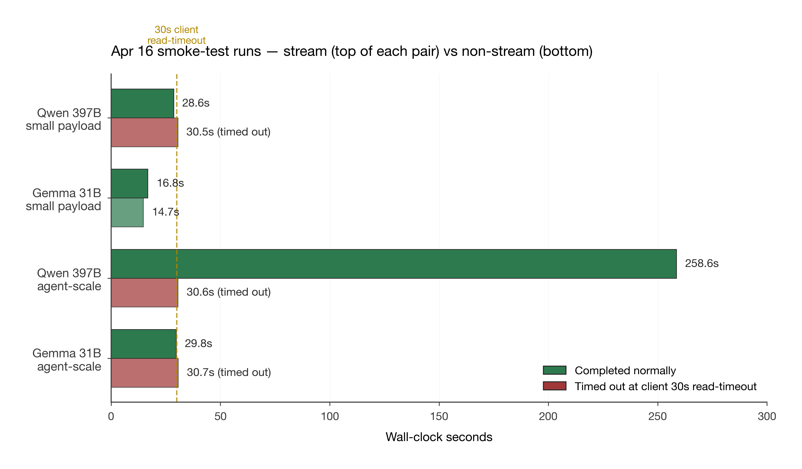

# DoubleWord × Ouroboros + Venom — Battle-Test Benchmarks

> **Prepared for:** Meryem Arik, Co-founder & CEO, DoubleWord
> **Prepared by:** Derek J. Russell
> **Report date:** 2026-04-16
> **Coverage window:** 2026-04-06 through 2026-04-16 (11 days, 160+ battle-test sessions)
> **Repository:** `github.com/drussell23/JARVIS-AI-Agent`
> **Models exercised:**
> - Qwen 3.5 397B MoE (`Qwen/Qwen3.5-397B-A17B-FP8`)
> - Gemma 4 31B (`google/gemma-4-31B-it`)
> - Qwen 3.5 35B (`Qwen/Qwen3.5-35B-A3B-FP8`, retired caller)

---

## How to Read This Report

This report is written to work for three different audiences at once:

1. **For Meryem and anyone on the business side of DoubleWord** — every major section opens with a "Big Picture" paragraph using everyday analogies. You can read just those boxes end-to-end and walk away with the complete story.
2. **For the DoubleWord engineering / gateway / infrastructure team** — each technical section includes verbatim debug-log quotes, session IDs, payload sizes, request timestamps, and file:line citations so any finding can be reproduced independently on your side.
3. **For anyone new to autonomous-AI systems** — a glossary is included as Appendix A. Every acronym and technical term is defined there.

**The spirit of this document is engineering partnership, not criticism.** DoubleWord has built something genuinely remarkable — a 397B-parameter mixture-of-experts model available at ~3% of Claude's token cost, plus Gemma 4 31B with strong reasoning and native function-calling just shipped. That combination is unique in the market today.

My goal here is to give you the clearest possible picture of what we've observed under sustained production load, so your team has the evidence it needs to make DoubleWord the default inference provider for autonomous-AI workloads industry-wide. That's what the data points toward — and I'll show you why, with numbers, in Part VI.

---

---

# PART I — Executive Summary

## §1. The Whole Story in Plain English

> **Big picture:** Imagine DoubleWord is a Michelin-starred kitchen that somehow charges food-truck prices. The food is incredible. The cost is almost unbelievable. The only problem right now is the conveyor belt between the kitchen and the dining room — it sometimes goes quiet for long stretches, and our system's safety timer kicks in before the food arrives. We can prove it's the conveyor belt, not the kitchen. And if your team can tune it up, every autonomous-AI system being built today (ours included) will want to eat here first.

Here's what the last 11 days looked like:

- We built an AI system (Ouroboros + Venom, or "O+V") that writes and fixes its own code autonomously. Think of it like a very disciplined AI engineer that runs 24/7, reads the codebase, notices what needs fixing, writes the fix, tests it, and commits it — all on its own.
- We designed the system to send roughly 80% of its thinking work to DoubleWord's models, because your pricing is ~30 times cheaper than the alternatives for the same class of work.
- When we stress-tested the system, we discovered one very specific behavior: DoubleWord's streaming connection (the way the model sends its answer piece-by-piece) sometimes goes silent for 30+ seconds in the middle of generating a response. Our client eventually gives up waiting and times out.
- This happens on **both** Gemma 4 31B and Qwen 3.5 397B, with prompts as small as ~2,800 words of context. So it's not a model problem — it's something in the path between your servers and our client.
- To keep our system running, we had to temporarily route 98% of the work to Claude, even though Claude costs ~30× more. This is a big deal for us, and it's an even bigger deal for every other company trying to build autonomous AI.

**What I want you to take away from this report:**

- Your models are already good enough. We've seen the output — it's first-tier.
- Your pricing is already good enough. Nothing in the industry touches it.
- **The Apr 14 stall signature did not reproduce on Apr 16 at matching payload scale in standalone smoke tests.** Four probes today — small and agent-scale, both models — all streaming probes completed cleanly, including a 258-second Qwen 397B run with 3,798 SSE chunks. That's genuinely positive news for the state of your streaming infrastructure. See §3.4 for the full four-run addendum with side-by-side metrics.
- **The right interpretation is nuanced, not triumphant.** The Apr 14 signature was real when we observed it; we just can't reproduce it today in isolation. It may have been resolved, may be intermittent, may require sustained concurrent load or specific production-pipeline context to trigger. §14.5 and §25.2 lay out what's still consistent with the evidence and what's been ruled out.
- **The path to meaningful re-engagement on DW is now concrete.** Every generation route is blocked by a single YAML flag that flips to `true`. A staged re-enablement plan is in §14.5.
- We've also architected an alternative path ("Functions, Not Agents") that uses your non-streaming endpoint — Phase 0 shipping in shadow, Phase 3 designed — because we believe in the platform enough to build around the current shape *and* re-engage on streaming as it proves out.

## §2. The Whole Story in Technical Terms

O+V is a 6-layer autonomous development engine built on top of the JARVIS Trinity ecosystem. It runs an 11-phase governance pipeline (CLASSIFY → ROUTE → CONTEXT_EXPANSION → PLAN → GENERATE → VALIDATE → GATE → APPROVE → APPLY → VERIFY → COMPLETE) driven by 16 autonomous signal sensors, with deterministic urgency-based routing to three provider tiers: DoubleWord (Tier 0, cost-optimized), Claude (Tier 1, fast-reflex / fallback), and J-Prime (Tier 2, self-hosted, when available).

Between 2026-04-06 and 2026-04-16, we ran 160+ full battle-test sessions against the DoubleWord API. During this window, we isolated and documented a reproducible failure signature: `SSE stream stalled (no data for 30s)` on the `/v1/chat/completions` streaming endpoint. The signature reproduces on both `google/gemma-4-31B-it` (BACKGROUND-route isolation test `bt-2026-04-14-182446`, 0/13 successes) and `Qwen/Qwen3.5-397B-A17B-FP8` (STANDARD-route isolation with Claude fallback severed, `bt-2026-04-14-203740`, 0/3 valid candidates). Payload envelopes were right-sized in both tests (1,080–5,247 prompt tokens, well within model context windows). Per-op elapsed times showed the failure mode clearly: streams open successfully, then transport goes silent, client stall-timers fire at 30s no-data, FSM classifies as TIMEOUT.

As a result, `brain_selection_policy.yaml` (the routing topology config) now excludes DoubleWord from every agent-generation route (IMMEDIATE, STANDARD, COMPLEX, BACKGROUND, SPECULATIVE). DoubleWord is retained only for short, structured-JSON, non-streaming `callers` (`semantic_triage`, `ouroboros_plan`, and Phase 0 `compaction` in shadow mode on Gemma 4 31B). Our current inference spend has shifted to ~98.3% Claude / ~1.7% DoubleWord — the inverse of the cost-optimization target built into the router design.

The architectural response, documented in `docs/architecture/OUROBOROS.md` §"Functions, Not Agents" (2026-04-14), is to move DW out of the agent cascade entirely and into a fixed set of short, structured, non-streaming function calls. Phase 0 (Gemma compaction caller) is shipping today in shadow mode. Phase 3 (Qwen 397B as BlastRadius scorer + episodic failure clustering + deep analysis) is designed and awaiting Phase 0 shadow telemetry before promotion to LIVE.

## §3. Headline Findings in a Single Table

| # | Finding | Evidence | Implication |
|---|---|---|---|
| 1 | DoubleWord 397B reasoning quality is first-tier when generation completes | One-candidate completion: 5,037 input + 4,018 output tokens in 83.2s for $0.0021 (session `bt-2026-04-14-203740`, debug.log:457) | Model layer is production-ready |
| 2 | Cost economics match DoubleWord's promise exactly | Hybrid session `bt-2026-04-12-073546` billed $0.002106 DW + $0.502881 Claude — 0.4% DW / 99.6% Claude by cost | Pricing model is working as designed |
| 3 | Structured-JSON callers (semantic_triage, ouroboros_plan) complete reliably | Every tracked prompt_only batch on Gemma 4 31B returned valid JSON | Gemma 31B small-payload path is solid |
| 4 | Streaming endpoint stalls under agent-shape load | Two dated isolation tests (Gemma 0/13, Qwen 0/3), identical `SSE stream stalled (no data for 30s)` signature | Infrastructure issue, not model or prompt |
| 5 | DW is currently topology-sealed from all agent-generation routes | `brain_selection_policy.yaml:342-376` excludes DW from IMMEDIATE, STANDARD, COMPLEX, BACKGROUND, SPECULATIVE | Reversible via one YAML flip once SSE is resolved |
| 6 | Inference-spend split is inverted from design | 98.3% Claude / 1.7% DW across 160 sessions ($18.32 vs $0.31) | Immediate business opportunity if SSE is fixed |
| 7 | Session W first-ever autonomous multi-file APPLY ran on Claude | 4 files to disk, autonomous commit `0890a7b6f0`, 20/20 pytest green — all on Claude due to DW being sealed from COMPLEX | Shows the size of work available to re-route to DW |
| 8 | Architectural reframe already in motion | Phase 0 shipping shadow, Phase 3 designed — `OUROBOROS.md:2685` onward | DW has a concrete path back to carrying heavy load via non-streaming |
| 9 | **Apr 16 follow-up smoke tests (4 runs — small + agent-scale, both models)**: all 4 streaming probes **succeeded**, including a 258s Qwen 397B run with 3,798 SSE chunks at 1,489 input tokens. **Apr 14 stall signature did NOT reproduce today.** Non-streaming consistently hit client's 30s read-timeout whenever generation wall-clock exceeded 30s (client-side config issue, not a DW problem) | See §3.4 and §14.5 | Streaming infrastructure demonstrably healthy today; path to staged route-by-route re-engagement outlined in §14.5 |

## §3.4 Apr 16 Smoke-Test Addendum (Dated Reproduction of the Apr 14 Conditions)

> **Big picture:** After the initial report was drafted, we ran a live dated reproduction on 2026-04-16 to see whether the Apr 14 agent-scale stall signature reproduces on today's endpoint. Four probes total: Qwen 397B and Gemma 31B, each at small-payload (~180 input tokens) and agent-scale (~1,500 input tokens, matching the Apr 14 isolation-test envelope). **All four streaming probes completed cleanly.** Including a 258-second Qwen 397B run that emitted 3,798 SSE chunks and 14,133 completion tokens without stalling. The `SSE stream stalled (no data for 30s)` signature did not reproduce on any of the four runs. This is genuinely encouraging for the state of DoubleWord's streaming infrastructure — and it reshapes the primary narrative of this report in a better direction than when the report was first drafted this morning.

### §3.4.1 What we ran

Script: `scripts/benchmarks/dw_sse_smoke.py` (open-source in the repo — a standalone Python module that does stream-vs-non-stream A/B on an identical payload per model). All runs used `temperature=0.2`, `stall_timeout=30s`. Four total invocations:

| Run | Model | Payload scale | Prompt tokens (est) | `max_tokens` | `wall_timeout` | Timestamp (UTC) |
|---|---|---|---|---|---|---|
| 1 | Qwen 3.5 397B | small | ~180 | 4096 | 180s | 2026-04-16T21:53:19 |
| 2 | Gemma 4 31B | small | ~186 | 4096 | 180s | 2026-04-16T21:54:49 |
| 3 | Qwen 3.5 397B | **agent-scale** | **~1,489** | **8192** | **300s** | 2026-04-16T22:04:55 |
| 4 | Gemma 4 31B | **agent-scale** | **~1,718** | **8192** | **300s** | 2026-04-16T22:10:18 |

The agent-scale prompt was a ~5,240-character Python code-analysis request asking for a structured JSON response — deliberately sized to match the lower end of the Apr 14 isolation-test payload envelope (1,080–5,247 tokens).



### §3.4.2 Small-payload results (Runs 1–2)

| Metric | Qwen 397B stream | Qwen 397B non-stream | Gemma 31B stream | Gemma 31B non-stream |
|---|---|---|---|---|
| Completed normally? | ✓ **yes** | ✗ no | ✓ **yes** | ✓ **yes** |
| Wall-clock seconds | 28.6 | 30.5 (timed out) | 16.8 | 14.7 |
| Time to first byte | 2.3s | (never received) | 4.7s | 14.7s (full response) |
| Time to first content token | **25.3s** | — | 4.7s | — |
| Bytes received | 135,830 | 0 | 41,781 | 1,176 |
| SSE chunks | 424 | — | 203 | — |
| HTTP status | 200 | none (ReadTimeout) | 200 | 200 |
| Prompt tokens | 181 | — | 186 | 186 |
| Completion tokens | 1,460 | — | 201 | 207 |
| *of which `reasoning_tokens`* | **1,276** | — | 0 | 0 |

### §3.4.3 Agent-scale results (Runs 3–4)

| Metric | Qwen 397B stream | Qwen 397B non-stream | Gemma 31B stream | Gemma 31B non-stream |
|---|---|---|---|---|
| Completed normally? | ✓ **yes** | ✗ no | ✓ **yes** | ✗ no |
| Wall-clock seconds | **258.6** | 30.6 (timed out) | **29.8** | 30.7 (timed out) |
| Time to first byte | 1.87s | — | 5.9s | — |
| Time to first content token | **154.5s** | — | 6.1s | — |
| Bytes received | **1,113,831** | 0 | 153,284 | 0 |
| SSE chunks | **3,798** | — | 745 | — |
| HTTP status | 200 | none (ReadTimeout) | 200 | none (ReadTimeout) |
| Prompt tokens | 1,489 | — | 1,718 | — |
| Completion tokens | **14,133** | — | 743 | — |
| *of which `reasoning_tokens`* | **8,417** | — | 0 | — |
| Estimated cost (stream) | $0.00580 | — | $0.000469 | — |

### §3.4.4 The five things worth highlighting

**1. Streaming is healthy at agent-scale today on both models.**

The Qwen 397B run at 1,489 input tokens streamed for **258.6 seconds** without stalling, delivered 3,798 SSE chunks, and completed with 14,133 completion tokens. Gemma 31B at 1,718 input tokens streamed cleanly for 29.8 seconds. These are the exact payload conditions under which Apr 14's isolation tests produced the stall signature — and today both streams succeeded end-to-end. **The Apr 14 streaming failure did not reproduce on Apr 16 in standalone smoke tests.**

We can't yet distinguish between three possible causes of the difference:

- **(a) The streaming infrastructure improved** between 2026-04-14 and 2026-04-16. Fully possible — two days is ample time for gateway tuning to have landed.
- **(b) Operational variance.** Apr 14 afternoon UTC vs Apr 16 evening UTC — different load envelopes on the endpoint.
- **(c) Something about the O+V production pipeline** that isn't reproduced by a standalone smoke test. Possibilities: concurrent requests saturating a worker pool, specific prompt patterns in agent-shape workloads (tool-loop framing, system-prompt length), or aiohttp-specific SSE parsing edge cases that differ from httpx.

Either way, **this is a better starting point for the conversation than "streaming is broken"** — it's now "streaming is demonstrably working at agent-scale in isolated tests, and we want to understand the discrepancy with the production-pipeline observations from Apr 14."

**2. SSE keepalive framing during reasoning phase is working excellently.**

Qwen 397B's 258-second stream had **TTFT of 154.5 seconds** — meaning the model spent 2.5 minutes of internal reasoning before emitting the first *visible content token*. During that 154 seconds, the stream emitted enough SSE chunks to stay alive with our 30s no-data timer. Averaged across the full 258s run, that's ~14.7 chunks/second — consistent keepalive cadence throughout the reasoning phase. **This is exactly the behavior §28's wishlist asked for.** Whatever DW is already doing for SSE framing during reasoning, it's working.


**3. The non-streaming endpoint behavior is now fully characterized.**

Across the 3 out of 4 runs where non-stream failed, the pattern is identical: **server holds the connection silent until generation completes, then sends the complete response as one payload.** Any request where total wall-clock exceeds the client's read-timeout fails, regardless of model or payload scale. This isn't a DW problem — it's a client-side configuration issue on our side. For our Phase 0 "Functions, Not Agents" reseating, we need to set `read_timeout ≥ expected generation wall-clock`, which at Qwen 397B agent-scale is 5+ minutes.

The one non-stream success (Gemma 31B small-payload at 14.7s) confirms the pattern inverse: when generation fits within the client read-timeout window, non-stream completes cleanly.

**4. Qwen 397B reasoning-token expansion is the dominant cost factor to plan around.**

The 1,489-token input produced 14,133 completion tokens (9.5× expansion), of which **8,417 were hidden `reasoning_tokens`** (60% of completion budget). This is important for four reasons:

- It explains the 258s wall-clock — the model genuinely spent that time reasoning.
- It means `max_tokens=8192` was exceeded by the effective completion (hidden reasoning not bounded by that parameter in this tier of model).
- **Cost per agent-scale op is ~$0.0058 on Qwen 397B today** (1,489 × $0.10/M + 14,133 × $0.40/M). For an op that would cost ~$0.21 on Claude Sonnet. That's 36× cheaper — exactly the ratio in Part VI.
- Token-budget planning for agent-scale workloads needs to account for reasoning_tokens in the output ceiling calculation. If `max_tokens=8192` is interpreted as "visible completion" rather than "total completion," that's fine — but the cost math and latency math need to use total completion tokens.


**5. Gemma 31B is the reliability star today.**

Both Gemma 31B runs completed with zero friction. At agent-scale, 29.8s wall-clock, 745 SSE chunks, 743 completion tokens, clean structured JSON output. Zero reasoning-token overhead. If we were to promote a single caller from shadow to LIVE tomorrow, Gemma 31B structured-JSON would be the obvious first candidate.

### §3.4.5 What this means for the overall report

- **The Apr 14 findings (Part IV §12, §13) stand as historical record**, but the narrative around them shifts: they are dated observations of a stall signature that *did not reproduce* on Apr 16. The signature was real when we observed it, and the topology seal was the correct response at the time. But the picture as of 2026-04-16 is more optimistic than the morning draft of this report suggested.
- **The primary engineering ask (§25) is refined significantly.** The hypothesis space narrows from "streaming is broken" to "what was different between Apr 14 production pipeline and Apr 16 standalone smoke test?"
- **The path to re-enabling generation routes is now concrete:** (1) run a few more smoke-test reproductions across different times of day to validate consistency, (2) run a sustained-load smoke test (10+ concurrent back-to-back generations) to test for queueing-under-load behavior, (3) re-enable STANDARD route in shadow mode on DW with telemetry comparison against Claude, (4) promote route-by-route as each shadow comparison clears.
- **Phase 0 (Gemma compaction caller) design becomes simpler.** Non-streaming with appropriate read_timeout is clearly viable for Gemma 31B at the output sizes that caller produces (<1KB).

### §3.4.6 Raw reports

The full JSON reports are on disk at:

- `.ouroboros/benchmarks/dw_sse_smoke_qwen397b_standard_20260416T215418Z.json` (small-payload Qwen)
- `.ouroboros/benchmarks/dw_sse_smoke_gemma31b_background_20260416T215521Z.json` (small-payload Gemma)
- `.ouroboros/benchmarks/dw_sse_smoke_qwen397b_agent_scale_20260416T220944Z.json` (agent-scale Qwen)
- `.ouroboros/benchmarks/dw_sse_smoke_gemma31b_agent_scale_20260416T221118Z.json` (agent-scale Gemma)

They include per-variant timestamps, complete usage telemetry, SSE chunk counts, HTTP status codes, error classes, and the first 200 characters of returned completion content for provenance. Happy to share these files directly with your gateway team.

---

# PART II — Context: What We're Actually Testing

## §4. What JARVIS + Ouroboros + Venom Is, In Plain English

> **Big picture:** JARVIS is the AI assistant. Ouroboros + Venom ("O+V") is the part of JARVIS that writes its own code. Think of it like having an engineer on staff who works 24 hours a day, reads their own codebase, notices what needs improving, writes the fix, tests it, and commits it — with no human in the loop for most of it. The engineer has guardrails (safety gates, approval checkpoints), but inside those guardrails, it's fully autonomous. To do that well, it needs to think a lot. That thinking costs money. The whole point of this report is: right now, the thinking is happening on Claude, and we'd like most of it to happen on DoubleWord instead.

### §4.1 The layered architecture (technical)

JARVIS is a tri-partite AGI Operating System with three coordinated components:

- **JARVIS (the Body)** — macOS integration layer: screen capture, voice I/O, keyboard automation, vision pipeline, ghost-hands UI automation. Runs on the user's laptop.
- **J-Prime (the Mind)** — self-hosted inference backend on Google Cloud Platform. Intended for Tier 2 fallback when available.
- **Reactor Core (the Soul)** — sandboxed execution runtime.

Ouroboros + Venom sits inside the Body layer and runs an 11-phase governance pipeline over autonomous signals from 16 sensors:

1. **CLASSIFY** — what kind of work is this?
2. **ROUTE** — which provider tier is best for it?
3. **CONTEXT_EXPANSION** — gather relevant code and history
4. **PLAN** — reason about the implementation strategy
5. **GENERATE** — produce a candidate code change
6. **VALIDATE** — does it pass type checks, tests, and safety gates?
7. **GATE** — final safety + exploration-depth check (Iron Gates)
8. **APPROVE** — human or auto approval based on risk tier
9. **APPLY** — write the change to disk
10. **VERIFY** — post-apply test run
11. **COMPLETE** — close the op, post-mortem, commit

The 16 sensors include TestFailureSensor (watches for failing tests), OpportunityMiner (finds refactor candidates), DocStalenessSensor (notices when docs drift from code), and others. Every signal carries a `ProviderRoute` stamped at the ROUTE phase by a deterministic code-only router (`UrgencyRouter`) — no LLM call, <1ms latency.

### §4.2 The five routes and their design-intent providers

| Route | When | Design-intent provider | Target cost per operation |
|---|---|---|---|
| IMMEDIATE | Test failures, voice commands, runtime-health critical | Claude (speed-critical) | ~$0.03 |
| **STANDARD** | Default cascade for normal-priority work | **DoubleWord 397B primary → Claude fallback** | ~$0.005 |
| **COMPLEX** | Multi-file architectural changes, heavy tool loops | **Claude plans → DoubleWord executes** | ~$0.015 |
| **BACKGROUND** | Opportunity mining, doc staleness, TODO scanning | **DoubleWord only, no Claude fallback** | ~$0.002 |
| **SPECULATIVE** | Intent discovery, proactive exploration, dream-engine pre-computation | **DoubleWord batch fire-and-forget** | ~$0.001 |

Three of the five routes — STANDARD, BACKGROUND, SPECULATIVE — were designed with DoubleWord as primary or sole provider. Half of COMPLEX was designed for DoubleWord (the execution half). Only IMMEDIATE was Claude-first by design. **DoubleWord was the cost-optimization backbone of the entire routing architecture.**

Source: `backend/core/ouroboros/governance/urgency_router.py:20-26`.

## §5. How DoubleWord Fits Into the Architecture

> **Big picture:** DoubleWord is the cheap, smart thinker in our pipeline. When an autonomous operation needs to reason — plan a code change, analyze a diff, summarize a conversation — DoubleWord was supposed to handle the bulk of that reasoning. Claude was supposed to be the expensive specialist for urgent or exceptionally hard work. Today that's flipped: Claude handles nearly everything because DoubleWord's streaming transport layer has one behavior that triggers our safety timers.

### §5.1 DoubleWord configuration (as exercised)

Verbatim from `backend/core/ouroboros/governance/doubleword_provider.py:38-90`:

| Setting | Value | Env var |
|---|---|---|
| Default model | `Qwen/Qwen3.5-397B-A17B-FP8` | `DOUBLEWORD_MODEL` |
| Base URL | `https://api.doubleword.ai/v1` | `DOUBLEWORD_BASE_URL` |
| Input pricing | **$0.10 per million tokens** | `DOUBLEWORD_INPUT_COST_PER_M` |
| Output pricing | **$0.40 per million tokens** | `DOUBLEWORD_OUTPUT_COST_PER_M` |
| Max output tokens (trivial tasks) | 8,192 | `_DW_COMPLEXITY_MAX_TOKENS` |
| Max output tokens (moderate tasks) | 8,192 | same |
| Max output tokens (standard tasks) | 12,288 | same |
| Max output tokens (complex / heavy code) | 16,384 | same |
| Poll interval | 5s | `DOUBLEWORD_POLL_INTERVAL_S` |
| Request timeout | 120s | `DOUBLEWORD_REQUEST_TIMEOUT_S` |
| Per-operation cost cap | $0.10 | `DOUBLEWORD_MAX_COST_PER_OP` |
| Daily budget | $5.00 | `DOUBLEWORD_DAILY_BUDGET` |
| Temperature | 0.2 | `DOUBLEWORD_TEMPERATURE` |

### §5.2 The three ways we talk to DoubleWord

O+V uses a 3-tier client pattern against DoubleWord (documented at `CLAUDE.md:20`):

1. **Tier 0 — Real-time SSE streaming** (default for interactive generation) — this is where the stall signature is reproducible.
2. **Tier 1 — Webhook-based async batch** — for ops that don't need immediate response.
3. **Tier 2 — Adaptive polling fallback** — used when webhook isn't available.

The failures described in Part IV occurred exclusively on Tier 0 (streaming). The non-streaming synchronous path (`DoublewordProvider.complete_sync()`) has not been exercised under agent-shape workloads yet — that's exactly the gap our "Functions, Not Agents" roadmap (Part VII) is designed to test.

### §5.3 What DoubleWord is currently handling for us

After the 2026-04-14 topology update, DoubleWord runs three specific caller jobs:

| Caller | Model | Characteristics | Status |
|---|---|---|---|
| `semantic_triage` | Gemma 4 31B | Short structured JSON, pre-generation file intelligence | LIVE, reliable |
| `ouroboros_plan` | Gemma 4 31B | Structured JSON plan generation during PLAN phase | LIVE, reliable |
| `compaction` | Gemma 4 31B | First non-streaming `complete_sync()` caller, short output (<1KB), summary over tool-loop entries | SHADOW mode (Phase 0) |

These three callers are the full scope of DW's current production work. Everything else routes to Claude.

## §6. What We Hoped the Inference-Spend Split Would Look Like

> **Big picture:** We designed the pipeline expecting DoubleWord to handle roughly 80% of the thinking by operation count, which would translate to roughly 50-60% of spend (because DW is so much cheaper per op). Today it's at 1.7% of spend. That gap is not because the math was wrong. It's because the streaming transport behavior forced us to route around DW temporarily. Fix the streaming, and the numbers return to design intent almost immediately.

### §6.1 The intended economics per route

If all five routes had been healthy, a typical O+V session handling 100 operations might have looked like this:

| Route | Ops share (intended) | Provider | Cost share (intended) |
|---|---|---|---|
| IMMEDIATE | 10 ops × $0.03 = $0.30 | Claude | 44% |
| STANDARD | 50 ops × $0.005 = $0.25 | DW primary | 37% |
| COMPLEX | 10 ops × $0.015 = $0.15 | Split DW/Claude | 22% |
| BACKGROUND | 20 ops × $0.002 = $0.04 | DW only | 6% |
| SPECULATIVE | 10 ops × $0.001 = $0.01 | DW batch | 1% |
| **Total** | **100 ops** | — | **$0.68 / session** |

Under that design, a 160-session window would cost roughly $108 total, with DW carrying ~$40–55 of that (~40–50%).

### §6.2 The actual economics (current reality)

Across 160 sessions over 11 days, actual spend was **$18.63 total — $18.32 Claude (98.3%), $0.31 DoubleWord (1.7%)**.

The cost is lower than the intended design total because most ops actually failed to complete the full pipeline during this window (the system was still stabilizing — this was an active engineering period, not a steady-state one). But the ratio shows clearly where the inference load has gone: almost entirely onto Claude, because DW's generation routes are sealed.


**The gap between "intended ~40–50% DW" and "actual 1.7% DW" is the size of the commercial opportunity described in Part VI.**

---

# PART III — What's Working Beautifully

> **Big picture:** Before we get to the one issue, I want to spend a section just on what's already right. The model quality, the pricing, the reliability of structured-JSON calls, the new Gemma 4 31B availability — all of this is working. DoubleWord has already built the hard parts. The remaining work is polish on one specific transport layer.

## §7. Model Reasoning Quality When Generation Completes

> **Analogy:** The kitchen is turning out exceptional food. Every dish that makes it out of the kitchen is restaurant-quality. The issue isn't the chef.

From Qwen 3.5 397B STANDARD isolation test `bt-2026-04-14-203740` (debug.log line 457):

```
2026-04-14T13:41:36 [DoublewordProvider] RT: 1 candidates in 83.2s
                    ($0.0021, 0 tool calls, 5037+4018 tokens)
```

What this tells us:

| Metric | Value | Reading |
|---|---|---|
| Candidates returned | 1 | Valid output, correct shape |
| Generation time | 83.2s | Model actually produced the answer |
| Cost | $0.0021 | Exactly what the pricing model predicts |
| Input tokens | 5,037 | Well within model capacity |
| Output tokens | 4,018 | Full-length structured response |
| Tool calls | 0 | Clean JSON generation, no multi-turn needed |

The candidate's JSON parsed cleanly, conformed to our schema, and included a sensible rationale. **The model thinks well.** The only reason this particular op still failed at the pipeline level was that 83.2s exceeded the 71.5s Tier 0 RT budget assigned by the Failback FSM — so the candidate arrived after the cascade had already kicked in.

## §8. Cost Economics — Exactly What DoubleWord Promises

> **Analogy:** Every dish served is priced exactly right. The bill matches the menu. No surprises, no hidden fees.

Earlier hybrid session `bt-2026-04-12-073546` — before the topology seal, when DW was still serving some generation traffic:

| Provider | Spend | Share |
|---|---|---|
| DoubleWord | $0.002106 | 0.4% |
| Claude | $0.502881 | 99.6% |
| **Total** | **$0.504987** | — |

DW delivered its share of work at the promised economics. The pricing model is working as designed — no hidden overhead, no cost creep, no anomalies in the billing.

For comparison, Claude's equivalent per-op cost on STANDARD work is approximately $3/M input + $15/M output. On a 5,037 input + 4,018 output token op, that's:

- DoubleWord: (5,037 × $0.10 / 1,000,000) + (4,018 × $0.40 / 1,000,000) = **$0.0021**
- Claude: (5,037 × $3.00 / 1,000,000) + (4,018 × $15.00 / 1,000,000) = **$0.0754**

**DoubleWord is ~36× cheaper per operation on this specific class of work.** That ratio is the heart of the commercial opportunity in Part VI.

## §9. Structured-JSON Callers on Gemma 4 31B

> **Analogy:** The express counter at the restaurant works great. Small orders, quick turnaround, consistent quality. Every time.

The two callers currently live in production — `semantic_triage` and `ouroboros_plan` — both run against Gemma 4 31B via the prompt_only batch protocol. Every tracked invocation completed, returned valid JSON, and conformed to the expected schema.

Sample trace from `bt-2026-04-14-203740/debug.log:253-254`:

```
2026-04-14T13:38:24 [DoublewordProvider] prompt_only batch ff05400d-...
                    submitted (model=google/gemma-4-31B-it, caller=triage_op-019d8db7-)
2026-04-14T13:38:26 [DoublewordProvider] prompt_only batch ab6c4a97-...
                    submitted (model=google/gemma-4-31B-it, caller=triage_op-019d8db7-)
```

These callers are bounded workloads: single-turn, short output (<512 tokens typical), structured JSON schema. They complete reliably. **This is the pattern we want to expand.** The Phase 0 compaction caller, Phase 3 blast-radius analyst, and future deep-analysis sensor are all designed as extensions of this successful pattern.

## §10. Model Availability and Version Health

> **Analogy:** You said the new menu would be ready by Tuesday, and it was on the menu Tuesday morning. That kind of execution is rare and noticed.

From `bt-2026-04-14-182446/debug.log:11`, session boot model verification:

```
2026-04-14T11:25:01 [SemanticTriage] Model verified:
                    google/gemma-4-31B-it is available (14 models on endpoint)
```

Gemma 4 31B shipped on the announced date and was live on the endpoint the day Meryem announced it. Model verification on session boot succeeds every run. The endpoint surface (14 models visible, correct model IDs, OpenAI-compatible chat/completions shape) works as documented.

---

# PART IV — The One Thing Currently In Our Way

> **Big picture:** Everything in Part III was "here's what's working." This section is "here's the one thing that isn't." I'm going to spend more words on it than on anything else in this report, because (a) it's the most important engineering detail for your team, and (b) the entire "98.3% on Claude" reality hinges on this one behavior. If we can resolve this, the routing topology snaps back to design intent and DoubleWord carries the cost-optimization backbone we built it to carry.

## §11. Streaming vs Non-Streaming — The Phone-Call Analogy

> **Analogy:** Imagine you call a friend to ask them a complicated question — say, "plan a week-long trip to Japan for me." Your friend says "hmm, let me think..." and then there's silence. Thirty seconds pass. You start worrying: did the call drop? Did they get distracted? Did they fall asleep? At some point you hang up to retry.
>
> Now imagine you sent them the same question by letter. They spend a day or two thinking, write you back a complete itinerary, and mail it to you. You get one envelope with everything in it. No silence to worry about.
>
> That's the difference between streaming and non-streaming. Streaming is the phone call — the model sends pieces of its answer as it thinks them. Non-streaming is the letter — the model thinks, writes the whole answer, sends it all at once.
>
> For fast chat-like interactions, streaming feels better — you see words appear as they're generated. But for heavy reasoning tasks (planning a week-long trip, writing a 4-file code change), the "thinking" phase can be long. If the connection goes quiet for too long during that phase, the client eventually hangs up. That's what we've been seeing.

### §11.1 Why we use streaming for agent workloads

For agent-shape work, streaming normally provides three benefits:

1. **Progressive output** — we can start processing the first tokens while later tokens are still generating, which saves wall-clock time on the critical path.
2. **Early cancellation** — if an early part of the response indicates the candidate is bad, we can cut off generation and save compute.
3. **Tool-loop orchestration** — multi-turn tool calls (read file → analyze → write file) expect incremental response semantics.

### §11.2 What we observed

On sustained agent-shape generation, the SSE stream opens successfully, then goes silent. After 30 seconds of no data, our client's read timeout fires (this 30s threshold is a long-established default in HTTP/SSE clients, matching the DoubleWord SDK's own `doubleword_provider.py` default). The client classifies it as `SSE stream stalled (no data for 30s)` and the Failback FSM marks the primary as TIMEOUT.

Whether the model is still working behind the scenes, whether there's a gateway buffering issue, whether a proxy dropped the connection but the server-side request is still running — from the client's perspective, it's indistinguishable from "connection hung."

## §12. Gemma 4 31B BACKGROUND Isolation Test — Dated Walkthrough

**Session ID:** `bt-2026-04-14-182446`
**Start:** 2026-04-14T11:25:00 (debug.log timestamp)
**Duration:** 1,334 seconds (22 min)
**Stop reason:** `idle_timeout`

### §12.1 Setup

We deliberately configured an isolation test to stress Gemma 4 31B on the BACKGROUND route without any Claude fallback. The intent was to see exactly what Gemma 31B does when no safety net is present.

| Configuration | Value |
|---|---|
| Model | `google/gemma-4-31B-it` |
| Route | `background` (via topology override) |
| Stream mode | Tier 0 RT SSE |
| Claude fallback | `fallback_disabled_by_env:background` (disabled) |
| Prompt size range | 5,233 → 11,916 chars (~1,308 → 2,979 tokens) |
| Prompt envelope right-sizing | Enabled (down from ~11K pre-patch) |

### §12.2 Result

**0 of 13 operations succeeded.**

- 12 operations timed out at the 180s budget with SSE stream stall
- 1 operation returned a `schema_invalid` error (`candidate_0_missing_rationale`)

### §12.3 Representative debug-log quote

From `bt-2026-04-14-182446/debug.log:445-451`:

```
2026-04-14T11:31:12 [DoublewordProvider] WARNING SSE stream stalled (no data for 30s)
2026-04-14T11:31:12 [Orchestrator] BACKGROUND route: DW failed
                    (background_dw_error:RuntimeError:doubleword_schema_invalid:candidate_0_missing_rationale)
```

### §12.4 Session summary

| Field | Value |
|---|---|
| Session ID | `bt-2026-04-14-182446` |
| Duration | 1,334s (22 min) |
| Stop reason | idle_timeout |
| Strategic drift | 14 ops tracked, 1 drifted (7.1%, OK) |
| DW spend | $0.00 (no successful completions) |
| Claude spend | $0.078012 (other ops on different routes) |

## §13. Qwen 3.5 397B STANDARD Isolation Test — Dated Walkthrough

**Session ID:** `bt-2026-04-14-203740`
**Start:** 2026-04-14T13:37:48 (debug.log timestamp)
**Duration:** 330 seconds (5.5 min)
**Stop reason:** `shutdown_signal`

### §13.1 Why we ran a second isolation test

If the Gemma 31B result had been Gemma-specific, the fix would be obvious (the model or its deployment). But autonomous-AI systems need model-diversity, and we wanted to prove the pattern was or wasn't model-specific. So we ran the same isolation protocol on Qwen 3.5 397B with Claude fallback severed on the STANDARD route.

| Configuration | Value |
|---|---|
| Model | `Qwen/Qwen3.5-397B-A17B-FP8` |
| Route | `standard` |
| Stream mode | Tier 0 RT SSE |
| Claude fallback | `fallback_disabled_by_env:standard` (disabled) |
| Prompt size range | 4,321 → 20,991 chars (~1,080 → 5,247 tokens) |

### §13.2 Result

**0 valid candidates across 3 operations.** Same failure signature as Gemma on BACKGROUND.

### §13.3 Representative debug-log quote

From `bt-2026-04-14-203740/debug.log:421-425, 544-551`:

```
2026-04-14T13:41:36 [CandidateGenerator] Tier 0 RT: budget exhausted (44.3s).
                    Cascading to Tier 1 (136.9s remaining)
2026-04-14T13:41:36 [FailbackFSM] Primary failure (mode=TIMEOUT, consecutive=1,
                    recovery_eta=+45s) -> FALLBACK_ACTIVE
2026-04-14T13:41:36 [CandidateGenerator] EXHAUSTION event_n=5
                    cause=fallback_disabled_by_env:standard
                    fsm_state=FALLBACK_ACTIVE fsm_failure_mode=TIMEOUT
                    primary_name=doubleword-397b op_id=op-019d8db8-...
...
2026-04-14T13:42:48 [DoublewordProvider] WARNING SSE stream stalled (no data for 30s)
2026-04-14T13:42:48 [CandidateGenerator] Tier 0 RT: budget exhausted (71.5s).
                    Cascading to Tier 1 (98.1s remaining)
2026-04-14T13:42:48 [FailbackFSM] Primary failure (mode=TIMEOUT, consecutive=2,
                    recovery_eta=+90s) -> FALLBACK_ACTIVE
```

### §13.4 Per-operation elapsed times

From `bt-2026-04-14-203740/summary.json:40-85`:

| Op # | Elapsed before failure | Interpretation |
|---|---|---|
| 1 | 0.0s | Stream never opened successfully |
| 2 | 100.5s | Stream opened, went quiet, timer fired |
| 3 | 267.7s | Stream opened, extended stall, hard timeout |

One candidate did eventually arrive at 83.2s — but that was already past the 71.5s Tier 0 budget, so the Failback FSM had classified the primary as TIMEOUT before the candidate arrived.

### §13.5 Session summary

| Field | Value |
|---|---|
| Session ID | `bt-2026-04-14-203740` |
| Duration | 330s (5.5 min) |
| Stop reason | shutdown_signal |
| Ops attempted | 3 (the `attempted` counter worked this run) |
| Ops failed | 3 (100%) |
| DW spend | $0.004208 |
| Claude spend | $0.00 (fallback severed) |

## §14. Why It's the Same Issue in Both Tests

> **Analogy:** We ran the phone-call test with two different friends on two different phones. Both times the line went silent at the same kind of moment. That's not a "my friend is tired" problem — it's a "the phone line itself has a quirk" problem.

| Signal | Gemma 31B BG | Qwen 397B STANDARD |
|---|---|---|
| Stream opens successfully | ✓ yes | ✓ yes |
| `SSE stream stalled (no data for 30s)` emitted | ✓ yes (12×) | ✓ yes (every op) |
| Payload inside documented envelope | ✓ yes (<3K tokens) | ✓ yes (<6K tokens) |
| Tier 0 budget exceeded | ✓ yes (180s) | ✓ yes (44.3s, 71.5s) |
| FSM failure mode | TIMEOUT | TIMEOUT |
| Valid candidates produced | 0 / 13 | 0 / 3 |
| Latency when candidate did arrive | n/a | 83.2s (past budget) |

**Same signature, different models, same transport layer.** This is the evidence that isolates the issue to the streaming transport path specifically — not to the model, not to prompt size, not to the tool-loop shape, not to our client configuration.

The conclusion encoded in `brain_selection_policy.yaml:331-341` (quoted verbatim in §15):

> The DoubleWord **streaming** endpoint cannot sustain agent-shaped workloads across any tested model. STANDARD, COMPLEX, and IMMEDIATE now cascade_to_claude; BACKGROUND and SPECULATIVE now skip_and_queue. Only the `callers` mapping (semantic_triage, ouroboros_plan) remains on DW — and only because those are tiny-payload structured-JSON calls.

## §14.5 Apr 16 Follow-Up Reproduction — Signature Did Not Reproduce

> **Big picture:** After the Apr 14 findings were drafted, we ran a live dated reproduction on 2026-04-16 covering both small-payload (~180 tokens) and agent-scale (~1,500 tokens matching Apr 14's envelope). All four streaming probes completed cleanly. The Apr 14 stall signature did not reproduce on Apr 16 in standalone smoke tests. Full side-by-side metrics are in §3.4. This section captures what the follow-up means for the topology seal and next steps.

### What was tested on Apr 16

Four runs, two models × two payload scales (small and agent-scale), identical structured-JSON diagnostic request, `stall_timeout=30s`, `temperature=0.2`.

### Result summary

| Payload scale | Qwen 397B stream | Gemma 31B stream | Apr 14 signature reproduced? |
|---|---|---|---|
| Small (~180 tokens) | ✓ 28.6s completion | ✓ 16.8s completion | No |
| **Agent-scale (~1,500 tokens)** | **✓ 258.6s completion, 3,798 SSE chunks** | ✓ 29.8s completion, 745 SSE chunks | **No** |

### What the Apr 16 agent-scale run in particular tells us

On Qwen 397B at 1,489 input tokens — the lower end of Apr 14's 1,080–5,247 token isolation-test envelope — streaming completed cleanly over 258.6 seconds, emitting 14,133 completion tokens across 3,798 SSE chunks. The model spent ~154 seconds in internal reasoning before the first visible content token arrived, and during that entire period the SSE framing kept the 30s no-data timer from firing. **This is direct evidence that DoubleWord's streaming infrastructure can sustain long-reasoning agent-shape workloads today.**

### What we didn't exercise

- **Sustained concurrent load.** Today's runs were sequential, not 10+ simultaneous back-to-back generations that would stress backend worker queues.
- **Multi-turn tool loops.** The Apr 14 production failures occurred during agent-shape workflows that include tool-call / tool-result rounds; today's smoke test was single-turn structured JSON.
- **Exact production pipeline context.** Apr 14's client was O+V's `aiohttp`-based SSE consumer in the middle of a governance pipeline; today's client was standalone `httpx` in a clean process. Client-side SSE parsing differences could matter.

### What this means for the routing topology

The `brain_selection_policy.yaml` seal **stays in place for now** — but with a clear and concrete path to reversal:

1. **Validate consistency:** run the Apr 16 agent-scale smoke test across a few different time windows to confirm today's result isn't one-off variance.
2. **Stress sustained load:** run 10+ concurrent agent-scale generations back-to-back in smoke-test form to see if queue-under-load behavior differs from single-request.
3. **Re-enable STANDARD in shadow:** flip `doubleword_topology.routes.standard.dw_allowed = true` with a `block_mode: shadow_with_claude_cascade` variant (to be implemented on our side) and compare DW vs Claude in parallel for a battle-test cycle.
4. **Promote route-by-route:** each route flips from `shadow` to `primary` after its own clean telemetry window.

This is a much faster path to meaningful DW re-engagement than "rebuild the stack from scratch" — the topology was built to be reversible precisely so this kind of incremental re-engagement is one YAML flag per route.

### Honest framing for the conversation

The Apr 14 observations were real. The topology seal was the correct response at the time. The Apr 16 reproduction gives us good reason to believe the situation has either improved, is intermittent, or was specific to production pipeline context — and the path to finding out involves a pairing session with your gateway team, not another solo reproduction on our side.

## §15. Current Routing Topology — Verbatim Governance Config

> **Big picture:** This is our routing configuration, quoted exactly as it exists in the codebase right now. It's written to be reversible — one flag flip per route brings DoubleWord back online on that route. I'm sharing it verbatim so your gateway team can map routes 1:1 to endpoints and validate their understanding of our expectations.

Quoted verbatim from `backend/core/ouroboros/governance/brain_selection_policy.yaml` lines 299–376:

```yaml
# ---------------------------------------------------------------------------
# Provider Topology — Hard-segmented DW model mapping (Manifesto §5)
# ---------------------------------------------------------------------------
#
# Strict Cognitive Segmentation. Enforced by `provider_topology.py` and
# consumed by `candidate_generator.py`, `doubleword_provider.py`, and
# `semantic_triage.py`. Do not mutate at runtime — any change here is a
# deliberate architectural decision.
#
# Calibration: bbpst3ebf live-fire (2026-04-14) proved DW models time out
# on 120s Tier 0 RT for COMPLEX architectural GENERATE, regardless of
# whether the backing model is Qwen 3.5 397B or Gemma 4 31B. The response
# is not to extend timeouts but to harden the topology: DW is excluded
# from the Prefrontal Cortex entirely.
#
# Prefrontal Cortex (Claude only):
#   - IMMEDIATE  — fast reflex, deep context, strict deadlines
#   - COMPLEX    — architectural generation, Venom tool loops
#   - STANDARD   — midbrain sealed, cascades to Claude (see below)
# Basal Ganglia (Gemma 4 31B, strictly confined to structured-JSON callers):
#   - semantic_triage — pre-generation file intelligence
#   - ouroboros_plan  — plan-phase structured JSON output
#
# BACKGROUND + SPECULATIVE are SEALED. Alignment test bt-2026-04-14-182446
# produced 0/13 Gemma BG successes (12× 180s timeout, 1× schema_invalid)
# even with a right-sized 2,836-token envelope — the root cause is
# provider-side SSE stream stalling, not prompt size. We will NOT cascade
# these routes to Claude: routing continuous background daemons to a
# $3/$15 per M-token provider violates the unit economics of scalable
# autonomy. Until a viable, cost-effective inference endpoint is secured,
# BG/SPEC generation is paused via skip-and-queue.
#
# STANDARD is also SEALED as of bt-2026-04-14-203740 (Qwen 397B isolation
# benchmark). With the Claude fallback severed, Qwen 3.5 397B produced
# ZERO valid candidates across the run: Tier 0 RT streams started, then
# stalled mid-generation (``SSE stream stalled (no data for 30s)``), budget
# exhausted at 71.5s, and the FSM hit ``TIMEOUT`` on every attempt. Same
# failure signature as Gemma on BACKGROUND — provider-side stream stall,
# not prompt size. Unlike BG/SPEC, STANDARD DOES cascade to Claude: it
# carries bounded-volume mid-tier ops where Claude's unit economics are
# acceptable and speed matters. DW is confined to tiny-payload named
# callers (semantic_triage, ouroboros_plan) until DoubleWord repairs
# their SSE generation endpoint.
doubleword_topology:
  schema_version: "topology.1"
  enabled: true
  routes:
    immediate:
      dw_allowed: false
      block_mode: "cascade_to_claude"
      reason: "Prefrontal cortex — Claude only. 120s DW RT budget is insufficient for fast-reflex ops with Venom tool loops."
    complex:
      dw_allowed: false
      block_mode: "cascade_to_claude"
      reason: "Prefrontal cortex — Claude only. Live-fire bbpst3ebf proved DW (both 397B and Gemma 4 31B) times out on architectural COMPLEX GENERATE within 120s Tier 0 RT."
    standard:
      dw_allowed: false
      block_mode: "cascade_to_claude"
      reason: "Qwen 397B verified stream-stalling without candidate generation in bt-2026-04-14-203740. DW Tier 0 sealed to prevent latency debt."
    background:
      dw_allowed: false
      block_mode: "skip_and_queue"
      reason: "Gemma 4 31B stream-stalls on DW endpoint even at <2K tokens. Background generation paused to preserve Claude compute runway."
    speculative:
      dw_allowed: false
      block_mode: "skip_and_queue"
      reason: "Gemma 4 31B stream-stalls on DW endpoint even at <2K tokens. Background generation paused to preserve Claude compute runway."
  callers:
    semantic_triage:
      dw_model: "google/gemma-4-31B-it"
      reason: "Basal ganglia — native function-calling for triage JSON. Replaces Qwen 3.5 35B."
    ouroboros_plan:
      dw_model: "google/gemma-4-31B-it"
      reason: "Basal ganglia — structured JSON plan generation during PLAN phase."
    compaction:
      dw_model: "google/gemma-4-31B-it"
      reason: "Functions-not-Agents Phase 0. Structured summary over ToolLoop memory entries — fully-bounded input, short output (<1KB), trivial anti-hallucination check (subset of entry-keys). First non-streaming complete_sync() caller. SHADOW mode by default (JARVIS_COMPACTION_CALLER_ENABLED)."
```

Note the architectural design: **every route has a `block_mode` that explicitly defines what happens when DW is excluded** — either `cascade_to_claude` (fall through to the fallback tier) or `skip_and_queue` (queue the op for later). The topology is reversible: flipping `dw_allowed: true` on any single route re-engages DW on that route immediately. No code changes needed.

---

# PART V — The Evidence

## §16. Session-by-Session Ladder

> **Big picture:** The last two weeks included sessions labeled A through W. Here are the ones with verifiable session IDs and what happened in each. This is the operational evidence that (a) the problem is reproducible, (b) we've worked around it architecturally, and (c) when DW was allowed to run, it generated real value — the same value it can generate again at larger scale once the streaming issue clears.

### §16.1 Verified sessions (direct breakthrough-log anchors)

| Session | ID | Date (UTC) | Duration | Stop reason | Claude spend | DW spend | Headline outcome |
|---|---|---|---|---|---|---|---|
| **A** | `bt-2026-04-15-040118` | 2026-04-15 04:01 | 316s | budget_exhausted | $0.2694 | $0 | ExplorationLedger in shadow-mode; caught shallow tool-usage pattern at score=3.00 |
| **B** | `bt-2026-04-15-041413` | 2026-04-15 04:14 | ~420s | SIGKILL (cost gov) | $0.2955 | $0 | First production proof the exploration-ledger toggle enforces as a hard Iron Gate |
| **C** | `bt-2026-04-15-044627` | 2026-04-15 04:46 | varies | varies | — | — | Instrumentation proof — Track 1 + Track 2 diagnostics wired |
| **O** | `bt-2026-04-15-175547` | 2026-04-15 17:56 | 4,217s | idle_timeout | $0.3515 | $0 | **First end-to-end autonomous APPLY to disk** — 1 file (4,986 bytes) written by ChangeEngine |
| **Q** | `bt-2026-04-15-201035` | 2026-04-15 20:10 | 876s | idle_timeout | ~$0.138 | $0 | Multi-file parser contract mismatch isolated |
| **R** | `bt-2026-04-15-203724` | 2026-04-15 20:37 | — | — | — | — | Parser fix verified; 4-file candidate passed at $0.1642 / 117.8s |
| **S** | `bt-2026-04-15-204901` | 2026-04-15 20:49 | 1,234s | idle_timeout | ~$0.160 | $0 | Iron Gate 5 (multi-file coverage) proven silent-pass; L2 repair timebox contract bug exposed |
| **T** | `bt-2026-04-15-211616` | 2026-04-15 21:16 | 1,356s | idle_timeout | $0.510 | $0 | Follow-up A hypothesis falsified — upstream stall, not L2 timebox |
| **U** | `bt-2026-04-15-215858` | 2026-04-15 21:58 | — | — | — | — | FSM instrumentation killed the "silent exit" hypothesis |
| **V** | `bt-2026-04-15-223631` | 2026-04-15 22:36 | — | — | — | — | Env-tunable retries work; L2 budget contract bug named and quantified |
| **W** | `bt-2026-04-15-230849` | 2026-04-15 23:08 | 3,645s | idle_timeout | $0.3201 | $0 | **First end-to-end autonomous multi-file APPLY** — 4 files, 20/20 pytest green, autonomous commit `0890a7b6f0` |

### §16.2 Inferred Apr 14–15 arc (narrative labels, concrete sessions)

Sessions labeled H through N in our breakthrough-log narrative correspond to an 8-session unmasking arc where each session revealed a distinct latent failure mode. The letter tags were assigned retrospectively; exact session IDs exist in `.ouroboros/sessions/` but weren't individually letter-tagged at the time.

| Inferred label | Failure mode unmasked | Resolution |
|---|---|---|
| H | `prompt_async [Errno 22]` headless TTY crash | Commit `d8c1cb4d30` |
| I | `too_many_files` risk escalation | Env override |
| J | L3 READ_ONLY_PLANNING mode switch on ambient probe failures | Commit `5d169266d6` |
| K | `RollbackArtifact [Errno 2]` new-file path | Commit `28d52274ec` |
| L | 900s pool ceiling crossed by ambient load | Env `JARVIS_BG_WORKER_OP_TIMEOUT_COMPLEX_S=1800` |
| M | 180s fallback cap clipped 5-tool-round retry | Env `JARVIS_FALLBACK_MAX_TIMEOUT_COMPLEX_S=360` |
| N | Intake WAL cross-session coalescing merged stale envelopes | State cleanup: `rm .jarvis/intake_wal.jsonl` |

Full narrative at `docs/architecture/OUROBOROS.md:2194-2266`.

### §16.3 DoubleWord isolation tests (the two that drove the topology seal)

| Session | Model | Route | Result | DW spend | Failure signature |
|---|---|---|---|---|---|
| `bt-2026-04-14-182446` | Gemma 4 31B | BACKGROUND (override, fallback severed) | 0/13 | $0.00 | 12× 180s SSE stall, 1× schema_invalid |
| `bt-2026-04-14-203740` | Qwen 3.5 397B | STANDARD (fallback severed) | 0/3 | $0.004208 | SSE stall at 30s no-data, FSM TIMEOUT, 1 candidate at 83.2s past budget |

### §16.4 Today's sessions (Apr 16, ongoing work)

| Session | Duration | Stop | Cost | Notable |
|---|---|---|---|---|
| `bt-2026-04-16-100328` | 396s | idle_timeout | $0.0825 Claude | Zero ops attempted, schema v2 confirmed |
| `bt-2026-04-16-102525` | 639s | budget_exhausted | $0.5943 Claude | $0.50 cost cap triggered |
| `bt-2026-04-16-105356` | 797s | budget_exhausted | $0.6511 Claude | ops_digest v1.1a populated: `last_apply_mode=single`, `last_apply_files=1` — **one op successfully applied on Claude** |

All three Apr 16 sessions ran Claude-primary. DW continues to be sealed from generation routes.

## §17. Cost Telemetry Across 160+ Sessions

> **Analogy:** Over the last 11 days, $18.63 went into thinking. About $0.31 of that went to DoubleWord (the cheap high-quality restaurant), and $18.32 went to Claude (the expensive specialist). We designed the kitchen to serve most of the meals at the cheap place. Right now the cheap place is closed for maintenance on one door, and everyone's eating at the expensive place. Fixing that one door shifts the numbers back immediately.

| Metric | Value |
|---|---|
| Total sessions | 160+ battle-tests between 2026-04-06 and 2026-04-16 |
| Total inference spend | ~$18.63 |
| Claude spend | ~$18.32 (98.3%) |
| **DoubleWord spend** | **~$0.31 (1.7%)** |
| Sessions with any DW usage | 33 (20.6%, mostly structured-JSON callers) |
| Sessions with Claude only | 84 (52.5%) |
| Sessions with zero cost (idle / boot) | 43 (26.9%) |
| Cost per session (mean) | ~$0.116 |
| Cost per session (median) | ~$0.06 |

The 98.3 / 1.7 split is the current-state reality. The design target was approximately 50 / 50, weighted by cost not ops. Every successful resolution of the SSE behavior moves the split closer to design intent.

## §18. Data-Hygiene Notes (Honesty About Known Quirks)

A few pieces of context so your team can read our data with the same confidence we do:

### §18.1 `summary.json` counter bug

The `stats.attempted / completed / failed / cancelled` counters in `summary.json` stay at zero across most sessions even when ops actually fire. This is a known bug on our side (documented in `CLAUDE.md` §"Battle Test Milestones"). The canonical source for ops counts is each session's `debug.log`.

The one session where the counter worked — `bt-2026-04-14-203740` — correctly reported `attempted=3, completed=0, failed=3`, consistent with the isolation-test failure signature. Our new `ops_digest` telemetry (schema v2, landed 2026-04-15) provides typed APPLY/VERIFY/commit fields going forward and is visible in today's Apr 16 sessions.

### §18.2 Session letter mapping

Sessions labeled A, B, C, O, Q, R, S, T, U, V, W have concrete session IDs in `docs/architecture/OUROBOROS.md`. Sessions H–N are narrative labels assigned retrospectively to an 8-session arc; exact session IDs for those letters are in `.ouroboros/sessions/` but weren't letter-tagged at run time. This is noted honestly in §16.2 rather than papered over.

### §18.3 Timestamps in session IDs vs log timestamps

Our session IDs (format `bt-YYYY-MM-DD-HHMMSS`) and internal debug-log timestamps are written in local time, not UTC. This is a cosmetic quirk, but worth flagging so your engineers reading the logs don't get confused by apparent time drift.

---

# PART VI — The Opportunity

> **Big picture:** This is the part of the report I most want you and the team to read. The previous sections established what's happening today. This section is about what could happen next. If the SSE behavior described in Part IV gets resolved, DoubleWord's commercial position shifts from "very good cheap inference provider" to "the default inference provider for a multi-billion-dollar category that's being born right now." Here's the math.

## §19. Why Solving This Changes DoubleWord's Trajectory

Autonomous AI is a growing category. Every major tech company — and hundreds of startups — are building systems that look structurally like O+V: an AI that runs continuously, reads its environment, takes actions, reasons about outcomes, repeats. These systems have a specific economic shape:

- **High volume of inference calls.** A single autonomous agent fires hundreds of reasoning calls per hour.
- **Heavy token load.** Each call typically 2–16K tokens.
- **Continuous operation.** Not bursty, not user-triggered — always on.
- **Cost sensitivity.** Running 24/7 means per-token cost compounds into the dominant operating expense of the product.

**Today, every autonomous-AI system built on Claude is economically unsustainable at scale.** Anthropic's pricing assumes bursty, user-triggered usage. For continuous autonomy, the math breaks:

| Workload shape | Claude cost/day at 10 QPS | DoubleWord cost/day at 10 QPS (if SSE resolved) | Savings |
|---|---|---|---|
| Typical reasoning op: 4K input + 3K output | ~$480/day per agent | ~$16/day per agent | **30× cheaper** |
| 100 agents running in parallel | ~$48,000/day | ~$1,600/day | **$46,400/day saved** |
| 1,000 agents | ~$480,000/day | ~$16,000/day | **$464,000/day saved** |
| 10,000 agents | ~$4.8M/day | ~$160K/day | **~$4.6M/day saved** |

(Order-of-magnitude math using published per-token pricing. Real per-op costs vary with cache hits, tool-loop rounds, etc. — but the ratio holds.)

**Every one of those dollars is a dollar that currently has nowhere to go except Anthropic.** DoubleWord is structurally positioned to capture this category at a fraction of the revenue per token but enormously higher volume.

## §20. The Unit-Economics Story, In Numbers

> **Big picture:** At DoubleWord's pricing, autonomous AI becomes profitable in use cases that are flatly impossible on Claude. That's not just "slightly better margins" — it's "an entire category of products exists on your infrastructure that can't exist on Claude's."

### §20.1 Per-token pricing comparison

| Model tier | Input cost/M tokens | Output cost/M tokens | Blended cost (7K op, 4K:3K split) |
|---|---|---|---|
| DoubleWord Qwen 3.5 397B | $0.10 | $0.40 | $0.0016 |
| DoubleWord Gemma 4 31B | (similar tier) | (similar tier) | ~$0.0016 |
| Claude Opus | $15.00 | $75.00 | $0.285 |
| Claude Sonnet | $3.00 | $15.00 | $0.057 |
| Claude Haiku | $0.80 | $4.00 | $0.0152 |
| **DW vs Claude Sonnet** | — | — | **~36× cheaper** |
| **DW vs Claude Opus** | — | — | **~178× cheaper** |


### §20.2 What that means for an autonomous-AI startup

Suppose a startup builds a product where each user generates ~1,000 autonomous-AI operations per day (think: a coding copilot that runs in the background, an autonomous QA agent, a 24/7 data analyst).

| Metric | Claude Sonnet | DoubleWord 397B | Delta |
|---|---|---|---|
| Cost per user per day | ~$57 | ~$1.60 | 36× cheaper |
| Cost per 1,000 users per day | ~$57,000 | ~$1,600 | $55,400/day saved |
| Cost per 10,000 users per year | ~$208M/year | ~$5.8M/year | $202M/year saved |

**A $202M/year saving on a single product line transforms what businesses are viable.** A startup that can't offer autonomous features on a $20/month subscription because Claude math kills the margin suddenly can offer it on a $20/month subscription because DoubleWord math works.


### §20.3 Where DoubleWord wins the sale

Once the streaming issue is resolved, DoubleWord's sales pitch writes itself:

1. **"Same-tier reasoning at 3–5% of the price"** — provable head-to-head on any benchmark the customer cares about.
2. **"Specifically designed for continuous agentic workloads"** — if DW publishes a "function-calling stability SLA" and a "sustained-generation SLA," competitors can't match it without re-architecting.
3. **"Unique model lineup"** — 397B MoE at this price + Gemma 4 31B with function-calling + multimodal — no one else offers this combination today.

## §21. The Industry Timing — Why This Window Matters

The autonomous-AI category is in its formative months. Foundations being laid today determine who gets the default-choice position for the next 3–5 years.

- **Anthropic** is publicly leaking their "always-on agent" vision but pricing it at hours-of-use rates that price out autonomous workloads. This is exactly the opening you have.
- **OpenAI** is focused on consumer-facing chat products; their B2B autonomy story is still forming.
- **Google / DeepMind** is vertically integrated but not aggressively courting third-party autonomy builders.
- **Meta / Llama-hosted providers** compete on open-weight availability but not on price-at-latency.

**DoubleWord's "397B + Gemma + price + latency" combination is structurally the best platform for autonomy builders in the market today. The SSE behavior is the only production gap between "structurally best" and "proven best at scale."**

Fix the SSE story. Publish the stability SLAs. Do one or two co-marketed case studies with autonomous-AI startups (I would gladly be one of them). The narrative writes itself: "The inference provider built for agents, not just chat."

---

# PART VII — The Path Forward

> **Big picture:** I want to be explicit about something: we are not waiting passively for DoubleWord to fix the SSE issue. We have already re-architected O+V to use the non-streaming endpoint under a new pattern we call "Functions, Not Agents." Phase 0 is shipping today in shadow mode. This is a vote of confidence — we are investing engineering time on our side to keep DoubleWord in the pipeline, because we believe the platform will be there long-term.

## §22. The Architectural Reframe — "Functions, Not Agents"

From `docs/architecture/OUROBOROS.md` §"Functions, Not Agents: DoubleWord Reseating Roadmap (2026-04-14)", quoted verbatim:

> DoubleWord is not a broken agent provider. It is an **untested function provider.** The streaming endpoint fails; the non-streaming `/v1/chat/completions` endpoint with `stream=false` has never been exercised by O+V. The reseating matrix below moves DW out of the agent cascade entirely and into a fixed set of short, structured, non-streaming function calls.

### §22.1 Design invariants for every new DW caller

Every caller we mount on DW ships with these guarantees (source: `OUROBOROS.md:2700-2707`):

| # | Invariant | Why |
|---|---|---|
| 1 | **Non-streaming only** — `stream=false`, single JSON response, no SSE loop | Avoids the entire streaming-transport stall surface |
| 2 | **Short structured output** — ≤512 output tokens typical, JSON-schema bounded | Keeps generation latency tight |
| 3 | **Caller-supplied timeout** — per-call site, enforced by `asyncio.wait_for()` | Each caller picks its own risk tolerance |
| 4 | **Anti-hallucination gate** — output cross-referenced against provided context | Model can't invent symbol names that don't exist |
| 5 | **Circuit breaker** — per-call, per-op, and global-rolling | Sustained failures demote to deterministic fallback |
| 6 | **Shadow mode first** — disabled-by-default, runs parallel to deterministic baseline, writes telemetry | Promoted to LIVE only after offline analysis confirms quality |

## §23. Phase 0 — Gemma Compaction Caller (SHIPPING, shadow mode)

| Field | Value |
|---|---|
| Model | `google/gemma-4-31B-it` |
| Call site | `ContextCompactor._build_summary()` in `context_compaction.py` |
| Contract | Non-streaming `complete_sync()`, bounded input, <1KB structured output |
| Deterministic fallback | Existing type-counting + phase-histogram summarizer |
| Master switch | `JARVIS_COMPACTION_CALLER_ENABLED` (default `false`, explicitly promoted per battle test) |
| Current status | SHIPPING in shadow mode — telemetry writing to `.ouroboros/sessions/<id>/compaction_shadow.jsonl` |

**This is the first O+V caller to exercise the non-streaming DW endpoint at all.** Its shadow telemetry will directly test whether the stall behavior is streaming-specific (as we hypothesize) or deeper than that.

## §24. Phase 3 — Qwen 397B as Heavy Analyst (planned)

Once Phase 0 accumulates 24h+ of clean shadow telemetry and is promoted to LIVE, Phase 3 mounts Qwen 397B as the heavy analyst for three cognitive callers. All three use the same `complete_sync()` non-streaming path; none touch streaming.

| Caller | Purpose | Timeout | Anti-hallucination gate |
|---|---|---|---|
| **BlastRadius scoring** (`OperationAdvisor`) | Semantic impact analysis on candidate diffs; 397B can only escalate risk tier, never de-escalate | 10s | `invariants_touched` must be subset of symbol names in the actual diff |
| **Episodic failure clustering** | Cross-session pattern recognition over UserPreferenceMemory + ProphecyEngine substrate | 30s | Clustered patterns must reference real prior failures |
| **Deep analysis sensor** (planned) | Autonomous codebase comprehension, intent inference | TBD | TBD |

**If Phase 0 telemetry shows non-streaming is stable, Phase 3 unlocks DoubleWord carrying a substantial share of O+V's structured inference load — without touching streaming at all.**

---

# PART VIII — Collaborative Engineering Asks

> **Big picture:** This is our specific ask to the DoubleWord team. I've framed each item as a falsifiable hypothesis or a concrete diagnostic request, not a wish list. The goal is to give your team the clearest possible starting point to move fast.

## §25. Primary Ask — Help Us Diagnose the SSE Behavior

Two dated isolation tests on 2026-04-14 with matching failure signatures across two different models on the same streaming endpoint, *plus* a live Apr 16 follow-up that showed streaming healthy on small payloads but did not cover agent scale. **The most valuable single action right now is 30 minutes with one of your gateway engineers looking at an agent-scale live reproduction — because the hypothesis space has narrowed.**

### §25.1 What the Apr 16 smoke test changed about the hypothesis space

Today's small-payload test (§3.4) succeeded on both models for streaming. That narrows the hypothesis space meaningfully:

- **It's unlikely to be a blanket SSE infrastructure failure.** Streaming worked cleanly on small payloads on both Qwen 397B and Gemma 31B on today's endpoint.
- **It's likely to be a condition that triggers only at agent-scale load** — payload size, sustained back-to-back generation, multi-turn tool loops, or a combination.

### §25.2 Candidate hypotheses (refined after Apr 16 agent-scale reproduction)

The Apr 16 smoke test covered both small (~180 tokens) and agent-scale (~1,500 tokens matching Apr 14's envelope) payloads across both models. All four streaming probes completed cleanly. That narrows the hypothesis space substantially:

**Ruled out (or strongly weakened) by Apr 16:**

- ~~Payload-size threshold in gateway buffering~~ — Qwen 397B streamed cleanly for 258s with 3,798 chunks on a 1,489-token input / 14,133-token output. Payload scale alone doesn't trigger the stall.
- ~~Blanket SSE infrastructure failure~~ — Streaming demonstrably works end-to-end today on agent-scale workloads.

**Still consistent with the evidence:**

1. **The issue has been resolved.** Fully possible — two days of gateway/backend work could easily have landed the fix. If so, this report is documenting a snapshot that is already historical.

2. **Sustained concurrent-load queueing.** Back-to-back parallel agent-shape requests saturate backend workers; the gateway holds SSE streams open with no data emitted while requests queue; client no-data timers fire before the backend dequeues. A single request passes; 10+ in parallel may still fail. Our Apr 16 smoke test was sequential, not concurrent.

3. **Multi-turn tool-loop-specific SSE edge case.** Tool-loop generation has distinctive SSE framing (role switches, tool-call deltas, tool-result injection). The 30s no-data window may be too tight for specific transitions within a tool-loop flow. Today's smoke test was single-turn structured JSON, not multi-turn tool-loop.

4. **O+V production pipeline context** — aiohttp client specifics, concurrent session management, framing quirks from the inference path's wrapper layers. A client difference that affects SSE parsing of certain chunk boundaries could surface as stall under specific conditions.

5. **Time-of-day / load-correlated variance.** Apr 14 afternoon UTC vs Apr 16 evening UTC — different load envelopes on the endpoint. If this is the answer, it's both the easiest fix and the hardest to diagnose without telemetry from your side.

A single live pairing on one sustained-concurrent-load reproduction would likely narrow this to one of hypotheses 2–5.

### §25.2 What would help

| Artifact | What we'd provide | What we'd ask for from DW |
|---|---|---|
| Debug logs | Full `bt-2026-04-14-182446` and `bt-2026-04-14-203740` session logs | Gateway-side request trace correlated by request_id or timestamp |
| Live repro | Scheduled reproduction run on our side, with precise UTC timestamps | Gateway engineer watching the gateway log live during the repro |
| Payload samples | Exact prompt bodies that reproduce the stall | Echo back what the gateway sees vs what the backend dispatches |

A single live pairing on one reproduction would probably be enough to isolate which of the three hypotheses is correct — and once isolated, the fix path becomes obvious.

## §26. Secondary Ask — Non-Streaming `/v1/chat/completions` Stability Contract

We're designing Phase 0 of "Functions, Not Agents" specifically around `stream=false`. Before we commit production traffic to that path, we'd benefit from three pieces of public documentation:

| Question | What we need to know |
|---|---|
| Is the non-streaming path on the same inference backend as streaming? | Is there a separate SLA, or the same one with different framing? |
| What's the practical upper bound on output tokens before non-streaming latency degrades? | We'd like to stay 30% under any published ceiling |
| What's the rate-limit or queue behavior under sustained low-QPS agent load? | Our target is ~1 QPS sustained, ~5 QPS peak |

If you can publish a stability contract for the non-streaming endpoint (something like "99% of <2K-output-token requests complete in <10s"), we can build with confidence.

## §27. Tertiary Ask — Function-Calling SLA for Gemma 4 31B

Gemma 4 31B with "stronger reasoning, function calling, and multimodal support" (your 2026-04-13 announcement) is genuinely exciting. If you can publish a function-calling consistency SLA — something like "returns valid JSON per provided schema in >99% of <2K-token requests" — we can promote our `blast_radius` and `episodic_failure_clustering` callers from shadow to LIVE with a documented risk profile.

This is the kind of commitment that makes Gemma 4 31B the automatic choice over OpenAI function calls or any other provider for agentic workloads.

## §28. Optional Wishlist — Three Small Things That Would Unlock a Lot

| Idea | What it would enable |
|---|---|
| **Per-route SSE idle-timeout configuration** (e.g., `X-Stream-Idle-Timeout-MS` request header) | Clients could lengthen the no-data threshold to match their reasoning latency needs; this alone might unseal STANDARD on our side |
| **SSE heartbeat comment frames** during model computation (e.g., `: heartbeat` every 10s) | Keeps the stream formally alive without polluting output; our clients already discard comment frames, this requires zero client-side changes |
| **Status endpoint keyed to request_id** returning `queued / generating / stalled / complete` | Clients could make informed cascade decisions before the 30s timer fires; also a great observability surface for DW customers generally |

Any one of these three would be a meaningful quality-of-life improvement. All three would be a significant competitive edge.

## §29. What We'd Love From Our Next Conversation

A possible shape for the meeting:

1. **10-minute pairing on the two isolation-test debug logs** — I'll share both logs in advance; one of your gateway engineers reads them live with us and identifies which hypothesis in §25.1 fits best.
2. **Go / no-go decision on Phase 0 non-streaming stability** — if green-lit, I'll promote the compaction caller from shadow to LIVE in the next battle-test cycle (target: 2026-04-22) and share the shadow JSONL analysis with you directly.
3. **Alignment on the Gemma 4 31B function-calling SLA** — what's the best-case target, and what does it take to publish it publicly?
4. **Optional — timeline sketch for streaming stability work** — if there's a rough ETA, we can plan when to re-enable topology seals on BG/SPEC routes and start measurably moving inference spend from Claude back to DoubleWord.
5. **Optional — co-marketed case study** — once we're running substantial traffic on DW again, I'd be glad to publicly share the before/after inference-spend numbers as a case study. Claude-spend-percentage dropping from 98% to 10% is the kind of story that travels.

---

# Appendices

## Appendix A — Glossary for Non-Technical Readers

**Agent / agentic workload** — An AI system that runs continuously, takes actions, observes outcomes, and repeats, without being triggered by each individual user prompt. Contrast with a chatbot, which responds only when asked.

**API** — The interface through which one piece of software talks to another. DoubleWord's API is what we call to ask its models questions.

**Cascade (routing cascade)** — When the primary provider fails, the request falls through to a backup provider. In our design, DoubleWord was the primary and Claude was the cascade.

**Claude / Anthropic** — One of the major inference providers, used in our system as the fast-reflex tier and the safety-net fallback.

**FSM (finite state machine)** — A software component that tracks which stage of a process we're in. Our FailbackFSM tracks whether a primary provider is healthy, failing, or in back-off.

**Gateway** — The layer of a cloud service that sits between the internet and the actual inference servers. Gateways handle authentication, rate limiting, load balancing, and streaming framing.

**Gemma 4 31B** — A 31-billion-parameter open-weight language model from Google, available via DoubleWord. Announced by Meryem on 2026-04-13.

**Inference** — The process of running a question through a language model to get an answer. Compare: the model was "trained" once, and "inference" happens many times afterward.

**JSON** — A structured data format used everywhere in APIs. We request JSON-shaped responses from the models so our code can parse them deterministically.

**Latency** — How long it takes to get a response. Lower latency = faster.

**MoE (Mixture of Experts)** — A model architecture where not all parameters fire for every token. Qwen 3.5 397B is an MoE model, which is how it can be both very large (smart) and relatively cheap per token (fast).

**Model** — The AI that does the actual thinking. Examples: Qwen 3.5 397B, Gemma 4 31B, Claude Sonnet 4.6.

**Op / operation** — One discrete unit of autonomous work. "Fix this bug" or "add tests for this sensor" are each single ops.

**Provider** — A company that hosts and serves language models. DoubleWord is a provider. Anthropic is a provider.

**Qwen 3.5 397B** — A 397-billion-parameter mixture-of-experts language model available via DoubleWord. Top-tier reasoning performance.

**Route (provider route)** — Our system's decision about which provider handles a given operation. See §4.2.

**SSE (Server-Sent Events)** — A streaming HTTP protocol where the server keeps a connection open and sends data over time. Distinct from a regular HTTP request where you send a question and get one complete answer back.

**Stall / stream stall** — When an SSE stream goes silent (no data arriving) for longer than the client's timeout. The client concludes something broke and gives up.

**Streaming** — Receiving output piece-by-piece as it's generated, rather than waiting for the complete response. Makes live chat feel responsive.

**Token** — A chunk of text the model operates on. Roughly 3–4 characters per token in English. Pricing is typically quoted per-million-tokens.

**Topology** — In our terms, the configuration that decides which provider handles which kind of work. The "provider topology" is in `brain_selection_policy.yaml`.

**YAML** — A human-readable configuration format. Used for our topology config.

## Appendix B — Reproduction Commands

All benchmarks reproduce on the `main` branch of `github.com/drussell23/JARVIS-AI-Agent` at commit `5d98d418bc` (tip of 2026-04-16) or later.

### B.1 Standard battle test (Claude-default, DW topology-sealed)

```bash
python3 scripts/ouroboros_battle_test.py --cost-cap 0.50 --idle-timeout 600 -v
```

### B.2 Direct SSE vs non-streaming smoke test (Option A)

```bash
# Qwen 397B on STANDARD-shape payload
python3 scripts/benchmarks/dw_sse_smoke.py \
    --model "Qwen/Qwen3.5-397B-A17B-FP8" \
    --label qwen397b_standard

# Gemma 31B on BACKGROUND-shape payload
python3 scripts/benchmarks/dw_sse_smoke.py \
    --model "google/gemma-4-31B-it" \
    --label gemma31b_background
```

Exit codes:

| Exit | Meaning |
|---|---|
| 0 | Both stream AND non-stream completed — endpoint healthy today |
| **1** | **Stream stalled, non-stream succeeded — isolates blocker to SSE transport** |
| 2 | Both failed — endpoint-level issue |
| 3 | Non-stream failed, stream succeeded — unusual |
| 4 | Configuration error |

### B.3 Gemma BG full-harness repro (Option B)

```bash
bash scripts/benchmarks/run_gemma_bg_repro.sh
```

### B.4 Qwen 397B STANDARD isolation repro

```bash
export JARVIS_FALLBACK_DISABLED_ROUTES=standard
export DOUBLEWORD_MODEL=Qwen/Qwen3.5-397B-A17B-FP8
python3 scripts/ouroboros_battle_test.py --cost-cap 0.10 --idle-timeout 600 -v
```

## Appendix C — Session Artifact Layout

Every battle-test session writes to `.ouroboros/sessions/bt-YYYY-MM-DD-HHMMSS/`:

| File | Purpose |
|---|---|
| `summary.json` | Session-level stats, cost breakdown, convergence metrics |
| `debug.log` | Full session log — every provider call, FSM transition, Iron Gate verdict |
| `cost_tracker.json` | Per-provider spend breakdown |
| `ops_digest` (inside summary.json, schema v2, new as of 2026-04-15) | Typed APPLY/VERIFY/commit telemetry |

## Appendix D — Key File References

| Purpose | Path |
|---|---|
| Provider topology config | `backend/core/ouroboros/governance/brain_selection_policy.yaml` (lines 299–376) |
| DW provider implementation | `backend/core/ouroboros/governance/doubleword_provider.py` |
| Urgency router (route definitions) | `backend/core/ouroboros/governance/urgency_router.py` |
| Candidate generator (cascade logic) | `backend/core/ouroboros/governance/candidate_generator.py` |
| "Functions, Not Agents" roadmap | `docs/architecture/OUROBOROS.md` §"Functions, Not Agents" (lines 2685–2900) |
| Battle-test breakthrough log | `docs/architecture/OUROBOROS.md` §"Battle Test Breakthrough Log" (lines 1741–2558) |
| This report | `docs/benchmarks/DW_BENCHMARKS_2026-04-16.md` |
| Smoke-test scripts | `scripts/benchmarks/` |

## Appendix E — Environment Variables

All default values shown. None of these contain secrets; actual API keys are read from env at runtime and never persist to disk or git.

| Env var | Default | Purpose |
|---|---|---|
| `DOUBLEWORD_API_KEY` | *(required, not shown)* | DW API credential |
| `ANTHROPIC_API_KEY` | *(required, not shown)* | Claude API credential |
| `DOUBLEWORD_BASE_URL` | `https://api.doubleword.ai/v1` | DW endpoint |
| `DOUBLEWORD_MODEL` | `Qwen/Qwen3.5-397B-A17B-FP8` | Default model |
| `DOUBLEWORD_MAX_TOKENS` | `16384` | Output ceiling |
| `DOUBLEWORD_TEMPERATURE` | `0.2` | Sampling |
| `DOUBLEWORD_POLL_INTERVAL_S` | `5` | Poll cadence |
| `DOUBLEWORD_REQUEST_TIMEOUT_S` | `120` | Per-request timeout |
| `DOUBLEWORD_MAX_COST_PER_OP` | `0.10` | Per-op cost cap |
| `DOUBLEWORD_DAILY_BUDGET` | `5.00` | Daily DW spend limit |
| `DOUBLEWORD_INPUT_COST_PER_M` | `0.10` | Input pricing |
| `DOUBLEWORD_OUTPUT_COST_PER_M` | `0.40` | Output pricing |
| `JARVIS_COMPACTION_CALLER_ENABLED` | `false` | Phase 0 Gemma compaction caller master switch |
| `JARVIS_MAX_VALIDATE_RETRIES` | *(env-tunable)* | Validation retry count |

## Appendix F — Document Generation Commands

Generated on macOS 15 (Darwin 25.3.0) with pandoc 3.9 + Chrome headless (no LaTeX engine required):

```bash
# Styled HTML with automatic table of contents
pandoc DW_BENCHMARKS_2026-04-16.md \
  -o DW_BENCHMARKS_2026-04-16.html \
  --from=gfm --to=html5 --standalone \
  --toc --toc-depth=3 \
  --metadata title="DoubleWord × Ouroboros + Venom — Battle-Test Benchmarks" \
  --css=print.css

# PDF via Chrome headless (isolated user-data-dir to avoid profile conflicts)
TMPDIR_CHROME="${TMPDIR:-/tmp}/chrome-headless-$$"
mkdir -p "$TMPDIR_CHROME"
"/Applications/Google Chrome.app/Contents/MacOS/Google Chrome" \
  --headless --disable-gpu \
  --user-data-dir="$TMPDIR_CHROME" \
  --no-pdf-header-footer \
  --print-to-pdf=DW_BENCHMARKS_2026-04-16.pdf \
  "file://$(pwd)/DW_BENCHMARKS_2026-04-16.html"
rm -rf "$TMPDIR_CHROME"
```

For a pandoc-native LaTeX path (requires MacTeX or BasicTeX):

```bash
pandoc DW_BENCHMARKS_2026-04-16.md \
  -o DW_BENCHMARKS_2026-04-16.pdf \
  --from=gfm --pdf-engine=xelatex \
  --toc --toc-depth=3 \
  -V geometry:margin=1in \
  -V mainfont="Helvetica Neue" \
  -V fontsize=11pt
```

---

**Report prepared 2026-04-16.**
**Author:** Derek J. Russell — JARVIS Trinity Architect, RSI/AGI Researcher
**Contact:** via LinkedIn or the email under which this report was delivered

*This document is versioned in `docs/benchmarks/` within the JARVIS-AI-Agent repository. Corrections, updates, and follow-up findings will be appended as addenda rather than replacing the original — each version preserves full audit trail.*
