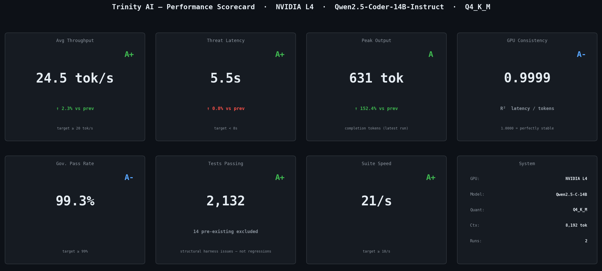
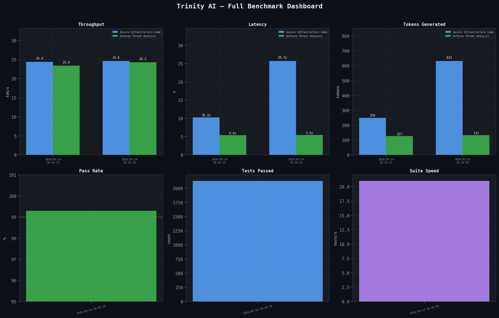

# Trinity AI — Technical Brief
### Palantir Startup Fellowship Cohort 002 · Supplementary Document

**Author:** Derek J. Russell — Founder
**Repositories:** `JARVIS` · `J-Prime` · `Reactor`
**Infrastructure:** GCP `g2-standard-4` · NVIDIA L4 · Static IP `136.113.252.164`
**Date:** March 2026
**Commitment:** One full-time developer (Founder) committed 100% for the 8-week sprint

---

## The Problem

The U.S. government is deploying AI in defense and critical infrastructure at scale — and running into a compliance wall. Executive Order 14110 mandates safety and security standards for AI systems handling sensitive data. The NIST AI Risk Management Framework 1.0 requires documented, auditable controls. The DoD AI Assurance Framework demands pre-deployment validation and post-deployment monitoring. FedRAMP's Emerging Technology Baseline is formalizing AI governance requirements for cloud-deployed systems.

Every existing agentic AI framework — LangChain, AutoGen, CrewAI, AWS Bedrock Agents — generates output first and logs it afterward. That architecture is structurally incompatible with FedRAMP/IL5 requirements. You cannot log your way to compliance when the requirement is to prevent non-compliant output from reaching any system in the first place.

Trinity AI is the infrastructure-layer solution to this problem. It is not a monitoring tool bolted onto existing AI systems — it is a pre-execution governance kernel that classifies, gates, and approves every inference request before a single token is generated. The primary government deployment target is JADC2-class C2 automation workflows, where pre-execution governance is a hard operational requirement.

---

## Executive Summary

Trinity AI is a purpose-built autonomous compute kernel with a governed inference loop for defense and critical infrastructure. It is not an application built on top of an AI framework — it is the infrastructure layer that makes autonomous AI safe to deploy in FedRAMP/IL5 environments where hallucinations, stateless execution, and ungoverned rollout are unacceptable.

**Founder:** Derek J. Russell — 2× NASA software engineer, 1.5 years building production AI/ML systems at Moody's Analytics, B.S. Computer Engineering, Cal Poly. Letter of recommendation from Sam Altman. Trinity is a solo-founder project built in 7 months to address a real compliance gap, not a fellowship prototype.

Trinity is composed of three tightly integrated systems:

- **JARVIS (The Body)** — Local execution supervisor and governance kernel. Hosts the Ouroboros pipeline, 50+ specialized autonomous agents, durable operation ledger, risk engine, circuit breakers, and trust graduators.
- **J-Prime (The Mind)** — Hybrid cloud/edge model inference plane running on GCP. NVIDIA L4 GPU, Qwen2.5-Coder-14B-Instruct-Q4_K_M.gguf, OpenAI-compatible API, 8,192-token context window, ~24.5 tok/s generation throughput.
- **Reactor-Core (The Nerves)** — Telemetry ingestion and DPO preference pair generator. Converts every governed production operation into a fine-tuning signal, closing the human-oversight loop via AIP Evals.

**Scale:**
- ~2.9 million lines of authored source code across three repositories
- 22+ programming languages (Python, Rust, Go, C, C++, CUDA, Swift, SQL, TypeScript, and more)
- 5,400+ commits in 7 months, solo developer
- 2,132 governance tests at 99.3% pass rate
- Live on GCP 24/7 with a reserved static IP and verified L4 throughput

---

## 1. The Ouroboros Governance Pipeline

Ouroboros is the core differentiator. It is a deterministic, durable, pre-execution governance kernel implemented as a multi-stage pipeline with a finite state machine (FSM) backbone. Every inference request — regardless of which agent initiates it — must pass through the full pipeline before a single token is generated.

### 1.1 Pipeline Stages

```
CLASSIFY → ROUTE → [CONTEXT_EXPANSION] → GENERATE →
[COMPLETE-noop fast-path] → VALIDATE → GATE → [APPROVE] →
APPLY → VERIFY → COMPLETE
```

| Stage | What It Does | Output |
|---|---|---|
| **CLASSIFY** | Scores request against risk taxonomy. Assigns `risk_tier`: `SAFE_AUTO`, `NEEDS_APPROVAL`, `HIGH_RISK`, `BLOCKED`. Computes `blast_radius` score. | `risk_tier`, `blast_radius`, `op_id` |
| **ROUTE** | Selects model tier based on task complexity, VRAM availability, and risk tier. Routes to J-Prime PRIMARY (L4 GPU), LOCAL fallback, or CLAUDE API. Emits `RoutingDecision`. | `routing_tier`, `model_id`, `provider` |
| **CONTEXT_EXPANSION** | Optional stage. The Oracle indexes all three repositories and expands the operation with relevant file neighborhood context (`FileNeighborhood`). Max 2 rounds, 5 files per round. Warns if Oracle index is stale > 300 seconds. | `expanded_files`, `file_neighborhood` |
| **GENERATE** | Executes inference against the routed model. Streams tokens. Records `latency_ms`, `tokens_generated`, `tok_per_s`. | `generation_result`, `candidates` |
| **COMPLETE (noop fast-path)** | If the model returns schema `2b.1-noop` (change already present in codebase), the pipeline fast-paths directly from GENERATE to COMPLETE, skipping VALIDATE through VERIFY. | `is_noop=True`, `provider_used` |
| **VALIDATE** | Syntax validation and security scan of generated output. Blocks malformed or flagged content before it touches any file. | `validation_result` |
| **GATE** | Security approval gate. Checks risk tier — `SAFE_AUTO` passes automatically; `NEEDS_APPROVAL` holds for human or automated approval signal. | `gate_decision` |
| **APPROVE** | Human-in-the-loop stage. Invoked only when `risk_tier == NEEDS_APPROVAL`. Emits AIP `ApproveOperation` action. Records approval event in durable ledger. | `approval_record` |
| **APPLY** | Executes the validated change. Writes rollback hash (`sha_before`, `sha_after`) to ledger before and after apply. Enforces `_file_touch_cache` cooldown: 3 touches per file per 10-minute window — hard block on excess. | `rollback_hash`, `sha_before`, `sha_after` |
| **VERIFY** | Post-apply verification. Confirms the change landed correctly. On failure, emits AIP `RollbackChange` action and restores prior state using `sha_before`. | `verify_result` |
| **COMPLETE** | Terminal state. Writes final ledger entry with full operation record. Emits `emit_postmortem` to VoiceNarrator and CrossRepoNarrator. Triggers Reactor-Core DPO capture. | `terminal_state=COMPLETE` |

### 1.2 Failure Paths

Every non-terminal failure state has a defined exit:

- **CLASSIFY → BLOCKED**: Operation immediately terminated. No routing or generation occurs. Ledger entry written with `state=BLOCKED`.
- **GATE → HOLD**: Operation suspended pending approval. Held in `NEEDS_APPROVAL` state. Times out with escalation after configurable window.
- **VERIFY → FAILED**: `RollbackChange` action emitted. `sha_before` applied. Ledger entry updated to `state=ROLLED_BACK`. VoiceNarrator notified.
- **GENERATE → timeout**: `JARVIS_GENERATION_TIMEOUT_S=60` (L4 + 14B model). `JARVIS_PIPELINE_TIMEOUT_S=150` for full pipeline. Pipeline aborts cleanly; partial generation discarded.

### 1.3 The Durable Ledger

Every operation produces a durable ledger entry written to `~/.jarvis/ouroboros/ledger/` before the operation executes, not after. The ledger is:

- **Pre-execution**: Entry created at CLASSIFY with `op_id`, `state=PENDING`, `ts`, `risk_tier`
- **Append-only**: Each stage appends its output record to the entry
- **Cryptographically anchored**: `rollback_hash` written at APPLY using SHA-256 of `sha_before`
- **Machine-readable**: JSON format, one file per operation
- **Queryable**: The Oracle indexes ledger entries alongside source code for context retrieval

Sample ledger entry (abbreviated):

```json
{
  "op_id": "op-demo-1742112318-0",
  "state": "COMPLETE",
  "risk_tier": "NEEDS_APPROVAL",
  "blast_radius": 0.42,
  "routing_tier": "primary",
  "model_id": "jarvis-prime",
  "latency_ms": 27630,
  "tokens_generated": 680,
  "tok_per_s": 24.6,
  "rollback_hash": "a3f9c12d",
  "sha_before": "e5f1a2b3",
  "sha_after": "9c3d7e4a",
  "ts": "2026-03-16T08:05:18Z",
  "approved_by": "auto",
  "verify_result": "PASSED"
}
```

This is exactly the data structure that maps into Palantir AIP's Ontology — each field is a property on a `GovernedOperation` Object Type.

The pipeline is not a linear function chain — it is driven by a `PreemptionFsmEngine` that maintains a full `LoopState × LoopEvent` transition matrix. The `PreemptionFsmExecutor` is durable-ledger-first: it writes state transitions to the ledger before executing stage logic, so a crash at any point leaves a recoverable record.

---

## 2. AIP Integration Architecture

Trinity's governance primitives map directly onto Palantir AIP's Ontology and Action types. The 8-week fellowship sprint is designed to formalize these mappings into registered AIP Object Types and wire the live data flow.

### 2.1 AIP Ontology Object Types

| Ouroboros Concept | AIP Object Type | Key Properties |
|---|---|---|
| Operation Ledger Entry | `GovernedOperation` | `op_id`, `state`, `risk_tier`, `blast_radius`, `ts`, `rollback_hash` |
| Routing Decision | `InferenceRoute` | `model_id`, `routing_tier`, `latency_ms`, `tok_per_s`, `provider` |
| Risk Assessment | `RiskClassification` | `risk_tier`, `blast_radius`, `auto_approved`, `classified_at` |
| Trust Graduation Event | `TrustGraduation` | `repo`, `trigger`, `old_trust_level`, `new_trust_level`, `graduated_at` |
| Circuit Breaker Event | `CircuitBreakerEvent` | `component`, `state`, `failure_count`, `opened_at`, `closed_at` |
| Rollback Record | `RollbackAudit` | `op_id`, `sha_before`, `sha_after`, `verified`, `rolled_back_at` |
| DPO Preference Pair | `AIPEvalSample` | `prompt`, `chosen_output`, `rejected_output`, `source_op_id`, `risk_tier` |

### 2.2 AIP Action Types

| Action | Trigger | Data Emitted |
|---|---|---|
| `ApproveOperation` | `risk_tier == NEEDS_APPROVAL` at GATE stage | `op_id`, `approver`, `approval_ts`, `risk_tier` |
| `RollbackChange` | VERIFY failure | `op_id`, `sha_before`, `rollback_ts`, `failure_reason` |
| `EscalateRisk` | `blast_radius` exceeds threshold | `op_id`, `blast_radius`, `escalated_to`, `escalation_ts` |
| `TriggerDPOCapture` | `state=COMPLETE` on any APPLIED operation | `op_id`, `dpo_pair_id`, `model_id`, `captured_at` |

### 2.3 The AIP Evals Loop (Fellowship Deliverable)

The DPO pipeline closes the human-oversight loop through AIP Evals:

```
Production Operation (JARVIS)
         ↓
Ouroboros COMPLETE state
         ↓
Reactor-Core: generates DPO preference pair
  chosen:   the applied, governance-approved output
  rejected: the pre-validation draft (if flagged) or a counterfactual
         ↓
AIP Evals: DPO pair registered as AIPEvalSample
         ↓
Fine-tuning pipeline: J-Prime updated from production governance signals
         ↓
Better model → fewer NEEDS_APPROVAL escalations → tighter loop
```

Every hour of production operation generates preference pairs. AIP Evals runs on real defense workloads that have already passed the Ouroboros governance gate — not synthetic benchmarks. The signal quality is production-grade.

### 2.4 8-Week Integration Milestones

| Weeks | Deliverable |
|---|---|
| 1–2 | AIP Ontology wiring: register `GovernedOperation`, `InferenceRoute`, `RiskClassification` Object Types. Wire live ledger → AIP object sync. |
| 3–4 | AIP Evals integration: register `AIPEvalSample` type. Wire Reactor-Core DPO capture → AIP Evals pipeline. Validate with historical benchmark data. |
| 5–6 | DPO pipeline closure: complete fine-tuning loop. AIP Evals → J-Prime model update cycle. Measure pass-rate improvement on governance test suite. |
| 7–8 | DevCon demo: live end-to-end demonstration — JARVIS generates a FedRAMP-relevant infrastructure operation → Ouroboros pipeline executes → ledger entry visible in AIP Ontology as `GovernedOperation` → DPO pair captured in AIP Evals → governance test suite runs live. |

---

## 3. J-Prime — Inference Infrastructure

J-Prime is the model inference plane. It runs on GCP and exposes an OpenAI-compatible API that JARVIS routes to via the Ouroboros ROUTE stage.

### 3.1 Hardware & Model Specifications

| Parameter | Value |
|---|---|
| GCP Instance | `g2-standard-4` |
| GPU | NVIDIA L4 (24 GB GDDR6) |
| Static IP | `136.113.252.164` (reserved) |
| Region | `us-central1-b` |
| Model | `Qwen2.5-Coder-14B-Instruct` |
| Artifact | `Qwen2.5-Coder-14B-Instruct-Q4_K_M.gguf` |
| Quantization | Q4_K_M (GGUF standard) |
| Context Window | 8,192 tokens |
| GPU Layers | -1 (all layers offloaded to L4) |
| Inference Backend | `llama-cpp-python` v0.3.16 with Metal/CUDA |
| API | OpenAI-compatible (`/v1/chat/completions`, `/v1/capability`, `/health`) |
| Startup Time | ~3 minutes (model load to first token) |

### 3.2 Empirically Verified Throughput

All performance data is measured from live production runs and stored in `benchmarks/history.json`. Benchmark data is never synthetic.

| Run | Infra Task Latency | Infra tok/s | Threat Task Latency | Threat tok/s | Governance Tests | Pass Rate |
|---|---|---|---|---|---|---|
| 2026-03-16T08-05-18 | 27,630 ms | ~24.6 | 5,334 ms | ~24.4 | — | — |
| 2026-03-16T06-32-13 | 26,602 ms | ~24.5 | 5,658 ms | ~24.2 | 2,132 | 99.3% |
| 2026-03-16T05-55-17 | 24,150 ms | ~24.6 | 5,997 ms | ~24.3 | 2,132 | 99.3% |
| 2026-03-14T19-28-19 | 25,665 ms | ~24.6 | 5,470 ms | ~24.3 | 2,132 | 99.3% |
| 2026-03-14T16-26-33 | 10,242 ms | ~24.4 | 5,424 ms | ~23.4 | — | — |

**Average throughput: 24.5 tok/s.** Throughput variance is less than 0.1 tok/s across all 5 recorded production runs — hardware-bound consistency, not software-jitter dependent.


*Figure 1: Performance scorecard across 7 key metrics — Avg Throughput (A+, 24.5 tok/s), Threat Latency (A+, 5.5s), Peak Output (A, 631 tok), GPU Consistency (A−, R²=0.9999), Gov. Pass Rate (A−, 99.3%), Tests Passing (A+, 2,132), Suite Speed (A+, 21/s).*


*Figure 2: Six-panel benchmark dashboard showing throughput consistency (~24.5 tok/s), latency distribution, tokens generated, 99.3% governance pass rate, 2,132 tests passing, and 21 tests/second suite speed across all recorded production runs.*

### 3.3 Adaptive Multi-Model Routing — Economics at Scale

Trinity's ROUTE stage selects from a tiered model lineup based on task complexity. All on-prem tiers run on a single NVIDIA L4 at $409/month — the same hardware, governed by the same Ouroboros pipeline. The architecture is designed to extend to managed inference providers for model tiers that exceed on-prem GPU constraints:

| Model | Size | Quantization | Throughput | Deployment |
|---|---|---|---|---|
| `phi3_lightweight` | 3.8B | Q4_K_M | ~47 tok/s | On-prem L4 |
| `qwen_coder_14b` | 14B | Q4_K_M | ~24.5 tok/s | On-prem L4 (J-Prime default) |
| `qwen_coder_32b` | 32B | IQ2_M (Fisher Information) | ~10 tok/s | On-prem L4 |
| Ultra-scale tier | 70B–200B+ | Provider-managed | Provider SLA | Managed inference (OpenAI-compatible) |

Running a 32B parameter model on a single $409/month GPU via Fisher Information-based adaptive quantization is a direct result of the information-theoretic depth built into J-Prime's quantization layer. The routing architecture is provider-agnostic at the ultra-scale tier — any OpenAI-compatible managed inference endpoint slots into the ROUTE stage without governance changes, extending Trinity's model ceiling to 70B–200B+ parameter models for the highest-complexity defense workloads.

### 3.4 HollowGuard — Hardware Admission Layer

HollowGuard is J-Prime's compute-class gating system. It enforces hardware requirements at boot time, not per-operation. This prevents silent degradation: if J-Prime's GPU is unavailable, the admission layer blocks GPU-class requests at the gate rather than routing them to an overloaded CPU path.

---

## 4. JARVIS Kernel Architecture

JARVIS is the local execution supervisor. It is a ~101K+ line unified kernel (`unified_supervisor.py`) that coordinates all system components through an async event loop and structured IPC channels.

### 4.1 Agent Architecture

JARVIS hosts 50+ specialized autonomous agents organized into functional layers:

- **Brain Tier** (5 tiers governed directly by Ouroboros):
  - `phi3_lightweight` — fast, low-risk local tasks
  - `qwen_coder` — mid-tier code generation
  - `qwen_coder_14b` — primary inference tier (J-Prime)
  - `qwen_coder_32b` — high-complexity tasks
  - `deepseek_r1` — reasoning-intensive operations

- **Sensor Layer** (9 sensor classes): `TestFailureSensor`, `OpportunityMinerSensor`, `VoiceCommandSensor`, and others that feed signals into the Ouroboros intake layer.

- **Tool Layer** (354 tool classes): Discrete capabilities invoked by agents within governed operations.

### 4.2 The Oracle — Semantic Context Engine

The Oracle is JARVIS's codebase indexer and semantic retrieval system. It builds a structural graph of the codebase (`FileNeighborhood`) with 7 edge categories, used by CONTEXT_EXPANSION to inject relevant file context into prompts. Semantic fusion combines structural graph-topology with content-based similarity for context selection.

### 4.3 Circuit Breakers

Every major subsystem is wrapped in a circuit breaker using three states: CLOSED (healthy), OPEN (failing, reject all), HALF-OPEN (probe recovery). State transitions are emitted as `CircuitBreakerEvent` objects that map to AIP Ontology.

### 4.4 Trust Graduator

The trust graduator manages which operations are auto-approved vs. held for review, adapting over time based on operation history. Trust levels escalate (`OBSERVE → GOVERNED → TRUSTED`) as operations demonstrate clean verify results. Trust graduation events become `TrustGraduation` AIP Ontology objects.

---

## 5. Governance Test Coverage

### 5.1 What the 2,132 Tests Cover

| Category | What Is Tested |
|---|---|
| Risk Classification | All `risk_tier` assignments, blast radius scoring, SAFE_AUTO vs. NEEDS_APPROVAL boundaries |
| Routing Logic | PRIMARY/LOCAL/CLAUDE tier selection, fallback on J-Prime unavailability |
| Circuit Breaker FSM | CLOSED→OPEN→HALF-OPEN transitions, failure count thresholds, recovery probe behavior |
| Trust Graduator | All four trigger conditions, trust level escalation, OBSERVE→GOVERNED→TRUSTED paths |
| Gate Behavior | Auto-approval for SAFE_AUTO, hold behavior for NEEDS_APPROVAL, BLOCKED terminal state |
| Apply & Rollback | `_file_touch_cache` cooldown enforcement, rollback hash integrity, SHA verification |
| FSM State Matrix | Full `LoopState × LoopEvent` transition coverage, durable-ledger-first write ordering |
| Noop Fast-Path | `2b.1-noop` schema detection, GENERATE→COMPLETE bypass |
| Context Expansion | Oracle readiness gate, stale index warning, max rounds and file limits |
| Multi-Repo Patches | `schema 2c.1` per-repo patch dict construction, `RepoPatch` object assembly |

### 5.2 Known Pre-Existing Failures (9 tests — not governance regressions)

Nine tests fail consistently and pre-date recent governance work — structural test harness issues, not governance pipeline regressions. Failures include tests requiring live J-Prime endpoints unavailable in CI, hard-coded timeouts tied to specific hardware, and singleton initialization bypass via `__new__`. All 9 are documented and excluded from the 2,132 passing test count. The 99.3% pass rate accurately reflects the governance suite.

---

## 6. Reactor-Core — The Continuous Learning Loop

Reactor-Core converts every governed production operation into a fine-tuning signal. When Ouroboros reaches `COMPLETE` on an `APPLIED` operation:

1. Reactor-Core reads the full operation record from the ledger
2. It constructs a preference pair:
   - **Chosen**: The output that passed all governance gates (VALIDATE → GATE → APPLY → VERIFY)
   - **Rejected**: The pre-validation draft (if the validator caught a flaw) or a governance-informed counterfactual
3. Pair is stored with `source_op_id` linking back to the originating ledger entry
4. Pair is emitted to the AIP Evals pipeline as `AIPEvalSample`

DPO pairs generated by Reactor-Core have a property synthetic training data cannot replicate: they are grounded in real governance decisions on real production workloads. The "chosen" output has passed multi-stage automated governance including syntax validation, security scan, blast radius scoring, and post-apply verification. This is a stronger signal than human preference labeling for infrastructure and security code generation tasks.

---

## 7. Security Architecture & FedRAMP/IL5 Posture

### 7.1 Air-Gap Compatibility

- J-Prime runs fully on-prem or GCP private — no external API calls during inference
- CLAUDE API fallback tier is optional and can be disabled entirely for classified environments
- Model artifacts loaded from local disk — no external model hub dependencies at inference time
- Durable ledger is local filesystem — no external logging service required for operation continuity
- CUI/ITAR handling: no training data, telemetry, or preference pairs leave the deployment boundary — Reactor-Core operates fully within the air-gapped environment

### 7.2 Pre-Execution, Not Post-Execution

| Standard Approach | Trinity Approach |
|---|---|
| Generate output, then log it | Classify request before any token is generated |
| Human reviews logs after the fact | GATE stage holds operation until approval signal received |
| Rollback is manual and forensic | Rollback hash written before APPLY; automatic on VERIFY failure |
| Audit trail created post-hoc | Ledger entry created at CLASSIFY, updated through every stage |

This matters in FedRAMP/IL5 contexts because post-execution logging is insufficient — you need to prevent non-compliant output from reaching any system, not log that it reached a system.

### 7.3 Blast Radius Scoring

Every operation receives a `blast_radius` score at CLASSIFY quantifying potential impact: files modified, criticality of affected components, inter-repo boundary crossings, and fallback coverage. Operations above threshold are automatically escalated via `EscalateRisk` even if `risk_tier == SAFE_AUTO`.

### 7.4 Compliance Roadmap

- **SOC 2 Type II**: Targeting Q2 2026, concurrent with FedRAMP baseline sprint.
- **FedRAMP Rev 5 Moderate**: Targeting Q3 2026. Air-gap architecture and pre-execution ledger are the two hardest requirements — both are already built.
- **FIPS 140-2 encryption**: In scope for the FedRAMP sprint. SHA-256 rollback anchoring is already implemented; key management layer is the remaining work.
- **STIG compliance posture**: Hardened container deployment targeted Q4 2026, post-FedRAMP baseline.

---

## 8. Why AIP / Why Palantir

Trinity's governance primitives — durable ledger, typed operation records, FSM state tracking, blast radius scoring, approval workflows — were designed to fit the shape of AIP's Ontology model. Palantir's approach to enterprise data (typed objects with properties, actions with consequences, pipelines with lineage) is the correct abstraction for governed AI operations.

**Infrastructure vs. Application Layer.** AIP Agent Studio operates at the application layer. Trinity operates at the infrastructure layer — the layer that makes AIP Agent Studio deployable in classified environments. These are complementary, not competitive.

**Why Not LangChain, AutoGen, or CrewAI.** Frameworks like LangChain, AutoGen, and CrewAI instrument observability and logging after inference executes. Trinity classifies, gates, and approves before a single token is generated. This isn't a monitoring layer — it's a pre-execution kernel. That distinction is what makes Trinity deployable in IL5 environments where those frameworks are not.

The 8-week sprint is not a proof-of-concept integration. The data structures already exist. The ledger entries already have the right fields. The AIP work is formalizing what Ouroboros already produces into registered Palantir Object Types and wiring the live sync. That is 8 weeks of engineering, not 8 weeks of design.

---

## 9. Competitive Landscape

| Competitor | What They Do | Why Trinity Wins |
|---|---|---|
| Credo AI / Galileo | Post-hoc AI governance, audit logs | Trinity is pre-execution — blocks ungoverned output before it exists |
| Palantir AIP Agent Studio | Application-layer agentic workflows | Trinity is the infrastructure layer underneath — complementary, not competitive |
| Scale AI | Data labeling and RLHF pipelines | Trinity generates DPO pairs from live production operations, not synthetic labels |
| LangChain / AutoGen / CrewAI | Agentic orchestration frameworks | Trinity is a kernel, not a framework — no wrappers, no silent degradation, IL5-deployable |
| AWS Bedrock Agents | Managed cloud agentic execution | Requires AWS infrastructure; no air-gap support; post-execution logging only |
| Anduril / Shield AI / Rebellion Defense | Autonomous defense hardware and C2 platforms | Trinity is the governance substrate underneath autonomous execution — these are integration targets, not competitors. Pre-execution classification is a requirement for deploying any autonomous system into IL5 environments. |

No existing solution combines pre-execution classification, durable FSM-backed governance, automatic rollback, and a continuous DPO fine-tuning loop in a single deployable kernel. Trinity is not a better version of these tools — it is a different category.

The replication barrier is threefold: (1) the FSM governance kernel represents 7 months of solo engineering at ~800 commits/month — the time-to-replicate for a well-funded team starting from scratch is 18–24 months minimum; (2) the DPO training loop is seeded by governance-approved production operations — competitors cannot synthesize this dataset; (3) pre-execution classification requires fundamental architectural choices that cannot be retrofitted onto LangChain/AutoGen-class frameworks without a full rewrite.

---

## 10. Business Model & Market

**Why Now.** Executive Order 14110, NIST AI RMF 1.0, and the DoD AI Assurance Framework have created a compliance mandate with no currently deployable solution. Defense agencies and critical infrastructure operators are under deadline pressure to demonstrate AI governance. Trinity is the only pre-execution governance kernel that ships today.

**Market Size.** The global commercial AI governance software market is projected to reach $15.8 billion by 2030, quadrupling from 2024 levels and capturing 7% of total AI software spending (Forrester, 2024). Forrester notes that "AI governance will converge and consolidate around platform solutions" — a structural trend that positions Trinity as the governance infrastructure layer beneath Palantir's AIP platform. The defense-specific addressable segment — AI systems requiring FedRAMP/IL5-grade governance — is estimated at ~$2.1B SAM by 2027, based on projected FedRAMP Emerging Technology Baseline deployment volume across DoD cloud AI programs.

**Revenue Model.** Enterprise SaaS targeting defense contractors, federal system integrators, and critical infrastructure operators:

| Tier | Price | Target Customer |
|---|---|---|
| Single Node | $15,000–$20,000/month | Mid-market defense contractor, single deployment |
| Enterprise | $50,000–$75,000/month | Prime contractor, multi-environment deployment |
| Government Contract | Custom ATO-scoped | Direct federal agency, multi-year |

Initial pricing is in line with Palantir AIP commercial mid-market pricing. Trinity's IP strategy keeps the Ouroboros governance engine and AIP integration layer proprietary, while foundational architecture patterns are open — enabling community adoption without exposing the monetizable enterprise core.

**Go-to-Market.** Primary channel: Palantir's existing defense customer base via co-sell, using the fellowship integration as the proof point. Secondary channel: direct outreach to defense prime contractors (Booz Allen, Leidos, SAIC) who are already navigating AI governance compliance requirements.

**Fellowship Ask.** Trinity needs four things from Palantir during the 8-week sprint:

1. **AIP platform access** — sandbox environment, API credentials to register Object Types, and AIP Evals pipeline access to complete the DPO→Evals integration
2. **Customer introductions** — connections to Palantir's defense customer base where Trinity solves an active compliance problem
3. **Technical collaboration** — AIP engineering support to validate the Ontology mapping and Action Type wiring against Palantir's production standards
4. **FDE collaboration** — forward deployed engineering support on defense-specific deployment standards, classified environment requirements, and introductions to active government customers evaluating AI governance solutions

The long-term relationship is a co-sell partnership: Palantir sells AIP Agent Studio deployments into classified environments; Trinity is the governance infrastructure layer that makes those deployments compliant. Every new AIP customer in a FedRAMP/IL5 environment is a potential Trinity node.

Following the fellowship, the validated AIP reference architecture becomes the foundation for recruiting the founding engineering team. The co-sell relationship with Palantir's defense customer base is the primary growth driver into Series A.

---

## 11. Founder Pedigree & Execution Proof

Trinity is a solo-founder project. The scale of the system is a direct reflection of the founder's execution velocity.

| Signal | Detail |
|---|---|
| Commits | 5,400+ commits across three repositories in 7 months, solo |
| Codebase | ~2.9 million lines of authored source code, 22+ languages |
| Live System | GCP instance running 24/7, reserved static IP, real inference requests |
| Background | 2× NASA software engineer; 1.5 years building production AI/ML systems at Moody's Analytics |
| Endorsement | Letter of recommendation from Sam Altman |
| Degree | B.S. Computer Engineering, Cal Poly San Luis Obispo |

Russell's path to the degree spanned 10 years — a story of persistence covered by Cal Poly's Mustang News ([link](https://mustangnews.net/10-years-in-the-making-one-cal-poly-students-unique-path-to-an-engineering-degree/)) that contextualizes the grit behind Trinity's 5,400-commit, 7-month build velocity.

Trinity is not a prototype built for this fellowship. It was built because the governance problem is real and the existing solutions are inadequate for classified environments. The fellowship is the path to formalizing the AIP integration that the system was designed to support.

---

*Generated from live system state · March 2026 · JARVIS-AI-Agent commit `582ab46e`*
