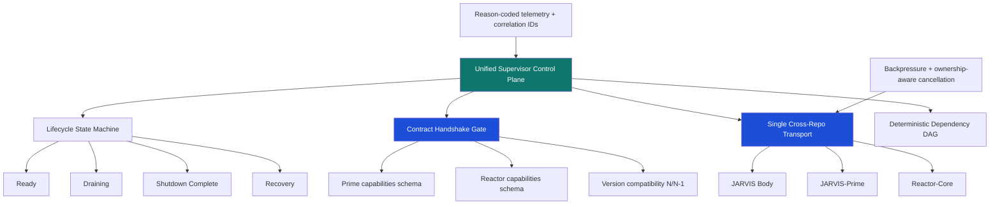

# Trinity Structural Disease Analysis (Body + Mind + Nerves)

Date: 2026-03-05  
Scope: `JARVIS-AI-Agent`, `jarvis-prime`, `reactor-core`  
Primary entrypoint: `python3 unified_supervisor.py`

---

## Why this document exists

This document captures the structural architecture risks that block the JARVIS ecosystem from behaving as a deterministic, resilient AI operating system. It is intentionally direct: the goal is to identify root causes, not symptoms.

It complements implementation plans by documenting:
- Current structural failure modes
- Why they are systemic (not isolated bugs)
- What a corrected architecture flow should look like
- A phased remediation model with verification gates

---

## Executive summary

The ecosystem is feature-rich and ambitious, but it currently carries systemic coupling and lifecycle ambiguity that can produce:
- split-brain orchestration
- restart/degradation storms
- hidden failures behind broad exception handling
- inconsistent cross-repo state and contract behavior

The highest-impact structural diseases are:
1. Supervisor monolith concentration (`unified_supervisor.py`)
2. Multiple lifecycle authorities across repos
3. Overlapping cross-repo transport responsibilities
4. Advisory (non-enforcing) contracts
5. Weak lifecycle/state-machine formalization

These must be addressed before broad optimization work. Otherwise each reliability patch adds complexity without reducing systemic risk.

---

## Current architecture flow (as implemented)

```mermaid
flowchart TD
    A[unified_supervisor.py] --> B[JARVIS Body Runtime]
    A --> C[JARVIS-Prime process start]
    A --> D[Reactor-Core process start]

    B --> E[Trinity Event Bus]
    B --> F[Reactor Bridge]
    C --> E
    D --> F

    C --> G[/health + /capabilities]
    D --> H[/health + /capabilities]
    A --> G
    A --> H

    I[Env var startup contracts] --> A
    J[Advisory startup checks] --> A

    style E fill:#1f2937,color:#fff
    style F fill:#1f2937,color:#fff
```

### Primary weaknesses in current flow
- Two transport/control paths (`Trinity Event Bus` and `Reactor Bridge`) overlap in role.
- Contracts are checked in ways that are advisory in multiple startup paths.
- Lifecycle ownership exists at both top-level and per-repo supervisors.
- State is partially propagated via environment variables (snapshot model, weak runtime semantics).

---

## Structural disease inventory

### Disease 1: God-file monolith risk
- `unified_supervisor.py` has accumulated cross-cutting concerns (startup, health, recovery, cloud orchestration, event wiring, diagnostics) into one high-change surface.
- Consequences:
  - high merge conflict probability
  - low local reasoning radius
  - difficult isolated testing
  - accidental coupling between unrelated concerns

### Disease 2: Multi-authority lifecycle control
- JARVIS body supervisor behavior overlaps with per-repo lifecycle management (`jarvis-prime`, `reactor-core` supervisors).
- Consequences:
  - competing restart logic
  - unclear ownership during fault recovery
  - potential re-entrant restarts

### Disease 3: Dual communication nervous systems
- Multiple cross-repo communication mechanisms overlap in heartbeat/event responsibilities.
- Consequences:
  - inconsistent health view
  - duplicate or out-of-order message handling
  - harder fault attribution

### Disease 4: Advisory contracts instead of enforcing contracts
- Startup checks that only warn cannot prevent incompatible boots.
- Consequences:
  - drift discovered at runtime instead of boot
  - latent incompatibility after deploy/version changes

### Disease 5: Broad exception swallowing
- Large use of broad exception handling can downgrade unknown failure into partial degraded execution.
- Consequences:
  - hidden state corruption
  - delayed root-cause visibility
  - false-positive "healthy enough" behavior

### Disease 6: Weakly formalized lifecycle state model
- States and transitions are not consistently enforced as a strict machine across all startup/shutdown flows.
- Consequences:
  - re-entrant transition hazards
  - ambiguous "ready vs draining vs shutdown-complete" semantics

### Disease 7: Repository hygiene and cognitive overload
- stale worktrees, one-off scripts, and large root-level noise increase path ambiguity and tooling burden.
- Consequences:
  - discovery confusion
  - duplicate edits in wrong locations
  - slower diagnostics

### Disease 8: Environment variable state overuse
- env vars are useful for boot config but weak for runtime coordination.
- Consequences:
  - no atomic multi-key updates
  - no native change notifications
  - version/schema ambiguity

### Disease 9: Missing end-to-end integration and chaos gates
- unit and feature tests exist, but whole-organism behavior verification is still limited.
- Consequences:
  - uncertain behavior under partition/restart/memory pressure scenarios
  - regression detection too late

### Disease 10: Symmetric coupling across repos
- internal details leak across boundaries.
- Consequences:
  - changes in one repo break another unexpectedly
  - difficult independent evolution

### Disease 11: Async lock misuse risk (`threading.RLock` in async contexts)
- blocking lock usage in async pathways can pause event loop progress.
- Consequences:
  - heartbeat pauses
  - request queue growth
  - false health degradation

### Disease 12: Shutdown ordering race
- shutdown completion markers can be set before drain/cleanup actually finishes.
- Consequences:
  - liminal state where system appears down and not-restartable
  - orphan in-flight operations

### Disease 13: Unsynchronized singleton initialization
- multi-path singleton setup without strong synchronization can duplicate instances.
- Consequences:
  - split state
  - silent loss of updates

### Disease 14: Dependency DAG not hard-enforced
- soft dependencies without strict gating can violate startup assumptions.
- Consequences:
  - component boot before dependency readiness
  - intermittent startup defects

### Disease 15: Wall-clock duration math
- using `datetime.now()` for duration-sensitive logic can break under clock shifts.
- Consequences:
  - negative/incorrect durations
  - timeout drift

### Disease 16: Missing correlation IDs on inter-repo requests
- trace context does not consistently cross HTTP boundaries.
- Consequences:
  - fragmented observability
  - difficult end-to-end incident reconstruction

### Disease 17: Health endpoint semantics during shutdown
- if health checks block on draining locks, peers can misclassify state.
- Consequences:
  - cascading false-failure recovery attempts
  - restart oscillation

---

## Target architecture flow (improved)



### Why this flow is stronger
- One control plane for lifecycle authority
- One transport for cross-repo runtime communication
- Contracts enforced before declaring readiness
- Explicit lifecycle transitions with guarded semantics
- End-to-end traceability with correlation IDs and reason codes

---

## Flaws in current architecture diagram and proposed improvements

### Flaws in many current diagrams
- They present a single supervisor box but do not show competing lifecycle authorities.
- They do not depict contract enforcement as a hard startup gate.
- They omit shutdown-state semantics and transition ownership.
- They treat communication as a simple line rather than potentially overlapping systems.
- They do not show end-to-end deadline/correlation propagation.

### Improvements for all architecture diagrams
- Add a dedicated "Control Plane Authority" layer with explicit ownership labels.
- Show startup as a DAG (hard deps, soft deps, and gate criteria).
- Show contract negotiation path (`/capabilities`, schema version, compatibility result).
- Show one canonical runtime transport with explicit reliability guarantees.
- Add lifecycle states and legal transitions.
- Add observability plane: correlation IDs, reason codes, saturation metrics.

---

## Remediation sequencing (high-level)

### Tier 1: Foundation stabilization
- Lifecycle authority unification
- Shutdown ordering correctness
- Async lock correctness in hot paths
- Contract gate promotion from advisory to enforceable

### Tier 2: Interface hardening
- Single transport normalization
- Dependency DAG enforcement
- Cross-repo capability/version negotiation
- Correlation ID propagation over HTTP and events

### Tier 3: Reliability and operability
- Exception taxonomy and reason-code policy
- Monotonic duration standard for timeout logic
- Integration + chaos + restart simulation suites

### Tier 4: Repo hygiene
- stale worktree cleanup policy
- root script reduction and archival conventions
- documentation index normalization

---

## Verification gates (must pass)

### Gate A: Lifecycle determinism
- No re-entrant startup/shutdown transitions accepted.
- Shutdown completion only set after drain confirmation.

### Gate B: Contract correctness
- Incompatible schema/capabilities block readiness.
- Compatible N/N-1 upgrades pass handshake.

### Gate C: Transport coherence
- One authoritative cross-repo transport path for runtime state/events.
- No duplicate event execution under reconnect replay scenarios.

### Gate D: Observability integrity
- 100% inter-repo requests carry correlation IDs.
- Failure reasons are classified and machine-parseable.

### Gate E: Soak resilience
- Multi-hour stress run without restart storm, deadlock, or split-brain health.

---

## Practical next step

Use this document as the architectural baseline when updating implementation plans.  
Any change that does not move at least one Tier 1 or Tier 2 disease toward resolution should be treated as non-foundational and lower priority.

