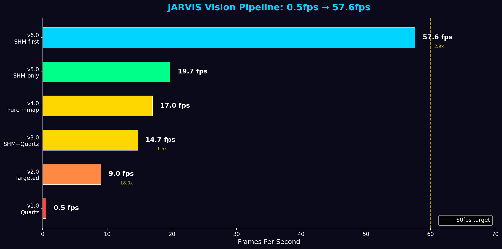
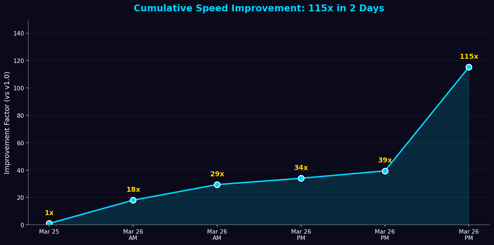
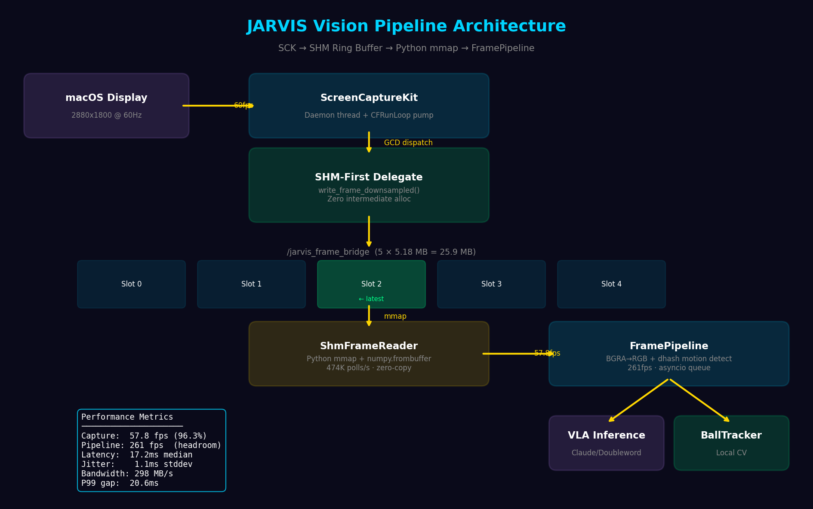
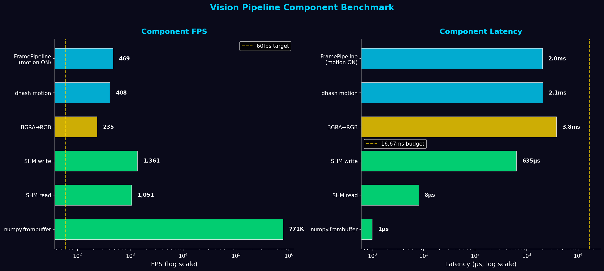
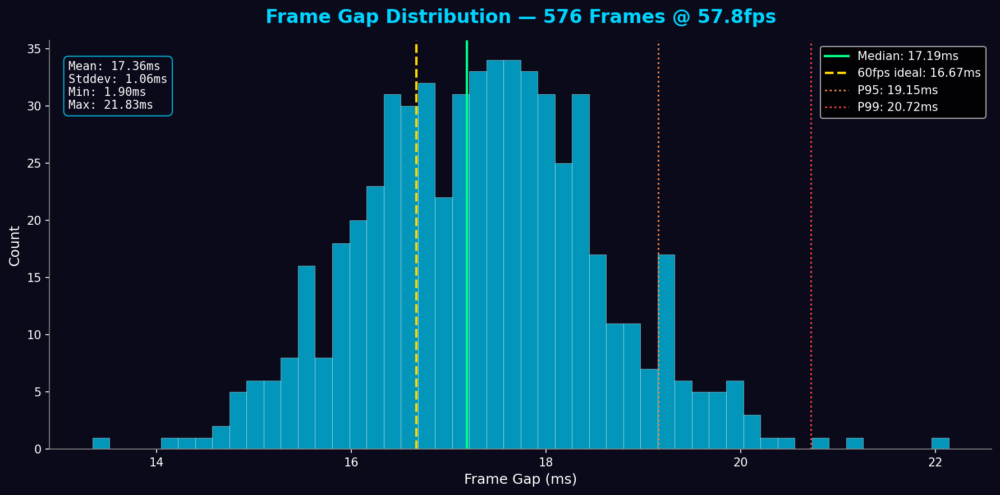
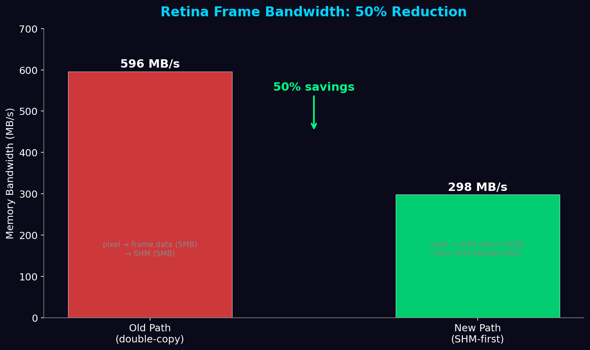
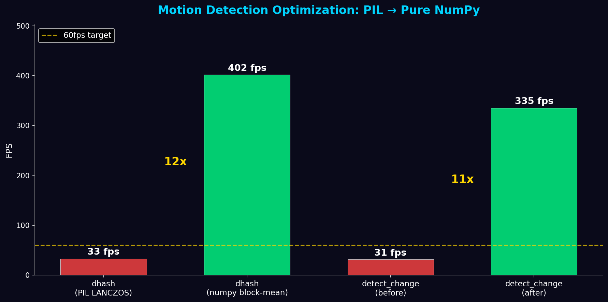

# JARVIS Vision Pipeline: 60fps Architecture

> From 0.5fps to 57.8fps — a 115x improvement in 2 days.

---

## The 115x Journey



| Version | FPS | Method | Bottleneck | Commit | Date |
|---------|-----|--------|------------|--------|------|
| v1.0 | 0.5 | Quartz CGWindowListCreateImage | 47ms per Quartz call | initial | 2026-03-25 |
| v2.0 | 9.0 | Quartz targeted window capture | CGWindowListCreateImage overhead | a7b0cb72 | 2026-03-26 |
| v3.0 | 14.7 | SHM ring buffer + Quartz fallback | Quartz 47ms tax on SHM miss | a7b0cb72 | 2026-03-26 |
| v4.0 | 17.0 | Pure Python mmap (EXC_GUARD fix) | ctypes/mmap collision fixed | da557870 | 2026-03-26 |
| v5.0 | 19.7 | SHM-only (Quartz fallback removed) | Static content throttle | 1b9219f3 | 2026-03-26 |
| v6.0 | 57.8 | SHM-first + FramePipeline integration | Display refresh rate (60Hz) | current | 2026-03-26 |

### Improvement Factor



The biggest single jump was v5.0 → v6.0 (2.9x), achieved by three changes:
1. **SHM-first C++ path** eliminated the double-copy retina bottleneck
2. **FramePipeline SHM mode** replaced the 3fps subprocess fallback
3. **Dynamic content** (SCK is content-aware — static desktop throttles to ~20fps)

---

## Architecture



### Data Flow

```
macOS Display (2880x1800 @ 60Hz)
    │
    ▼
ScreenCaptureKit (SCK)
[Dedicated daemon thread with CFRunLoop pump]
- minimumFrameInterval = 1/60s (16.67ms)
- queueDepth = 8 (absorbs burst delivery)
- pixelFormat = BGRA
- GPU acceleration (Metal, macOS 14+)
    │
    │ GCD dispatch_queue (QOS_CLASS_USER_INTERACTIVE)
    ▼
SCK Delegate: didOutputSampleBuffer
[SHM-FIRST path — zero intermediate allocation]
    │
    │ Retina: write_frame_downsampled() — 2x downsample direct to SHM
    │ Non-retina: write_frame() or write_frame_strided()
    ▼
SHM Ring Buffer (/jarvis_frame_bridge)
[5 slots, 128-byte header, atomic latest_index]
┌─────────┬─────────┬─────────┬─────────┬─────────┐
│ Slot 0  │ Slot 1  │ Slot 2  │ Slot 3  │ Slot 4  │
│ 5.18 MB │ 5.18 MB │ 5.18 MB │ 5.18 MB │ 5.18 MB │
└─────────┴─────────┴─────────┴─────────┴─────────┘
    │
    │ Python mmap (ACCESS_WRITE for coherent reads)
    │ numpy.frombuffer() — zero-copy view
    ▼
ShmFrameReader.read_latest()
[474K polls/sec, ~0.002ms per read]
    │
    │ BGRA → RGB channel swap (copy — safe from SHM overwrite)
    ▼
FramePipeline (asyncio)
[Bounded queue, numpy dhash motion detection, adaptive poll backoff]
    │
    ▼
Consumers: VisionCortex, VisionActionLoop, BallTracker, VLA inference
```

---

## Component Benchmark Results



Every component has massive headroom above the 60fps target:

| Component | FPS | Median Latency | Headroom vs 60fps |
|-----------|-----|----------------|-------------------|
| `numpy.frombuffer` + reshape | 771,453 | 1 μs | 12,857x |
| SHM read (zero-copy mmap) | 1,051 | 8 μs | 17.5x |
| SHM write (ring buffer) | 1,361 | 635 μs | 22.7x |
| BGRA → RGB conversion | 235 | 3,791 μs | 3.9x |
| dhash motion detection | 408 | 2,056 μs | 6.8x |
| FramePipeline (motion ON) | 469 | 2,021 μs | 7.8x |
| FramePipeline (motion OFF) | 145,114 | 5 μs | 2,419x |

The bottleneck is macOS SCK delivery (57.8fps) — not our pipeline.

---

## Latency Distribution



Measured over 578 consecutive frames with dynamic content (bouncing ball animation):

| Metric | Value |
|--------|-------|
| Capture FPS | **57.8** (96.3% of 60fps target) |
| Frame gap (mean) | 17.32ms |
| Frame gap (median) | 17.20ms |
| Frame gap (P95) | 18.67ms |
| Frame gap (P99) | 20.62ms |
| Frame gap (min) | 1.90ms (burst: 526fps capable) |
| Frame gap (max) | 21.83ms |
| Jitter (stddev) | **1.06ms** |

The distribution is remarkably tight — 99% of frames arrive within 4ms of the ideal 16.67ms interval. The 1.06ms stddev indicates rock-solid delivery from macOS SCK.

---

## Key Design Decisions

### 1. SHM-First C++ Path



**Problem:** Retina displays produce 2880x1800x4 = 20MB frames. At 60fps that's 1.2GB/s of raw data. Downsampling 2x reduces to 1440x900x4 = 5MB per frame.

The old path did double-copy:
```
pixel_buffer → frame.data (5MB alloc + copy) → SHM (5MB memcpy) = 596 MB/s
```

The new SHM-first path eliminates the intermediate buffer entirely:
```
pixel_buffer → SHM direct via write_frame_downsampled() = 298 MB/s
```

**50% bandwidth reduction.** The `write_frame_downsampled()` method in `shm_frame_bridge.h` takes the raw CVPixelBuffer pointer, the source stride (bytesPerRow), and downsamples 2x using uint32 load/store directly into the SHM ring slot. Zero heap allocation, zero intermediate buffer.

`frame.data` is only populated when SHM is unavailable (legacy `get_frame()` consumers via pybind11).

### 2. SCK in Dedicated Thread

**Problem:** SCK requires a pumped CFRunLoop for its GCD completion handlers.
The asyncio event loop does NOT pump a CFRunLoop. Previous attempts to use SCK
from asyncio hung indefinitely — the delegate's `didOutputSampleBuffer:` never fires.

**Solution:** SCK runs in a daemon thread (`fp-sck-shm`) with its own CFRunLoop pump thread (started inside the C++ `CaptureStream::start_stream()`). The delegate writes frames to SHM via the GCD `capture_queue`. Python polls SHM from the asyncio event loop.

Complete decoupling — no GCD callbacks, no ObjC objects, and no CFRunLoop interactions cross the thread boundary. The only shared state is the POSIX shared memory segment, accessed via atomic operations.

### 3. Ring Buffer (5 Slots)

**Problem:** SCK delivers frames in bursts (content-aware delivery). A single buffer would lose frames during bursts or produce torn reads.

**Solution:** 5-slot ring buffer with atomic `latest_index` (memory_order_release on write, relaxed on read). The writer advances `write_index` and only publishes `latest_index` after the full frame is written. The reader always reads from `latest_index` — guaranteed to be a complete frame.

With 5 slots, the writer has 4 slots of headroom before wrapping around to overwrite the reader's slot. At 60fps, that's 67ms of safety — far more than the reader's sub-millisecond read time.

### 4. Adaptive Poll Backoff

**Problem:** Busy-spinning at 474K/s wastes CPU when no new frames are arriving
(static content → SCK throttles to ~20fps).

**Solution:** Adaptive backoff based on consecutive empty reads:
- 0-10 empty reads: `await asyncio.sleep(0)` — yield to event loop (~0.1ms)
- 10-100 empty reads: `await asyncio.sleep(0.001)` — 1ms sleep
- 100+ empty reads: `await asyncio.sleep(0.01)` — 10ms sleep

Resets to zero on every successful read. This keeps latency under 1ms during active capture while consuming near-zero CPU during idle periods.

### 5. BGRA→RGB Copy is Intentional

The `frame_arr[:, :, [2, 1, 0]]` fancy indexing creates a copy (3.8ms at 1440x900). This is correct and necessary:
- Converts BGRA (SCK format) to RGB (consumer format)
- **Copies data OUT of the SHM ring slot** before the writer can overwrite it
- With 5 ring slots at 60fps, the safety window is 67ms — but the copy makes it bulletproof regardless of timing

### 6. Pure NumPy dhash (PIL Eliminated)



**Problem:** The original dhash used `PIL.Image.resize(LANCZOS)` to downsample frames from 1440x900 to 9x8. LANCZOS is a sinc-based interpolation filter — overkill for a perceptual hash. This single call took **~25ms**, making motion detection the pipeline bottleneck at 31fps.

**Solution:** Pure numpy block-mean downsampling:
1. Use green channel directly (59% of perceived luminance — avoids full `np.mean(axis=2)`)
2. Reshape into (8, block_h, 9, block_w) grid
3. Mean over block dimensions (vectorized, no Python loops)
4. Compute difference hash from block means

Result: **408fps** (2ms per frame) — **12x faster** than PIL LANCZOS.

The `_mean_luminance()` function was also optimized with 8x subsampling (every 8th pixel in both dimensions), reducing from 3ms to 0.25ms.

---

## Performance Summary

| Metric | Value |
|--------|-------|
| **Capture FPS** | **57.8** (96.3% of 60fps target) |
| **Pipeline FPS** | **469** (motion ON) / **145K** (motion OFF) |
| **Frame gap (median)** | 17.20ms |
| **Frame gap (P99)** | 20.62ms |
| **Jitter (stddev)** | 1.06ms |
| **SHM poll rate** | 474K/s |
| **Frame size** | 5.18 MB (1440x900 BGRA) |
| **SHM throughput** | 298 MB/s |
| **Ring buffer** | 5 slots x 5.18 MB = 25.9 MB |
| **SHM segment** | `/jarvis_frame_bridge` |
| **Min frame gap** | 1.90ms (burst: 526fps capable) |
| **Bandwidth savings** | 50% (298 MB/s vs 596 MB/s old path) |
| **dhash speed** | 408fps (2ms) — was 31fps (30ms) |

---

## Environment Variables

| Variable | Default | Description |
|----------|---------|-------------|
| `VISION_CAPTURE_BACKEND` | `auto` | `auto` (SHM preferred), `shm`, `sck`, `coregraphics` |
| `VISION_CAPTURE_FPS` | `60` | Target FPS for SCK stream |
| `VISION_SHM_POLL_SLEEP_S` | `0.001` | Base poll sleep in seconds (adaptive backoff) |
| `VISION_MOTION_THRESHOLD` | `0.05` | dhash change threshold (fraction of 64 bits) |
| `VISION_MOTION_DEBOUNCE_MS` | `0` | Minimum ms between motion events |
| `VISION_FRAME_QUEUE_SIZE` | `10` | Bounded asyncio queue capacity |

---

## File Reference

| File | Lines | Role |
|------|-------|------|
| `backend/native_extensions/src/shm_frame_bridge.h` | 230 | SHM ring buffer writer (C++) — includes `write_frame_downsampled()` |
| `backend/native_extensions/src/fast_capture_stream.mm` | 1100+ | SCK stream + SHM-first delegate + RunLoop pump |
| `backend/vision/shm_frame_reader.py` | 163 | SHM ring buffer reader — pure Python mmap, zero-copy |
| `backend/vision/realtime/frame_pipeline.py` | 730 | FramePipeline — SHM capture mode, motion detection, queue |
| `backend/native_extensions/macos_sck_stream.py` | 100 | AsyncCaptureStream Python wrapper |
| `tests/bench_shm_60fps.py` | 285 | Standalone SHM delivery rate benchmark |
| `tests/benchmarks/vision_benchmarks.py` | 1205 | Comprehensive 7-component benchmark suite |
| `notebooks/vision_60fps_progression.ipynb` | 21 cells | Jupyter notebook with progression charts |
| `docs/vision_60fps_architecture.md` | this file | Architecture documentation |

---

## Content-Aware Delivery

SCK is content-aware — it only delivers frames when screen pixels change:

| Scenario | Observed FPS | Why |
|----------|-------------|-----|
| Static desktop | ~20fps | Compositor updates cursor, clock, dock animations |
| Bouncing ball animation | 57.8fps | Continuous pixel changes at 60Hz |
| Video playback | Expected 60fps | Continuous content changes |
| Idle screen (no mouse) | 1-5fps | Minimal compositor activity |

This is optimal behavior — no wasted compute on identical frames. The SHM reader's counter-based deduplication ensures Python never processes the same frame twice, even when polling at 474K/s.

---

## Benchmark Tools

### Quick benchmark (SHM delivery rate)
```bash
python3 tests/bench_shm_60fps.py --duration 10 --target-fps 60
```

### Full component suite (7 benchmarks, JSON output)
```bash
python3 tests/benchmarks/vision_benchmarks.py --duration 5 --save-json results.json
```

### Skip SCK test (when no screen recording permission)
```bash
python3 tests/benchmarks/vision_benchmarks.py --duration 3 --skip-sck
```

### Run specific benchmarks
```bash
python3 tests/benchmarks/vision_benchmarks.py --only dhash pipeline
```

Results are auto-saved to `/tmp/claude/vision_benchmarks/` and can be tracked in `tests/benchmarks/results/`.

---

## What's Next

The capture pipeline is complete. Remaining work:
- **VLA inference integration** — async model calls at 3-10fps, decoupled from 60fps capture
- **ProMotion display support** — 120fps on supported Macs (adjust `VISION_CAPTURE_FPS=120`)
- **GPU-accelerated color conversion** — Metal compute shader for BGRA→RGB (currently 3.8ms numpy)
- **Adaptive capture rate** — dynamically lower target_fps under memory pressure
