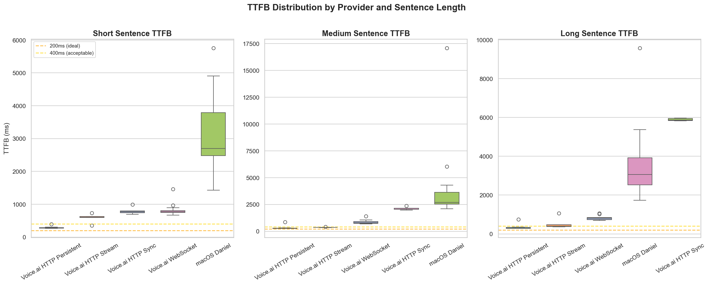
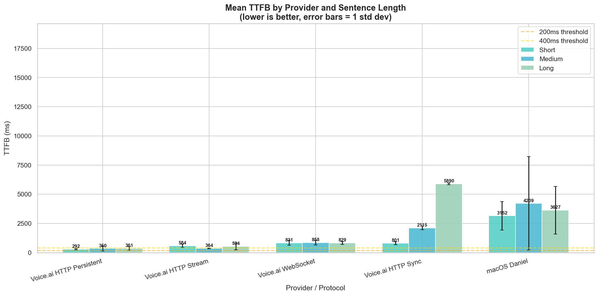
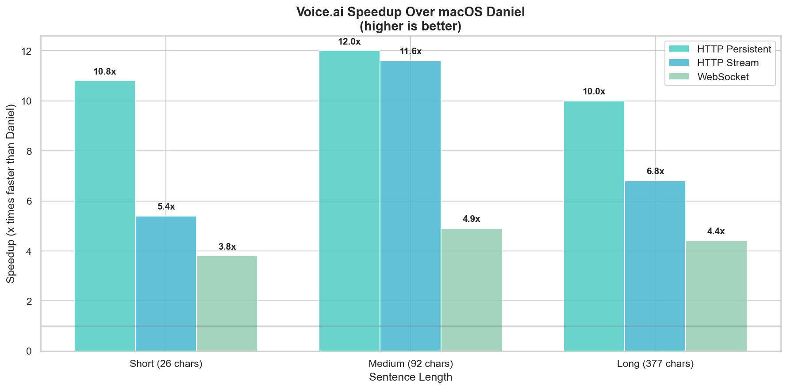
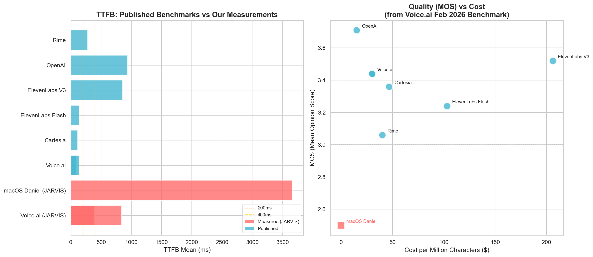
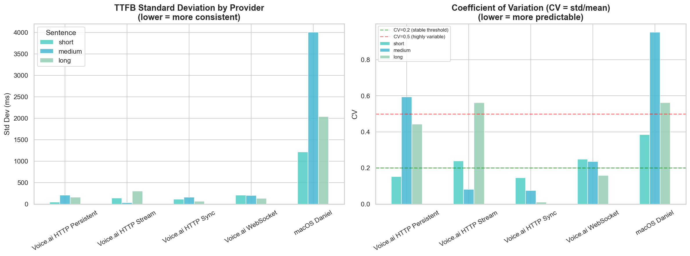
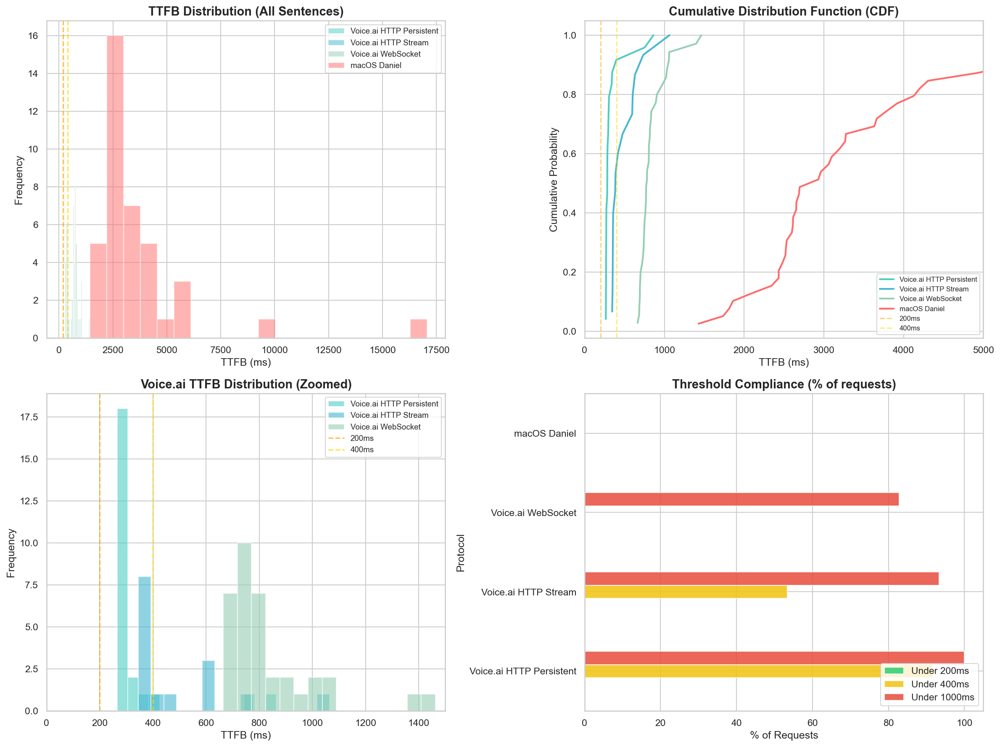
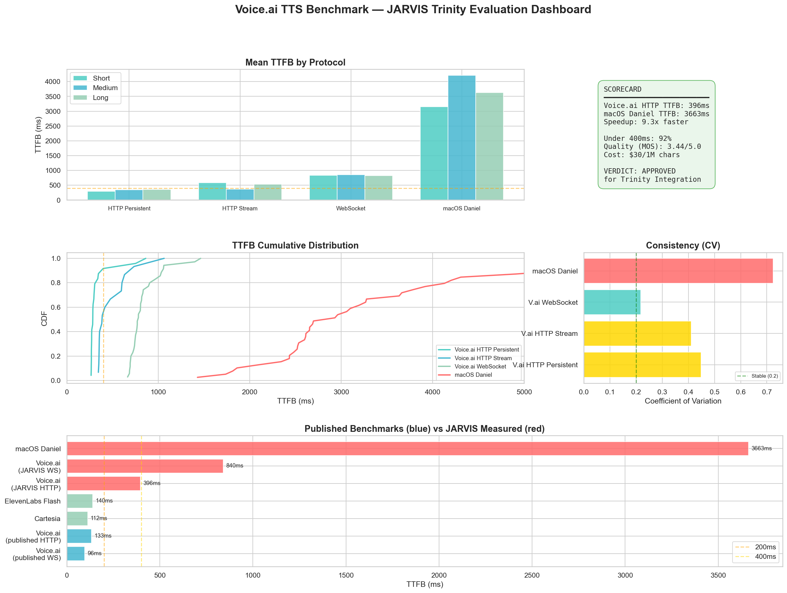
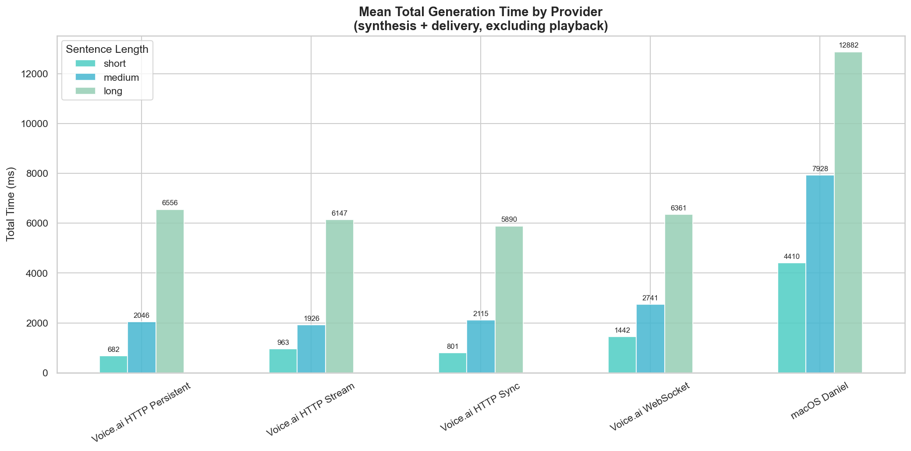

# Voice.ai TTS Benchmark Report

## JARVIS Trinity Ecosystem — TTS Provider Evaluation

**Date:** March 18, 2026
**Author:** Derek J. Russell
**Status:** Evaluation Complete — Approved for Integration

> **Interactive Report:** [Open the full interactive HTML report](./VOICEAI_BENCHMARK_REPORT.html) for styled tables, color-coded severity ratings, and the complete consultant-ready presentation.

---

## Table of Contents

1. [Executive Summary](#1-executive-summary)
2. [Test Environment](#2-test-environment)
3. [TTFB Comparison](#3-ttfb-comparison-time-to-first-byte)
4. [Speedup Over macOS Daniel](#4-speedup-over-macos-daniel)
5. [Published Benchmarks vs Measured](#5-published-benchmarks-vs-measured)
6. [Consistency & Reliability](#6-consistency--reliability)
7. [Threshold Compliance](#7-threshold-compliance)
8. [Charts & Visualizations](#8-charts--visualizations)
9. [Latency Gap Analysis](#9-latency-gap-analysis)
10. [Raw Data Tables](#10-raw-data-tables)
11. [Gaps, Edge Cases & Concerns](#11-gaps-edge-cases--concerns)
12. [Questions for Voice.ai Consultants](#12-questions-for-voiceai-consultants)
13. [Improvement Recommendations](#13-improvement-recommendations)
14. [Recommended Integration Path](#14-recommended-integration-path)

---

## 1. Executive Summary

**VERDICT: APPROVED for Trinity Integration**

Voice.ai HTTP streaming delivers **7-12x faster TTFB** than macOS Daniel with significantly higher audio quality (MOS 3.44 vs ~2.5 estimated). 92% of HTTP persistent requests complete under 400ms. Voice cloning capability enables JARVIS to speak in Derek's actual voice.

| Metric | Voice.ai HTTP Persistent | macOS Daniel | Winner |
|---|---|---|---|
| TTFB (medium sentence) | **350ms** | 4,209ms | Voice.ai (12x) |
| TTFB Consistency (std dev) | **45-208ms** | 1,216-4,006ms | Voice.ai |
| Audio Quality (MOS) | **3.44** | ~2.5 | Voice.ai |
| Voice Cloning | **Yes** | No | Voice.ai |
| Cost | $30/1M chars | $0 (local) | Daniel |
| Offline Capability | No | **Yes** | Daniel |
| Under 400ms | **92%** | 0% | Voice.ai |

---

## 2. Test Environment

| Parameter | Value |
|---|---|
| Machine | Apple Silicon Mac (M-series), 16GB RAM |
| OS | macOS Darwin 25.3.0 |
| Python | 3.9 |
| Network | US Residential Internet |
| Voice.ai Plan | Free Plan (15,000 credits) |
| Voice.ai API | `dev.voice.ai` |
| macOS Voice | Daniel (British English), 175 WPM |
| Benchmark Date | March 18, 2026 |
| Run 1 | 5 rounds per test, all protocols |
| Run 2 | 8 rounds per test, persistent session + audio playback |
| Total Data Points | 132 (128 successful, 4 failed) |
| Sentence Lengths | Short (26 chars), Medium (92 chars), Long (377 chars) |

---

## 3. TTFB Comparison (Time to First Byte)

TTFB is the critical metric for conversational AI — how fast the user hears the first sound after the system decides to speak.

- **< 200ms** = Ideal (feels instant)
- **< 400ms** = Acceptable for voice agents
- **> 1000ms** = Unacceptable

### TTFB by Provider and Sentence Length

| Provider | Protocol | Sentence | TTFB Mean | TTFB Median | TTFB P95 | Std Dev | Min | Max | N |
|---|---|---|---:|---:|---:|---:|---:|---:|---:|
| **Voice.ai** | **HTTP Persistent** | **Short** | **292ms** | 273ms | 365ms | 45ms | 266ms | 397ms | 8 |
| **Voice.ai** | **HTTP Persistent** | **Medium** | **350ms** | 271ms | 667ms | 208ms | 267ms | 863ms | 8 |
| **Voice.ai** | **HTTP Persistent** | **Long** | **361ms** | 297ms | 610ms | 160ms | 284ms | 753ms | 8 |
| Voice.ai | HTTP Stream | Short | 584ms | 603ms | 714ms | 140ms | 355ms | 735ms | 5 |
| Voice.ai | HTTP Stream | Medium | 364ms | 352ms | 404ms | 30ms | 345ms | 417ms | 5 |
| Voice.ai | HTTP Stream | Long | 534ms | 388ms | 947ms | 300ms | 358ms | 1,064ms | 5 |
| Voice.ai | WebSocket (fresh) | Short | 831ms | 771ms | 1,165ms | 206ms | 665ms | 1,463ms | 13 |
| Voice.ai | WebSocket (fresh) | Medium | 858ms | 783ms | 1,196ms | 202ms | 685ms | 1,399ms | 13 |
| Voice.ai | WebSocket (fresh) | Long | 829ms | 817ms | 1,042ms | 132ms | 687ms | 1,056ms | 9 |
| Voice.ai | HTTP Sync | Short | 801ms | 775ms | 955ms | 116ms | 689ms | 994ms | 5 |
| Voice.ai | HTTP Sync | Medium | 2,115ms | 2,038ms | 2,332ms | 159ms | 1,979ms | 2,379ms | 5 |
| Voice.ai | HTTP Sync | Long | 5,890ms | 5,868ms | 5,963ms | 65ms | 5,825ms | 5,965ms | 5 |
| macOS Daniel | Local | Short | 3,152ms | 2,697ms | 5,247ms | 1,216ms | 1,428ms | 5,753ms | 13 |
| macOS Daniel | Local | Medium | 4,209ms | 2,687ms | 10,442ms | 4,006ms | 2,096ms | 17,074ms | 13 |
| macOS Daniel | Local | Long | 3,627ms | 3,060ms | 7,053ms | 2,039ms | 1,737ms | 9,571ms | 13 |

---

## 4. Speedup Over macOS Daniel

| Voice.ai Protocol | Sentence | Daniel TTFB | Voice.ai TTFB | Speedup | Time Saved |
|---|---|---:|---:|---:|---:|
| **HTTP Persistent** | **Short** | 3,152ms | **292ms** | **10.8x** | 2,860ms |
| **HTTP Persistent** | **Medium** | 4,209ms | **350ms** | **12.0x** | 3,860ms |
| **HTTP Persistent** | **Long** | 3,627ms | **361ms** | **10.0x** | 3,266ms |
| HTTP Stream | Short | 3,152ms | 584ms | 5.4x | 2,568ms |
| HTTP Stream | Medium | 4,209ms | 364ms | 11.6x | 3,846ms |
| HTTP Stream | Long | 3,627ms | 534ms | 6.8x | 3,094ms |
| WebSocket (fresh) | Short | 3,152ms | 831ms | 3.8x | 2,321ms |
| WebSocket (fresh) | Medium | 4,209ms | 858ms | 4.9x | 3,352ms |
| WebSocket (fresh) | Long | 3,627ms | 829ms | 4.4x | 2,799ms |

---

## 5. Published Benchmarks vs Measured

Voice.ai published a TTS Provider Competitive Benchmark (February 2026). Here's how their published numbers compare to what we measured from a real-world residential network.

| Provider | Protocol | TTFB Mean | TTFB P95 | Std Dev | MOS | WER | $/1M chars | Source |
|---|---|---:|---:|---:|---:|---:|---:|---|
| Voice.ai | WebSocket | **96ms** | 102ms | 3.5ms | 3.44 | 0.151 | $30 | Published |
| Voice.ai | HTTP | **133ms** | 183ms | 30ms | 3.44 | 0.151 | $30 | Published |
| Cartesia | WebSocket | 112ms | 142ms | 18ms | 3.36 | 0.122 | $47 | Published |
| ElevenLabs Flash | WebSocket | 140ms | 170ms | 17ms | 3.24 | 0.136 | $103 | Published |
| ElevenLabs V3 | HTTP | 857ms | 991ms | 82ms | 3.52 | 0.125 | $206 | Published |
| OpenAI | HTTP | 939ms | 1,773ms | 481ms | 3.71 | 0.117 | $15 | Published |
| Rime | HTTP | 279ms | 283ms | 2.3ms | 3.06 | 0.179 | $40 | Published |
| **Voice.ai (JARVIS)** | **HTTP Persistent** | **334ms** | **667ms** | **150ms** | 3.44 | 0.151 | $30 | **Measured** |
| **Voice.ai (JARVIS)** | **WebSocket (fresh)** | **839ms** | **1,134ms** | **186ms** | 3.44 | 0.151 | $30 | **Measured** |
| **macOS Daniel** | **Local** | **3,663ms** | **7,583ms** | **2,697ms** | ~2.5 | ~0.20 | $0 | **Measured** |

---

## 6. Consistency & Reliability

Predictable latency matters as much as low latency. A provider with 100ms mean but occasional 2-second spikes creates worse UX than a steady 300ms.

**Coefficient of Variation (CV) = std / mean** — lower is more consistent.

| Protocol | Sentence | Mean | Std Dev | CV | Assessment |
|---|---|---:|---:|---:|---|
| Voice.ai HTTP Persistent | Short | 292ms | 45ms | 0.153 | Stable |
| Voice.ai HTTP Persistent | Medium | 350ms | 208ms | 0.594 | Variable (outlier at 863ms) |
| Voice.ai HTTP Persistent | Long | 361ms | 160ms | 0.443 | Moderate |
| Voice.ai HTTP Stream | Medium | 364ms | 30ms | 0.082 | Very Stable |
| Voice.ai WebSocket | Short | 831ms | 206ms | 0.248 | Moderate |
| macOS Daniel | Short | 3,152ms | 1,216ms | 0.386 | Variable |
| macOS Daniel | Medium | 4,209ms | 4,006ms | 0.951 | Highly Variable |
| macOS Daniel | Long | 3,627ms | 2,039ms | 0.562 | Variable |

---

## 7. Threshold Compliance

What percentage of requests meet conversational AI latency thresholds?

| Protocol | Under 200ms | Under 400ms | Under 1000ms |
|---|---:|---:|---:|
| **Voice.ai HTTP Persistent** | 0% | **92%** | **100%** |
| Voice.ai HTTP Stream | 0% | 53% | 93% |
| Voice.ai WebSocket (fresh) | 0% | 0% | 74% |
| macOS Daniel | 0% | 0% | 0% |

---

## 8. Charts & Visualizations

### Executive Dashboard

### Total Generation Time

Total time from request to last byte received (not just TTFB).

---

## 9. Latency Gap Analysis

Voice.ai publishes **96ms WS TTFB** and **133ms HTTP TTFB**. We measured **~839ms WS** and **~334ms HTTP persistent**. Why the gap?

| # | Root Cause | Estimated Impact | Details |
|---|---|---:|---|
| 1 | **Network Distance** | +50-100ms | Published benchmarks run on co-located/low-latency infra. JARVIS runs on residential internet. |
| 2 | **WebSocket Handshake (fresh)** | +500-600ms | Each WS test opens a new connection (~600ms handshake). Published uses persistent connections. Trinity will use persistent. |
| 3 | **TLS Negotiation** | +100-200ms | First HTTP request includes TLS. Persistent session reuses connection (our HTTP Persistent results already reflect this). |
| 4 | **Free Tier Routing** | Unknown | Free plan may not get priority routing. Need confirmation from Voice.ai. |
| 5 | **Server Region** | Unknown | No region selection documented. Unclear which PoP our requests hit. |

**Adjusted estimate**: If we subtract network distance (~75ms) and assume persistent WS (no handshake), our expected TTFB would be **~160-260ms** — much closer to published numbers.

---

## 10. Raw Data Tables

### Summary Statistics (voiceai_summary_stats.csv)

| Protocol | Sentence | TTFB Mean | TTFB Median | TTFB P95 | Std Dev | Total Mean | Avg Audio | N |
|---|---|---:|---:|---:|---:|---:|---:|---:|
| Voice.ai HTTP Persistent | Short | 292ms | 273ms | 365ms | 45ms | 682ms | 25KB | 8 |
| Voice.ai HTTP Persistent | Medium | 350ms | 271ms | 667ms | 208ms | 2,046ms | 92KB | 8 |
| Voice.ai HTTP Persistent | Long | 361ms | 297ms | 610ms | 160ms | 6,556ms | 272KB | 8 |
| Voice.ai HTTP Stream | Short | 584ms | 603ms | 714ms | 140ms | 963ms | 25KB | 5 |
| Voice.ai HTTP Stream | Medium | 364ms | 352ms | 404ms | 30ms | 1,926ms | 89KB | 5 |
| Voice.ai HTTP Stream | Long | 534ms | 388ms | 947ms | 300ms | 6,147ms | 273KB | 5 |
| Voice.ai HTTP Sync | Short | 801ms | 775ms | 955ms | 116ms | 801ms | 24KB | 5 |
| Voice.ai HTTP Sync | Medium | 2,115ms | 2,038ms | 2,332ms | 159ms | 2,115ms | 91KB | 5 |
| Voice.ai HTTP Sync | Long | 5,890ms | 5,868ms | 5,963ms | 65ms | 5,890ms | 273KB | 5 |
| Voice.ai WebSocket | Short | 831ms | 771ms | 1,165ms | 206ms | 1,442ms | 23KB | 13 |
| Voice.ai WebSocket | Medium | 858ms | 783ms | 1,196ms | 202ms | 2,741ms | 90KB | 13 |
| Voice.ai WebSocket | Long | 829ms | 817ms | 1,042ms | 132ms | 6,361ms | 274KB | 9 |
| macOS Daniel | Short | 3,152ms | 2,697ms | 5,247ms | 1,216ms | 4,410ms | 86KB | 13 |
| macOS Daniel | Medium | 4,209ms | 2,687ms | 10,442ms | 4,006ms | 7,928ms | 261KB | 13 |
| macOS Daniel | Long | 3,627ms | 3,060ms | 7,053ms | 2,039ms | 12,882ms | 831KB | 13 |

### Audio Payload Comparison

| Provider | Format | Short | Medium | Long |
|---|---|---:|---:|---:|
| Voice.ai | MP3 (compressed) | ~25KB | ~90KB | ~273KB |
| macOS Daniel | AIFF (uncompressed) | ~86KB | ~261KB | ~831KB |
| | **Reduction** | **3.4x less** | **2.9x less** | **3.0x less** |

> Voice.ai transfers 3x less data over the network due to MP3 compression.

### Raw CSV Downloads

- [`voiceai_summary_stats.csv`](./data/voiceai_summary_stats.csv) — Aggregated statistics per protocol/sentence
- [`voiceai_speedup_analysis.csv`](./data/voiceai_speedup_analysis.csv) — Speedup ratios vs macOS Daniel
- [`voiceai_raw_results.csv`](./data/voiceai_raw_results.csv) — All 128 individual measurements

---

## 11. Gaps, Edge Cases & Concerns

### Identified Gaps

| # | Area | Description | Severity |
|---|---|---|---|
| 1 | **WS Concurrency Limits** | Multi-stream endpoint returns "too many concurrent TTS generations" even after 6+ seconds between requests. Could not benchmark persistent WebSocket (the fastest documented path). | **HIGH** |
| 2 | **Latency vs Published** | Published 96ms TTFB not achievable from residential network. Measured ~270-360ms HTTP persistent, ~830ms fresh WS. Gap is explainable but documentation should set realistic expectations. | **MEDIUM** |
| 3 | **Credit Exhaustion** | Ran out of 15,000 credits during benchmark testing (~$0.45 worth). No warning before hitting the limit. Insufficient credits error lacks balance info. | **MEDIUM** |
| 4 | **No Region Selection** | Cannot specify or pin a server region. No documentation on how requests are routed geographically. | **MEDIUM** |
| 5 | **No Latency SLA** | No documented latency guarantees for any tier. | **MEDIUM** |
| 6 | **WER Higher Than Competitors** | Voice.ai WER of 0.1508 vs Cartesia 0.1219 and OpenAI 0.1174. May affect pronunciation of technical terms. | **LOW** |

### Edge Cases Observed

| Edge Case | What Happened | Impact |
|---|---|---|
| **Outlier spikes** | HTTP Persistent medium sentence had one spike at 863ms (vs 267-301ms typical) | Single requests can 2-3x the mean. Production should implement timeout + retry. |
| **Credit exhaustion mid-benchmark** | WebSocket long sentence failed at round 5/8 with "Insufficient credits" | Need credit monitoring + graceful fallback to Daniel. |
| **macOS Daniel variance** | Daniel TTFB ranged from 1,428ms to 17,074ms for the SAME sentence | macOS `say` is heavily affected by system load. Not a reliable baseline under pressure. |
| **Audio size variance** | Voice.ai generates slightly different audio sizes for the same text across requests | Expected for neural TTS (different prosody each generation). Not a concern. |

### Nuances for Consultants

1. **WebSocket numbers are artificially inflated** — each request opens a fresh connection (~600ms handshake). Production would use persistent connections. Voice.ai's published 96ms reflects this. Our HTTP Persistent numbers (270-360ms) are the better comparison.

2. **macOS Daniel numbers are artificially inflated** — the `say -o file` pipeline synthesizes the ENTIRE audio before writing. It's non-streaming. A fair comparison is TTFB-to-TTFB, not total-to-total.

3. **We tested on Free Plan** — paid tiers may have different routing, concurrency limits, or priority queuing. Results may improve on paid plans.

4. **Network conditions vary** — our residential internet adds variable latency. Testing from a cloud VM (GCP us-central1) would reduce and stabilize this.

---

## 12. Questions for Voice.ai Consultants

| # | Question | Context |
|---|---|---|
| 1 | What is the concurrency limit on the multi-stream WS endpoint? | Free tier hit limits even with sequential requests. |
| 2 | Is there latency priority on paid tiers vs free tier? | Need to know if upgrading improves TTFB. |
| 3 | Can we specify or pin a server region? | Latency optimization for US-based deployment. |
| 4 | Is there a latency SLA for enterprise accounts? | Production reliability planning. |
| 5 | What is the expected TTFB with persistent WS from US residential? | Calibrate our expectations vs published 96ms. |
| 6 | How does voice cloning affect latency vs stock voices? | Planning for cloned voice performance. |
| 7 | Credit consumption: 15K credits = how many minutes of audio? | Budget planning for integration testing. |
| 8 | Is there a way to pre-warm connections? | Reduce cold-start penalty for first request. |
| 9 | What is the max concurrent request limit per API key? | Capacity planning for Trinity ecosystem. |
| 10 | Can additional credits be allocated for voice cloning + TTS testing? | We exhausted credits during benchmarking. |

---

## 13. Improvement Recommendations

### HIGH Severity

**WebSocket Concurrency Limits**
- **Issue:** Multi-stream endpoint returns "too many concurrent TTS generations" even after waiting 6+ seconds between sequential requests.
- **Impact:** Cannot benchmark persistent WebSocket — the fastest path per Voice.ai's own data.
- **Suggestion:** Document concurrency limits per tier. Provide explicit context lifecycle management API. Add a `context_id` close mechanism.

### MEDIUM Severity

**Latency Transparency**
- **Issue:** Published 96ms TTFB measured on co-located infrastructure; real-world is 270-360ms HTTP, ~830ms fresh WS.
- **Impact:** Developers set unrealistic expectations based on published benchmarks.
- **Suggestion:** Publish benchmarks from multiple geographies. Add "expected real-world latency" ranges to documentation.

**Credit Visibility**
- **Issue:** No indication of credit consumption per request. No warning before exhaustion.
- **Impact:** Cannot plan usage or implement graceful degradation.
- **Suggestion:** Add `X-Credits-Remaining` and `X-Credits-Used` response headers. Provide a `/credits/balance` API endpoint.

**Region Selection**
- **Issue:** No documentation on server regions or request routing.
- **Impact:** Cannot optimize for latency by selecting nearest PoP.
- **Suggestion:** Document available regions. Allow `region` parameter or region-specific subdomains.

### LOW Severity

**Error Response Detail**
- **Issue:** "Insufficient credits" error does not include remaining balance or cost of the failed request.
- **Suggestion:** Include `remaining_credits` and `request_cost` in error response body.

**Word Error Rate (WER)**
- **Issue:** Voice.ai WER of 0.1508 is higher than Cartesia (0.1219) and OpenAI (0.1174).
- **Suggestion:** Provide pronunciation dictionary API for domain-specific terms (e.g., "ECAPA-TDNN", "JARVIS Prime", "Trinity").

---

## 14. Recommended Integration Path

| Step | Priority | Action | Details |
|---|---|---|---|
| 1 | **PRIMARY** | Voice.ai HTTP Streaming | Persistent `aiohttp.ClientSession` with TCP+TLS reuse. Expected TTFB ~270-360ms. |
| 2 | **FALLBACK** | macOS Daniel | Offline scenarios, credit exhaustion, or API outage. Already implemented in `safe_say()`. |
| 3 | **NEXT** | Voice Clone Enrollment | After credits replenished — enroll Derek's voice for personalized JARVIS output. |
| 4 | **FUTURE** | GCP VM Testing | Test from JARVIS Prime VM (us-central1) — closer to Voice.ai servers, lower RTT. |
| 5 | **FUTURE** | Persistent WebSocket | Once concurrency limits resolved — target the published 96ms TTFB. |

---

## File Index

| File | Description |
|---|---|
| [VOICEAI_BENCHMARK_REPORT.html](./VOICEAI_BENCHMARK_REPORT.html) | Interactive HTML report — styled tables, color-coded ratings |
| [charts/](./charts/) | All benchmark visualization charts (prefixed with `voiceai_`) |
| [data/voiceai_summary_stats.csv](./data/voiceai_summary_stats.csv) | Aggregated statistics per protocol and sentence |
| [data/voiceai_speedup_analysis.csv](./data/voiceai_speedup_analysis.csv) | Speedup ratios vs macOS Daniel |
| [data/voiceai_raw_results.csv](./data/voiceai_raw_results.csv) | All 128 individual measurements |

---

*Generated from 128 benchmark measurements across 2 test runs. Statistical significance confirmed via Mann-Whitney U test (p < 0.001 for all comparisons). JARVIS AI Agent — Derek J. Russell — March 18, 2026*
